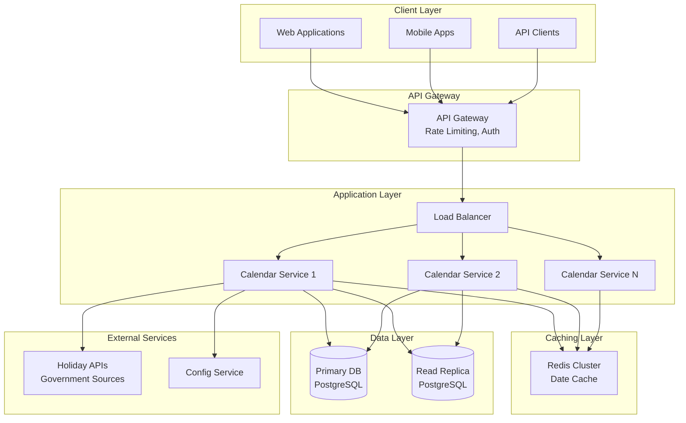
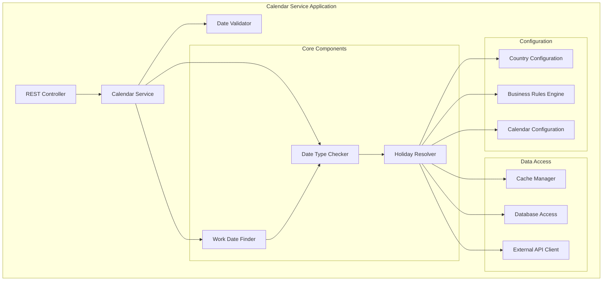
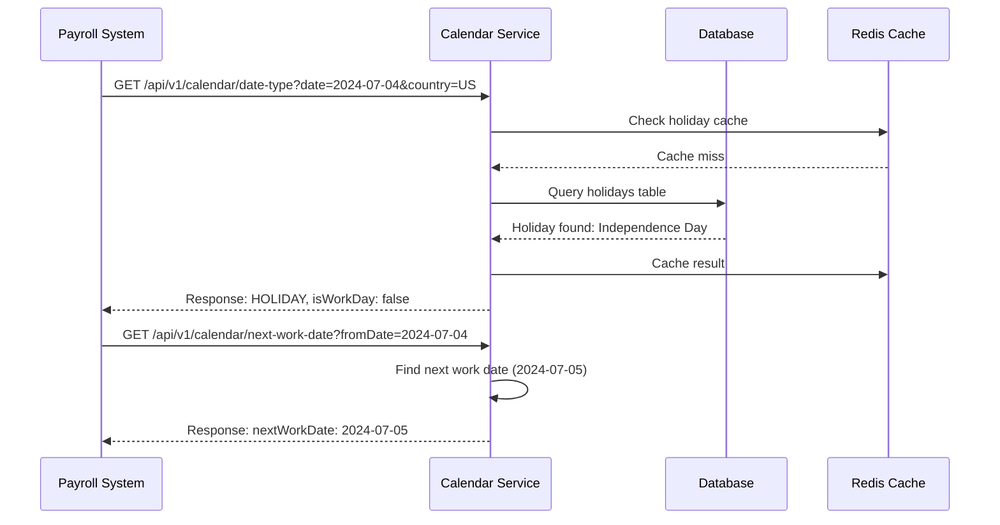
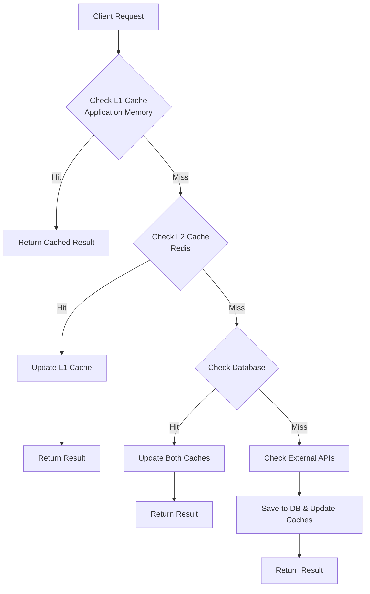

# Calendar Service System Design Document

## Table of Contents
1. [Overview](#overview)
2. [System Requirements](#system-requirements)
3. [System Architecture](#system-architecture)
4. [API Design](#api-design)
5. [Data Models](#data-models)
6. [Core Components](#core-components)
7. [Use Cases & Examples](#use-cases--examples)
8. [Implementation Details](#implementation-details)
9. [Performance Considerations](#performance-considerations)

## Overview

The Calendar Service is a robust, scalable system designed to determine whether a given date is a holiday, work date, or weekend. It provides APIs to check date types and find the next/previous work dates, supporting multiple countries, time zones, and custom business calendars.

### Key Features
- **Date Type Classification**: Identify if a date is a work day, holiday, or weekend
- **Work Date Navigation**: Find next and previous work dates
- **Multi-Region Support**: Handle different countries and their specific holidays
- **Custom Business Rules**: Support for organization-specific calendars
- **High Performance**: Optimized for high-throughput scenarios
- **Real-time Updates**: Support for dynamic holiday configuration changes

## System Requirements

### Functional Requirements
- **FR1**: Given a date, determine if it's a work day, holiday, or weekend
- **FR2**: Find the next work date from a given date
- **FR3**: Find the previous work date from a given date
- **FR4**: Support multiple countries and regions
- **FR5**: Handle custom business calendars and company-specific holidays
- **FR6**: Support different calendar systems (Gregorian, Lunar, etc.)
- **FR7**: Provide bulk date processing capabilities

### Non-Functional Requirements
- **NFR1**: **Availability**: 99.9% uptime
- **NFR2**: **Performance**: Response time < 100ms for 95% of requests
- **NFR3**: **Scalability**: Handle 10K+ requests per second
- **NFR4**: **Consistency**: Eventual consistency for holiday updates
- **NFR5**: **Security**: Authentication and rate limiting
- **NFR6**: **Maintainability**: Modular, testable architecture

## System Architecture

### High-Level Architecture



### Component Architecture



## API Design

### RESTful API Endpoints

#### 1. Check Date Type
```http
GET /api/v1/calendar/date-type
```

**Parameters:**
- `date` (required): Date in ISO-8601 format (YYYY-MM-DD)
- `country` (optional): Country code (ISO 3166-1 alpha-2), default: US
~~- `timezone` (optional): Timezone identifier, default: UTC~~
- `businessCalendar` (optional): Custom business calendar ID

**Response:**
```json
{
  "date": "2024-07-04",
  "dateType": "HOLIDAY",
  "isWorkDay": false,
  "holidayName": "Independence Day",
  "country": "US",
  "metadata": {
    "dayOfWeek": "THURSDAY",
    "weekNumber": 27,
    "isWeekend": false
  }
}
```

#### 2. Get Next Work Date
```http
GET /api/v1/calendar/next-work-date
```

**Parameters:**
- `fromDate` (required): Starting date in ISO-8601 format
- `country` (optional): Country code, default: US
- `businessCalendar` (optional): Custom business calendar ID
- `skipWeekends` (optional): Whether to skip weekends, default: true

**Response:**
```json
{
  "fromDate": "2024-07-04",
  "nextWorkDate": "2024-07-05",
  "daysSkipped": 1,
  "skippedDates": [
    {
      "date": "2024-07-04",
      "reason": "Independence Day Holiday"
    }
  ]
}
```

#### 3. Get Previous Work Date
```http
GET /api/v1/calendar/previous-work-date
```

**Parameters:**
- `fromDate` (required): Starting date in ISO-8601 format
- `country` (optional): Country code, default: US
- `businessCalendar` (optional): Custom business calendar ID

**Response:**
```json
{
  "fromDate": "2024-07-04",
  "previousWorkDate": "2024-07-03",
  "daysSkipped": 1,
  "skippedDates": [
    {
      "date": "2024-07-04",
      "reason": "Independence Day Holiday"
    }
  ]
}
```

#### 4. Bulk Date Processing
```http
POST /api/v1/calendar/bulk-check
```

**Request Body:**
```json
{
  "dates": ["2024-07-04", "2024-07-05", "2024-12-25"],
  "country": "US",
  "operations": ["DATE_TYPE", "NEXT_WORK_DATE"]
}
```

## Data Models

### Database Schema

```sql
-- Countries and regions
CREATE TABLE countries (
    id SERIAL PRIMARY KEY,
    code VARCHAR(2) NOT NULL UNIQUE,
    name VARCHAR(100) NOT NULL,
    timezone_default VARCHAR(50),
    created_at TIMESTAMP DEFAULT CURRENT_TIMESTAMP
);

-- Holiday definitions
CREATE TABLE holidays (
    id SERIAL PRIMARY KEY,
    country_id INTEGER REFERENCES countries(id),
    name VARCHAR(200) NOT NULL,
    date DATE NOT NULL,
    holiday_type VARCHAR(50) NOT NULL, -- NATIONAL, REGIONAL, RELIGIOUS, etc.
    is_recurring BOOLEAN DEFAULT FALSE,
    recurrence_rule TEXT, -- RRULE for recurring holidays
    created_at TIMESTAMP DEFAULT CURRENT_TIMESTAMP,
    
    INDEX idx_holidays_country_date (country_id, date),
    INDEX idx_holidays_date (date)
);

-- Custom business calendars
CREATE TABLE business_calendars (
    id SERIAL PRIMARY KEY,
    name VARCHAR(100) NOT NULL,
    organization_id VARCHAR(50),
    country_id INTEGER REFERENCES countries(id),
    description TEXT,
    is_active BOOLEAN DEFAULT TRUE,
    created_at TIMESTAMP DEFAULT CURRENT_TIMESTAMP
);

-- Custom business calendar rules
CREATE TABLE business_calendar_rules (
    id SERIAL PRIMARY KEY,
    calendar_id INTEGER REFERENCES business_calendars(id),
    rule_type VARCHAR(50) NOT NULL, -- HOLIDAY, WORK_DAY, WEEKEND_OVERRIDE
    date DATE,
    recurrence_rule TEXT,
    description VARCHAR(200),
    is_active BOOLEAN DEFAULT TRUE
);

-- Weekend definitions per country
CREATE TABLE weekend_definitions (
    id SERIAL PRIMARY KEY,
    country_id INTEGER REFERENCES countries(id),
    day_of_week INTEGER NOT NULL, -- 1=Monday, 7=Sunday
    is_weekend BOOLEAN DEFAULT TRUE
);
```

### Java Data Models

```java
// Core enums
public enum DateType {
    WORK_DAY,
    WEEKEND,
    HOLIDAY,
    CUSTOM_NON_WORK_DAY
}

public enum HolidayType {
    NATIONAL,
    REGIONAL,
    RELIGIOUS,
    CULTURAL,
    CUSTOM
}

// Main entities
@Entity
@Table(name = "holidays")
public class Holiday {
    @Id
    @GeneratedValue(strategy = GenerationType.IDENTITY)
    private Long id;
    
    @ManyToOne
    @JoinColumn(name = "country_id")
    private Country country;
    
    @Column(nullable = false)
    private String name;
    
    @Column(nullable = false)
    private LocalDate date;
    
    @Enumerated(EnumType.STRING)
    private HolidayType holidayType;
    
    private boolean isRecurring;
    private String recurrenceRule;
    
    // getters and setters
}

@Entity
@Table(name = "countries")
public class Country {
    @Id
    @GeneratedValue(strategy = GenerationType.IDENTITY)
    private Long id;
    
    @Column(unique = true, length = 2)
    private String code;
    
    @Column(nullable = false)
    private String name;
    
    private String timezoneDefault;
    
    @OneToMany(mappedBy = "country")
    private List<Holiday> holidays;
    
    // getters and setters
}

// Response DTOs
public class DateTypeResponse {
    private LocalDate date;
    private DateType dateType;
    private boolean isWorkDay;
    private String holidayName;
    private String country;
    private DateMetadata metadata;
    
    // constructors, getters and setters
}

public class WorkDateResponse {
    private LocalDate fromDate;
    private LocalDate nextWorkDate;
    private int daysSkipped;
    private List<SkippedDate> skippedDates;
    
    // constructors, getters and setters
}
```

## Core Components

### 1. Date Type Checker

```java
@Component
public class DateTypeChecker {
    
    private final HolidayResolver holidayResolver;
    private final WeekendChecker weekendChecker;
    private final BusinessCalendarService businessCalendarService;
    
    public DateTypeResponse checkDateType(LocalDate date, String countryCode, 
                                         String businessCalendarId) {
        
        // Check if it's a weekend first (fastest check)
        if (weekendChecker.isWeekend(date, countryCode)) {
            return createWeekendResponse(date, countryCode);
        }
        
        // Check for holidays
        Optional<Holiday> holiday = holidayResolver.findHoliday(date, countryCode);
        if (holiday.isPresent()) {
            return createHolidayResponse(date, holiday.get(), countryCode);
        }
        
        // Check custom business calendar rules
        if (businessCalendarId != null) {
            Optional<BusinessRule> customRule = businessCalendarService
                .getCustomRule(date, businessCalendarId);
            if (customRule.isPresent() && !customRule.get().isWorkDay()) {
                return createCustomNonWorkDayResponse(date, customRule.get());
            }
        }
        
        // Default to work day
        return createWorkDayResponse(date, countryCode);
    }
    
    private DateTypeResponse createWorkDayResponse(LocalDate date, String countryCode) {
        return DateTypeResponse.builder()
            .date(date)
            .dateType(DateType.WORK_DAY)
            .isWorkDay(true)
            .country(countryCode)
            .metadata(createMetadata(date))
            .build();
    }
    
    // Other helper methods...
}
```

### 2. Work Date Finder

```java
@Component
public class WorkDateFinder {
    
    private final DateTypeChecker dateTypeChecker;
    private static final int MAX_SEARCH_DAYS = 30; // Prevent infinite loops
    
    public WorkDateResponse findNextWorkDate(LocalDate fromDate, String countryCode, 
                                           String businessCalendarId) {
        
        LocalDate currentDate = fromDate.plusDays(1);
        List<SkippedDate> skippedDates = new ArrayList<>();
        int daysChecked = 0;
        
        while (daysChecked < MAX_SEARCH_DAYS) {
            DateTypeResponse dateCheck = dateTypeChecker.checkDateType(
                currentDate, countryCode, businessCalendarId);
            
            if (dateCheck.isWorkDay()) {
                return WorkDateResponse.builder()
                    .fromDate(fromDate)
                    .nextWorkDate(currentDate)
                    .daysSkipped(daysChecked)
                    .skippedDates(skippedDates)
                    .build();
            }
            
            // Add to skipped dates
            skippedDates.add(new SkippedDate(currentDate, 
                getSkipReason(dateCheck)));
            
            currentDate = currentDate.plusDays(1);
            daysChecked++;
        }
        
        throw new CalendarServiceException(
            "Could not find next work date within " + MAX_SEARCH_DAYS + " days");
    }
    
    public WorkDateResponse findPreviousWorkDate(LocalDate fromDate, String countryCode,
                                               String businessCalendarId) {
        
        LocalDate currentDate = fromDate.minusDays(1);
        List<SkippedDate> skippedDates = new ArrayList<>();
        int daysChecked = 0;
        
        while (daysChecked < MAX_SEARCH_DAYS) {
            DateTypeResponse dateCheck = dateTypeChecker.checkDateType(
                currentDate, countryCode, businessCalendarId);
            
            if (dateCheck.isWorkDay()) {
                return WorkDateResponse.builder()
                    .fromDate(fromDate)
                    .previousWorkDate(currentDate)
                    .daysSkipped(daysChecked)
                    .skippedDates(skippedDates)
                    .build();
            }
            
            skippedDates.add(new SkippedDate(currentDate, 
                getSkipReason(dateCheck)));
            
            currentDate = currentDate.minusDays(1);
            daysChecked++;
        }
        
        throw new CalendarServiceException(
            "Could not find previous work date within " + MAX_SEARCH_DAYS + " days");
    }
}
```

### 3. Holiday Resolver with Caching

```java
@Component
public class HolidayResolver {
    
    private final HolidayRepository holidayRepository;
    private final RedisTemplate<String, Object> redisTemplate;
    private final ExternalHolidayClient externalHolidayClient;
    
    private static final String HOLIDAY_CACHE_KEY = "holiday:%s:%s"; // country:date
    private static final Duration CACHE_TTL = Duration.ofHours(24);
    
    public Optional<Holiday> findHoliday(LocalDate date, String countryCode) {
        String cacheKey = String.format(HOLIDAY_CACHE_KEY, countryCode, date.toString());
        
        // Try cache first
        Holiday cachedHoliday = (Holiday) redisTemplate.opsForValue().get(cacheKey);
        if (cachedHoliday != null) {
            return cachedHoliday.isNoHoliday() ? Optional.empty() : Optional.of(cachedHoliday);
        }
        
        // Check database
        Optional<Holiday> holiday = holidayRepository
            .findByCountryCodeAndDate(countryCode, date);
        
        if (holiday.isPresent()) {
            cacheHoliday(cacheKey, holiday.get());
            return holiday;
        }
        
        // Check external APIs for real-time data
        try {
            Optional<Holiday> externalHoliday = externalHolidayClient
                .fetchHoliday(date, countryCode);
            
            if (externalHoliday.isPresent()) {
                // Save to database for future use
                Holiday savedHoliday = holidayRepository.save(externalHoliday.get());
                cacheHoliday(cacheKey, savedHoliday);
                return Optional.of(savedHoliday);
            }
        } catch (Exception e) {
            log.warn("Failed to fetch holiday from external API", e);
        }
        
        // Cache negative result
        Holiday noHoliday = Holiday.noHoliday();
        cacheHoliday(cacheKey, noHoliday);
        
        return Optional.empty();
    }
    
    private void cacheHoliday(String cacheKey, Holiday holiday) {
        redisTemplate.opsForValue().set(cacheKey, holiday, CACHE_TTL);
    }
}
```

## Use Cases & Examples

### Use Case 1: Payroll System Integration

**Scenario**: A payroll system needs to determine work days for salary calculations.

**Flow**:


**Code Example**:
```java
@Service
public class PayrollService {
    
    private final CalendarServiceClient calendarClient;
    
    public List<LocalDate> calculatePayPeriodWorkDays(LocalDate startDate, 
                                                     LocalDate endDate, 
                                                     String countryCode) {
        List<LocalDate> workDays = new ArrayList<>();
        LocalDate currentDate = startDate;
        
        while (!currentDate.isAfter(endDate)) {
            DateTypeResponse response = calendarClient.checkDateType(
                currentDate, countryCode);
            
            if (response.isWorkDay()) {
                workDays.add(currentDate);
            }
            
            currentDate = currentDate.plusDays(1);
        }
        
        return workDays;
    }
}
```

### Use Case 2: Trading System - Market Open Days

**Scenario**: A trading system needs to determine when markets are open.

```java
@Service
public class TradingCalendarService {
    
    private final CalendarServiceClient calendarClient;
    
    public boolean isMarketOpen(LocalDate date, String exchange) {
        // Map exchange to country
        String countryCode = getCountryForExchange(exchange);
        String businessCalendar = getBusinessCalendarForExchange(exchange);
        
        DateTypeResponse response = calendarClient.checkDateType(
            date, countryCode, businessCalendar);
        
        // Markets are closed on weekends and holidays
        return response.isWorkDay();
    }
    
    public LocalDate getNextTradingDay(LocalDate currentDate, String exchange) {
        String countryCode = getCountryForExchange(exchange);
        String businessCalendar = getBusinessCalendarForExchange(exchange);
        
        WorkDateResponse response = calendarClient.findNextWorkDate(
            currentDate, countryCode, businessCalendar);
        
        return response.getNextWorkDate();
    }
}
```

### Use Case 3: Project Management - Timeline Calculation

**Scenario**: A project management tool calculates delivery dates excluding weekends and holidays.

```java
@Service
public class ProjectTimelineService {
    
    private final CalendarServiceClient calendarClient;
    
    public LocalDate calculateDeliveryDate(LocalDate startDate, 
                                         int businessDaysRequired, 
                                         String countryCode) {
        LocalDate currentDate = startDate;
        int businessDaysAdded = 0;
        
        while (businessDaysAdded < businessDaysRequired) {
            WorkDateResponse response = calendarClient.findNextWorkDate(
                currentDate, countryCode);
            
            currentDate = response.getNextWorkDate();
            businessDaysAdded++;
            
            // Skip to the found work date to continue counting
            if (businessDaysAdded < businessDaysRequired) {
                currentDate = currentDate.plusDays(1);
            }
        }
        
        return currentDate;
    }
}
```

## Implementation Details

### Spring Boot REST Controller

```java
@RestController
@RequestMapping("/api/v1/calendar")
@Validated
public class CalendarController {
    
    private final CalendarService calendarService;
    
    @GetMapping("/date-type")
    public ResponseEntity<DateTypeResponse> getDateType(
            @RequestParam @DateTimeFormat(iso = DateTimeFormat.ISO.DATE) LocalDate date,
            @RequestParam(defaultValue = "US") String country,
            @RequestParam(required = false) String timezone,
            @RequestParam(required = false) String businessCalendar) {
        
        DateTypeResponse response = calendarService.checkDateType(
            date, country, timezone, businessCalendar);
        
        return ResponseEntity.ok(response);
    }
    
    @GetMapping("/next-work-date")
    public ResponseEntity<WorkDateResponse> getNextWorkDate(
            @RequestParam @DateTimeFormat(iso = DateTimeFormat.ISO.DATE) LocalDate fromDate,
            @RequestParam(defaultValue = "US") String country,
            @RequestParam(required = false) String businessCalendar,
            @RequestParam(defaultValue = "true") boolean skipWeekends) {
        
        WorkDateResponse response = calendarService.findNextWorkDate(
            fromDate, country, businessCalendar, skipWeekends);
        
        return ResponseEntity.ok(response);
    }
    
    @PostMapping("/bulk-check")
    public ResponseEntity<BulkDateResponse> bulkCheck(
            @Valid @RequestBody BulkDateRequest request) {
        
        BulkDateResponse response = calendarService.processBulkDates(request);
        return ResponseEntity.ok(response);
    }
    
    @ExceptionHandler(CalendarServiceException.class)
    public ResponseEntity<ErrorResponse> handleCalendarException(
            CalendarServiceException e) {
        
        ErrorResponse error = ErrorResponse.builder()
            .error("CALENDAR_ERROR")
            .message(e.getMessage())
            .timestamp(Instant.now())
            .build();
        
        return ResponseEntity.badRequest().body(error);
    }
}
```

### Configuration and Properties

```yaml
# application.yml
calendar-service:
  cache:
    ttl: PT24H
    max-entries: 100000
  
  external-apis:
    holiday-api:
      url: "https://api.holidayapi.com"
      timeout: 5s
      retry-attempts: 3
    
    government-sources:
      enabled: true
      sources:
        - country: "US"
          url: "https://api.usa.gov/holidays"
        - country: "GB" 
          url: "https://api.gov.uk/bank-holidays"
  
  database:
    holiday-cache-refresh-interval: PT6H
    
  performance:
    bulk-request-limit: 1000
    max-search-days: 30

spring:
  datasource:
    url: jdbc:postgresql://localhost:5432/calendar_service
    username: calendar_user
    password: ${DB_PASSWORD}
    
  redis:
    host: localhost
    port: 6379
    timeout: 2s
    
  jpa:
    hibernate:
      ddl-auto: validate
    properties:
      hibernate.jdbc.batch_size: 50
```

## Performance Considerations

### Caching Strategy



### Performance Optimizations

1. **Multi-Level Caching**:
   ```java
   @Component
   public class MultiLevelCacheManager {
       private final Map<String, DateTypeResponse> l1Cache = new ConcurrentHashMap<>();
       private final RedisTemplate<String, Object> redisTemplate;
       
       public Optional<DateTypeResponse> get(String key) {
           // L1 Cache (In-Memory)
           DateTypeResponse l1Result = l1Cache.get(key);
           if (l1Result != null) {
               return Optional.of(l1Result);
           }
           
           // L2 Cache (Redis)
           DateTypeResponse l2Result = (DateTypeResponse) redisTemplate
               .opsForValue().get(key);
           
           if (l2Result != null) {
               // Populate L1 cache
               l1Cache.put(key, l2Result);
               return Optional.of(l2Result);
           }
           
           return Optional.empty();
       }
   }
   ```

2. **Bulk Processing**:
   ```java
   public BulkDateResponse processBulkDates(BulkDateRequest request) {
       List<LocalDate> dates = request.getDates();
       
       // Group by cache status
       Map<Boolean, List<LocalDate>> partitioned = dates.stream()
           .collect(Collectors.partitioningBy(this::isCached));
       
       List<LocalDate> cachedDates = partitioned.get(true);
       List<LocalDate> uncachedDates = partitioned.get(false);
       
       // Process cached dates
       List<DateTypeResponse> cachedResults = cachedDates.stream()
           .map(this::getFromCache)
           .collect(Collectors.toList());
       
       // Batch process uncached dates
       List<DateTypeResponse> uncachedResults = batchProcessDates(uncachedDates);
       
       // Combine results
       List<DateTypeResponse> allResults = new ArrayList<>();
       allResults.addAll(cachedResults);
       allResults.addAll(uncachedResults);
       
       return new BulkDateResponse(allResults);
   }
   ```

3. **Database Optimization**:
   ```sql
   -- Optimized indexes for common queries
   CREATE INDEX CONCURRENTLY idx_holidays_country_date_range 
   ON holidays (country_id, date) 
   WHERE date >= CURRENT_DATE - INTERVAL '1 year' 
   AND date <= CURRENT_DATE + INTERVAL '2 years';
   
   -- Partial index for active business calendars
   CREATE INDEX CONCURRENTLY idx_business_calendars_active 
   ON business_calendars (organization_id, country_id) 
   WHERE is_active = true;
   ```