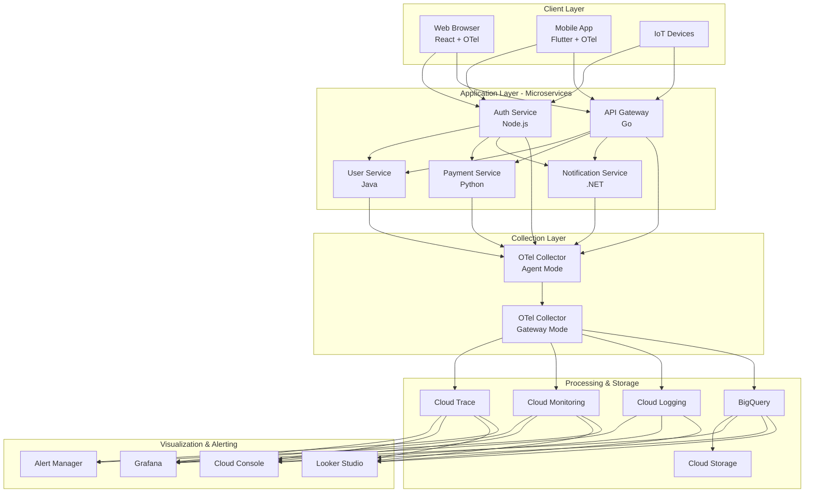
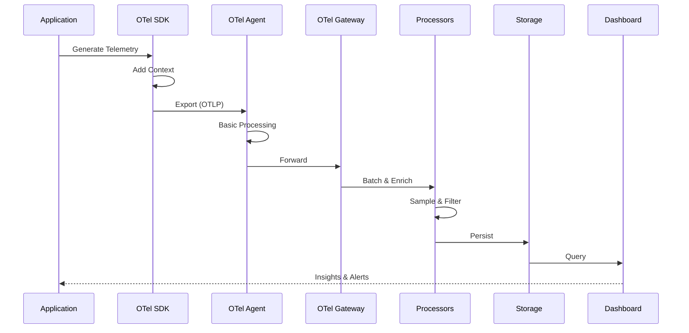
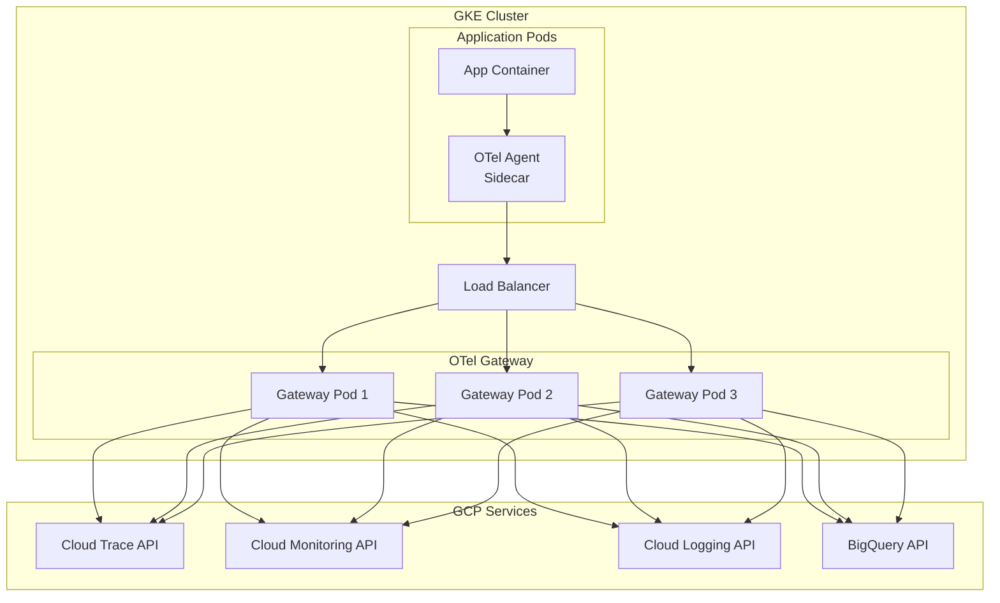
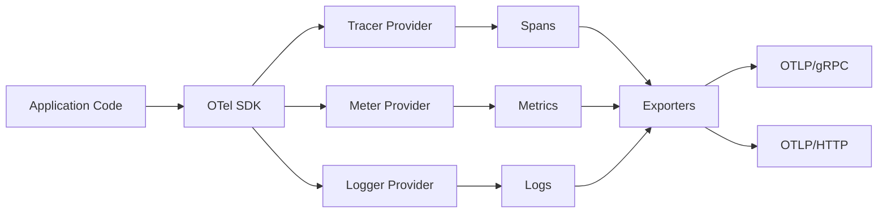
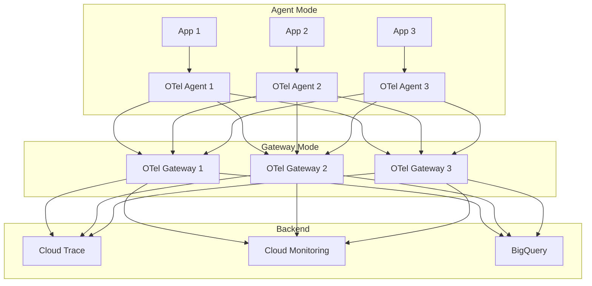

# Observability System Design Document
## Using OpenTelemetry for Comprehensive Business & Technical Monitoring

---

## Table of Contents
1. [Executive Summary](#executive-summary)
2. [System Overview](#system-overview)
3. [Architecture Design](#architecture-design)
4. [Core Components](#core-components)
5. [Data Collection Strategy](#data-collection-strategy)
6. [Use Cases & Implementation Examples](#use-cases--implementation-examples)
7. [Deployment Architecture](#deployment-architecture)
8. [Security & Compliance](#security--compliance)
9. [Scalability & Performance](#scalability--performance)
10. [Monitoring & Alerting](#monitoring--alerting)
11. [Implementation Roadmap](#implementation-roadmap)
12. [References](#references)

---

## Executive Summary

This document outlines a comprehensive observability system designed to capture, process, and visualize both **technical telemetry** (traces, metrics, logs) and **business events** (user behaviors, transactions, conversions) using the OpenTelemetry ecosystem deployed on Google Cloud Platform.

### Key Objectives
- **Unified Observability**: Single platform for technical and business monitoring
- **Language Agnostic**: Support for Java, Python, Node.js, Go, .NET microservices
- **Real-time Processing**: Sub-second latency for critical alerts
- **Scalable Architecture**: Handle millions of events per second
- **Cost Effective**: Intelligent sampling and aggregation strategies

### Signal Types

| Signal Type | Description | Examples | Retention |
|------------|-------------|----------|-----------|
| **Traces** | Request flow across services | User login journey, API call chains | 7 days (hot), 90 days (cold) |
| **Metrics** | Quantitative measurements | Login rate, page load time, error rate | 30 days (hot), 1 year (aggregated) |
| **Logs** | Discrete event records | Error messages, audit logs, debug info | 30 days (hot), 1 year (cold) |
| **Events** | Business occurrences | User signup, purchase, feature usage | Indefinite (BigQuery) |

---

## System Overview

### High-Level Architecture



### Data Flow Pipeline



---

## Architecture Design

### Three-Tier Architecture

#### Tier 1: Instrumentation Layer
- **Auto-instrumentation**: Framework-level automatic tracing
- **Manual instrumentation**: Custom business logic tracking
- **Client-side SDKs**: Browser and mobile instrumentation

#### Tier 2: Collection & Processing Layer
- **Agent Collectors**: Deployed alongside applications (sidecar/daemonset)
- **Gateway Collectors**: Centralized processing cluster
- **Processing Pipeline**: Filter, sample, enrich, and batch

#### Tier 3: Storage & Analysis Layer
- **Hot Storage**: Real-time querying (Cloud Trace, Monitoring, Logging)
- **Warm Storage**: Recent analytics (BigQuery partitioned tables)
- **Cold Storage**: Long-term retention (Cloud Storage)

### Deployment Topology



---

## Core Components

### 1. OpenTelemetry SDKs

#### SDK Architecture



#### Language-Specific Implementation

##### Java (Spring Boot)

```java
// build.gradle
dependencies {
    implementation 'io.opentelemetry:opentelemetry-api:1.32.0'
    implementation 'io.opentelemetry:opentelemetry-sdk:1.32.0'
    implementation 'io.opentelemetry:opentelemetry-exporter-otlp:1.32.0'
    implementation 'io.opentelemetry.instrumentation:opentelemetry-spring-boot-starter:1.32.0'
}

// application.yml
otel:
  service:
    name: user-service
  traces:
    exporter: otlp
  metrics:
    exporter: otlp
  logs:
    exporter: otlp
  exporter:
    otlp:
      endpoint: http://otel-collector:4317
  resource:
    attributes:
      deployment.environment: production
      service.version: 1.2.3
      service.namespace: ecommerce

// Custom Instrumentation Example
@RestController
@RequestMapping("/api/users")
public class UserController {
    
    private final Tracer tracer;
    private final Counter userCreationCounter;
    private final Histogram requestDuration;
    
    @Autowired
    public UserController(Tracer tracer, Meter meter) {
        this.tracer = tracer;
        this.userCreationCounter = meter.counterBuilder("user.creation.count")
            .setDescription("Number of users created")
            .build();
        this.requestDuration = meter.histogramBuilder("http.server.duration")
            .setUnit("ms")
            .build();
    }
    
    @PostMapping
    public ResponseEntity<User> createUser(@RequestBody CreateUserRequest request) {
        long startTime = System.currentTimeMillis();
        Span span = tracer.spanBuilder("user.create")
            .setSpanKind(SpanKind.SERVER)
            .startSpan();
        
        try (Scope scope = span.makeCurrent()) {
            // Add attributes
            span.setAttribute("user.email", request.getEmail());
            span.setAttribute("user.country", request.getCountry());
            
            // Business logic
            User user = userService.createUser(request);
            
            // Record business event
            span.addEvent("user.created", Attributes.of(
                AttributeKey.stringKey("user.id"), user.getId(),
                AttributeKey.stringKey("user.tier"), user.getTier()
            ));
            
            // Update metrics
            userCreationCounter.add(1, Attributes.of(
                AttributeKey.stringKey("country"), request.getCountry(),
                AttributeKey.stringKey("tier"), user.getTier()
            ));
            
            span.setStatus(StatusCode.OK);
            return ResponseEntity.ok(user);
            
        } catch (Exception e) {
            span.recordException(e);
            span.setStatus(StatusCode.ERROR, "User creation failed");
            throw e;
        } finally {
            span.end();
            requestDuration.record(System.currentTimeMillis() - startTime);
        }
    }
}
```

##### Python (FastAPI)

```python
# requirements.txt
opentelemetry-api==1.21.0
opentelemetry-sdk==1.21.0
opentelemetry-exporter-otlp==1.21.0
opentelemetry-instrumentation-fastapi==0.42b0
opentelemetry-instrumentation-sqlalchemy==0.42b0
opentelemetry-instrumentation-redis==0.42b0

# instrumentation.py
from opentelemetry import trace, metrics
from opentelemetry.sdk.trace import TracerProvider
from opentelemetry.sdk.metrics import MeterProvider
from opentelemetry.sdk.resources import Resource
from opentelemetry.exporter.otlp.proto.grpc.trace_exporter import OTLPSpanExporter
from opentelemetry.exporter.otlp.proto.grpc.metric_exporter import OTLPMetricExporter
from opentelemetry.sdk.trace.export import BatchSpanProcessor
from opentelemetry.sdk.metrics.export import PeriodicExportingMetricReader

# Configure resource
resource = Resource.create({
    "service.name": "payment-service",
    "service.version": "2.1.0",
    "deployment.environment": "production",
    "service.namespace": "ecommerce",
})

# Setup tracing
trace_provider = TracerProvider(resource=resource)
trace_provider.add_span_processor(
    BatchSpanProcessor(OTLPSpanExporter(endpoint="http://otel-collector:4317"))
)
trace.set_tracer_provider(trace_provider)

# Setup metrics
metric_reader = PeriodicExportingMetricReader(
    OTLPMetricExporter(endpoint="http://otel-collector:4317"),
    export_interval_millis=5000
)
metric_provider = MeterProvider(resource=resource, metric_readers=[metric_reader])
metrics.set_meter_provider(metric_provider)

# Get tracer and meter
tracer = trace.get_tracer(__name__)
meter = metrics.get_meter(__name__)

# Define metrics
payment_counter = meter.create_counter(
    "payment.processed.count",
    description="Number of payments processed",
    unit="1"
)

payment_amount = meter.create_histogram(
    "payment.amount",
    description="Payment amounts",
    unit="USD"
)

# app.py
from fastapi import FastAPI, HTTPException
from opentelemetry.instrumentation.fastapi import FastAPIInstrumentor
from instrumentation import tracer, payment_counter, payment_amount
from opentelemetry.trace import Status, StatusCode

app = FastAPI()
FastAPIInstrumentor.instrument_app(app)

@app.post("/api/payments")
async def process_payment(payment: PaymentRequest):
    with tracer.start_as_current_span("payment.process") as span:
        # Add attributes
        span.set_attribute("payment.method", payment.method)
        span.set_attribute("payment.currency", payment.currency)
        span.set_attribute("user.id", payment.user_id)
        
        try:
            # Validate payment
            with tracer.start_as_current_span("payment.validate") as validate_span:
                is_valid = validate_payment(payment)
                validate_span.set_attribute("validation.result", is_valid)
            
            if not is_valid:
                span.add_event("payment.validation_failed")
                span.set_status(Status(StatusCode.ERROR, "Invalid payment"))
                raise HTTPException(status_code=400, detail="Invalid payment")
            
            # Process payment
            with tracer.start_as_current_span("payment.charge") as charge_span:
                result = charge_payment(payment)
                charge_span.set_attribute("transaction.id", result.transaction_id)
            
            # Record success event
            span.add_event("payment.succeeded", {
                "transaction.id": result.transaction_id,
                "payment.amount": payment.amount
            })
            
            # Update metrics
            payment_counter.add(1, {
                "payment.method": payment.method,
                "payment.status": "success"
            })
            payment_amount.record(payment.amount, {
                "payment.method": payment.method,
                "currency": payment.currency
            })
            
            span.set_status(Status(StatusCode.OK))
            return {"transaction_id": result.transaction_id, "status": "success"}
            
        except Exception as e:
            span.record_exception(e)
            span.set_status(Status(StatusCode.ERROR, str(e)))
            payment_counter.add(1, {
                "payment.method": payment.method,
                "payment.status": "failed"
            })
            raise
```

##### Node.js (Express)

```javascript
// package.json
{
  "dependencies": {
    "@opentelemetry/api": "^1.7.0",
    "@opentelemetry/sdk-node": "^0.45.0",
    "@opentelemetry/auto-instrumentations-node": "^0.40.0",
    "@opentelemetry/exporter-trace-otlp-grpc": "^0.45.0",
    "@opentelemetry/exporter-metrics-otlp-grpc": "^0.45.0"
  }
}

// tracing.js
const { NodeSDK } = require('@opentelemetry/sdk-node');
const { OTLPTraceExporter } = require('@opentelemetry/exporter-trace-otlp-grpc');
const { OTLPMetricExporter } = require('@opentelemetry/exporter-metrics-otlp-grpc');
const { Resource } = require('@opentelemetry/resources');
const { SemanticResourceAttributes } = require('@opentelemetry/semantic-conventions');
const { getNodeAutoInstrumentations } = require('@opentelemetry/auto-instrumentations-node');
const { PeriodicExportingMetricReader } = require('@opentelemetry/sdk-metrics');

const sdk = new NodeSDK({
  resource: new Resource({
    [SemanticResourceAttributes.SERVICE_NAME]: 'auth-service',
    [SemanticResourceAttributes.SERVICE_VERSION]: '3.0.1',
    [SemanticResourceAttributes.DEPLOYMENT_ENVIRONMENT]: 'production',
  }),
  traceExporter: new OTLPTraceExporter({
    url: 'http://otel-collector:4317',
  }),
  metricReader: new PeriodicExportingMetricReader({
    exporter: new OTLPMetricExporter({
      url: 'http://otel-collector:4317',
    }),
    exportIntervalMillis: 5000,
  }),
  instrumentations: [getNodeAutoInstrumentations()],
});

sdk.start();

// app.js
const express = require('express');
const { trace, metrics } = require('@opentelemetry/api');

const app = express();
const tracer = trace.getTracer('auth-service');
const meter = metrics.getMeter('auth-service');

// Define metrics
const loginAttempts = meter.createCounter('user.login.attempts', {
  description: 'Number of login attempts',
});

const loginDuration = meter.createHistogram('user.login.duration', {
  description: 'Login duration in milliseconds',
  unit: 'ms',
});

app.post('/api/auth/login', async (req, res) => {
  const startTime = Date.now();
  const span = tracer.startSpan('user.login', {
    attributes: {
      'user.email': req.body.email,
      'user.ip': req.ip,
      'user.device': req.headers['user-agent'],
    },
  });

  try {
    // Increment login attempts
    loginAttempts.add(1, {
      'login.method': 'password',
    });

    // Authenticate user
    const user = await authenticateUser(req.body.email, req.body.password);

    if (!user) {
      span.addEvent('authentication.failed', {
        'failure.reason': 'invalid_credentials',
      });
      span.setStatus({ code: 2, message: 'Authentication failed' });
      return res.status(401).json({ error: 'Invalid credentials' });
    }

    // Generate JWT
    const token = generateToken(user);

    // Record success
    span.addEvent('user.authenticated', {
      'user.id': user.id,
      'user.role': user.role,
    });

    span.setStatus({ code: 1 }); // OK

    // Record duration
    const duration = Date.now() - startTime;
    loginDuration.record(duration, {
      'status': 'success',
    });

    res.json({ token, user });

  } catch (error) {
    span.recordException(error);
    span.setStatus({ code: 2, message: error.message });
    loginDuration.record(Date.now() - startTime, {
      'status': 'error',
    });
    res.status(500).json({ error: 'Internal server error' });
  } finally {
    span.end();
  }
});
```

##### Go (HTTP Server)

```go
// go.mod
module api-gateway

require (
    go.opentelemetry.io/otel v1.21.0
    go.opentelemetry.io/otel/sdk v1.21.0
    go.opentelemetry.io/otel/exporters/otlp/otlptrace/otlptracegrpc v1.21.0
    go.opentelemetry.io/otel/exporters/otlp/otlpmetric/otlpmetricgrpc v1.21.0
    go.opentelemetry.io/contrib/instrumentation/net/http/otelhttp v0.46.0
)

// tracing.go
package main

import (
    "context"
    "time"

    "go.opentelemetry.io/otel"
    "go.opentelemetry.io/otel/attribute"
    "go.opentelemetry.io/otel/exporters/otlp/otlptrace/otlptracegrpc"
    "go.opentelemetry.io/otel/exporters/otlp/otlpmetric/otlpmetricgrpc"
    "go.opentelemetry.io/otel/metric"
    "go.opentelemetry.io/otel/sdk/metric"
    "go.opentelemetry.io/otel/sdk/resource"
    sdktrace "go.opentelemetry.io/otel/sdk/trace"
    semconv "go.opentelemetry.io/otel/semconv/v1.21.0"
    "go.opentelemetry.io/otel/trace"
)

func initTelemetry(ctx context.Context) (*sdktrace.TracerProvider, *metric.MeterProvider, error) {
    // Create resource
    res, err := resource.New(ctx,
        resource.WithAttributes(
            semconv.ServiceName("api-gateway"),
            semconv.ServiceVersion("1.5.0"),
            semconv.DeploymentEnvironment("production"),
        ),
    )
    if err != nil {
        return nil, nil, err
    }

    // Setup trace exporter
    traceExporter, err := otlptracegrpc.New(ctx,
        otlptracegrpc.WithEndpoint("otel-collector:4317"),
        otlptracegrpc.WithInsecure(),
    )
    if err != nil {
        return nil, nil, err
    }

    // Create tracer provider
    tp := sdktrace.NewTracerProvider(
        sdktrace.WithBatcher(traceExporter),
        sdktrace.WithResource(res),
        sdktrace.WithSampler(sdktrace.TraceIDRatioBased(0.1)),
    )
    otel.SetTracerProvider(tp)

    // Setup metric exporter
    metricExporter, err := otlpmetricgrpc.New(ctx,
        otlpmetricgrpc.WithEndpoint("otel-collector:4317"),
        otlpmetricgrpc.WithInsecure(),
    )
    if err != nil {
        return nil, nil, err
    }

    // Create meter provider
    mp := metric.NewMeterProvider(
        metric.WithReader(metric.NewPeriodicReader(metricExporter, metric.WithInterval(5*time.Second))),
        metric.WithResource(res),
    )
    otel.SetMeterProvider(mp)

    return tp, mp, nil
}

// handler.go
package main

import (
    "net/http"
    "time"

    "go.opentelemetry.io/otel"
    "go.opentelemetry.io/otel/attribute"
    "go.opentelemetry.io/otel/codes"
    "go.opentelemetry.io/otel/metric"
)

var (
    tracer        = otel.Tracer("api-gateway")
    meter         = otel.Meter("api-gateway")
    requestCount  metric.Int64Counter
    requestLatency metric.Float64Histogram
)

func init() {
    var err error
    requestCount, err = meter.Int64Counter(
        "http.server.request.count",
        metric.WithDescription("Number of HTTP requests"),
    )
    if err != nil {
        panic(err)
    }

    requestLatency, err = meter.Float64Histogram(
        "http.server.request.duration",
        metric.WithDescription("HTTP request duration"),
        metric.WithUnit("ms"),
    )
    if err != nil {
        panic(err)
    }
}

func handleAPIRequest(w http.ResponseWriter, r *http.Request) {
    startTime := time.Now()
    ctx := r.Context()

    // Start span
    ctx, span := tracer.Start(ctx, "api.request",
        trace.WithAttributes(
            attribute.String("http.method", r.Method),
            attribute.String("http.path", r.URL.Path),
            attribute.String("http.user_agent", r.UserAgent()),
        ),
    )
    defer span.End()

    // Process request
    span.AddEvent("processing.started")

    // Your business logic here
    result, err := processRequest(ctx, r)

    if err != nil {
        span.RecordError(err)
        span.SetStatus(codes.Error, err.Error())
        
        requestCount.Add(ctx, 1, metric.WithAttributes(
            attribute.String("status", "error"),
            attribute.String("path", r.URL.Path),
        ))
        
        http.Error(w, err.Error(), http.StatusInternalServerError)
        return
    }

    span.AddEvent("processing.completed", trace.WithAttributes(
        attribute.String("result.id", result.ID),
    ))
    span.SetStatus(codes.Ok, "Success")

    // Record metrics
    duration := time.Since(startTime).Milliseconds()
    requestLatency.Record(ctx, float64(duration), metric.WithAttributes(
        attribute.String("status", "success"),
        attribute.String("path", r.URL.Path),
    ))

    requestCount.Add(ctx, 1, metric.WithAttributes(
        attribute.String("status", "success"),
        attribute.String("path", r.URL.Path),
    ))

    w.WriteHeader(http.StatusOK)
    w.Write([]byte("Success"))
}
```

##### .NET (ASP.NET Core)

```csharp
// Program.cs
using OpenTelemetry;
using OpenTelemetry.Resources;
using OpenTelemetry.Trace;
using OpenTelemetry.Metrics;
using OpenTelemetry.Exporter;

var builder = WebApplication.CreateBuilder(args);

// Configure OpenTelemetry
builder.Services.AddOpenTelemetry()
    .ConfigureResource(resource => resource
        .AddService("notification-service", serviceVersion: "1.0.0")
        .AddAttributes(new Dictionary<string, object>
        {
            ["deployment.environment"] = "production"
        }))
    .WithTracing(tracing => tracing
        .AddAspNetCoreInstrumentation()
        .AddHttpClientInstrumentation()
        .AddSqlClientInstrumentation()
        .AddOtlpExporter(options =>
        {
            options.Endpoint = new Uri("http://otel-collector:4317");
            options.Protocol = OtlpExportProtocol.Grpc;
        }))
    .WithMetrics(metrics => metrics
        .AddAspNetCoreInstrumentation()
        .AddHttpClientInstrumentation()
        .AddOtlpExporter(options =>
        {
            options.Endpoint = new Uri("http://otel-collector:4317");
            options.Protocol = OtlpExportProtocol.Grpc;
        }));

var app = builder.Build();
app.Run();

// NotificationController.cs
using System.Diagnostics;
using System.Diagnostics.Metrics;
using Microsoft.AspNetCore.Mvc;

[ApiController]
[Route("api/[controller]")]
public class NotificationController : ControllerBase
{
    private static readonly ActivitySource Activity = new("notification-service");
    private static readonly Meter Meter = new("notification-service");
    private static readonly Counter<long> NotificationsSent = 
        Meter.CreateCounter<long>("notifications.sent.count", description: "Number of notifications sent");
    private static readonly Histogram<double> NotificationDuration = 
        Meter.CreateHistogram<double>("notifications.duration", unit: "ms");

    [HttpPost("send")]
    public async Task<IActionResult> SendNotification([FromBody] NotificationRequest request)
    {
        var startTime = Stopwatch.GetTimestamp();
        
        using var activity = Activity.StartActivity("notification.send");
        activity?.SetTag("notification.type", request.Type);
        activity?.SetTag("notification.channel", request.Channel);
        activity?.SetTag("user.id", request.UserId);

        try
        {
            // Send notification
            activity?.AddEvent(new ActivityEvent("notification.processing"));
            
            var result = await _notificationService.SendAsync(request);
            
            activity?.AddEvent(new ActivityEvent("notification.sent", tags: new ActivityTagsCollection
            {
                ["notification.id"] = result.NotificationId,
                ["delivery.status"] = result.Status
            }));

            activity?.SetStatus(ActivityStatusCode.Ok);

            // Record metrics
            NotificationsSent.Add(1, new KeyValuePair<string, object?>("channel", request.Channel));
            
            var elapsed = Stopwatch.GetElapsedTime(startTime).TotalMilliseconds;
            NotificationDuration.Record(elapsed, new KeyValuePair<string, object?>("status", "success"));

            return Ok(result);
        }
        catch (Exception ex)
        {
            activity?.RecordException(ex);
            activity?.SetStatus(ActivityStatusCode.Error, ex.Message);
            
            NotificationsSent.Add(1, 
                new KeyValuePair<string, object?>("channel", request.Channel),
                new KeyValuePair<string, object?>("status", "failed"));
            
            var elapsed = Stopwatch.GetElapsedTime(startTime).TotalMilliseconds;
            NotificationDuration.Record(elapsed, new KeyValuePair<string, object?>("status", "error"));

            return StatusCode(500, "Failed to send notification");
        }
    }
}
```

### 2. OpenTelemetry Collector

#### Collector Deployment Modes



#### Collector Configuration

```yaml
# otel-collector-config.yaml
receivers:
  # OTLP receiver for traces, metrics, and logs
  otlp:
    protocols:
      grpc:
        endpoint: 0.0.0.0:4317
      http:
        endpoint: 0.0.0.0:4318
        cors:
          allowed_origins:
            - "https://*.example.com"
          allowed_headers:
            - "*"
  
  # Prometheus receiver for scraping metrics
  prometheus:
    config:
      scrape_configs:
        - job_name: 'otel-collector'
          scrape_interval: 10s
          static_configs:
            - targets: ['localhost:8888']

processors:
  # Memory limiter prevents OOM
  memory_limiter:
    check_interval: 1s
    limit_mib: 1024
    spike_limit_mib: 256

  # Batch processor for efficiency
  batch:
    timeout: 10s
    send_batch_size: 1024
    send_batch_max_size: 2048

  # Resource detection for GCP
  resourcedetection/gcp:
    detectors: [gcp, env, system]
    timeout: 5s
    override: false

  # Add custom attributes
  attributes/common:
    actions:
      - key: environment
        value: production
        action: upsert
      - key: service.namespace
        value: ecommerce
        action: insert

  # Filter out health checks and noise
  