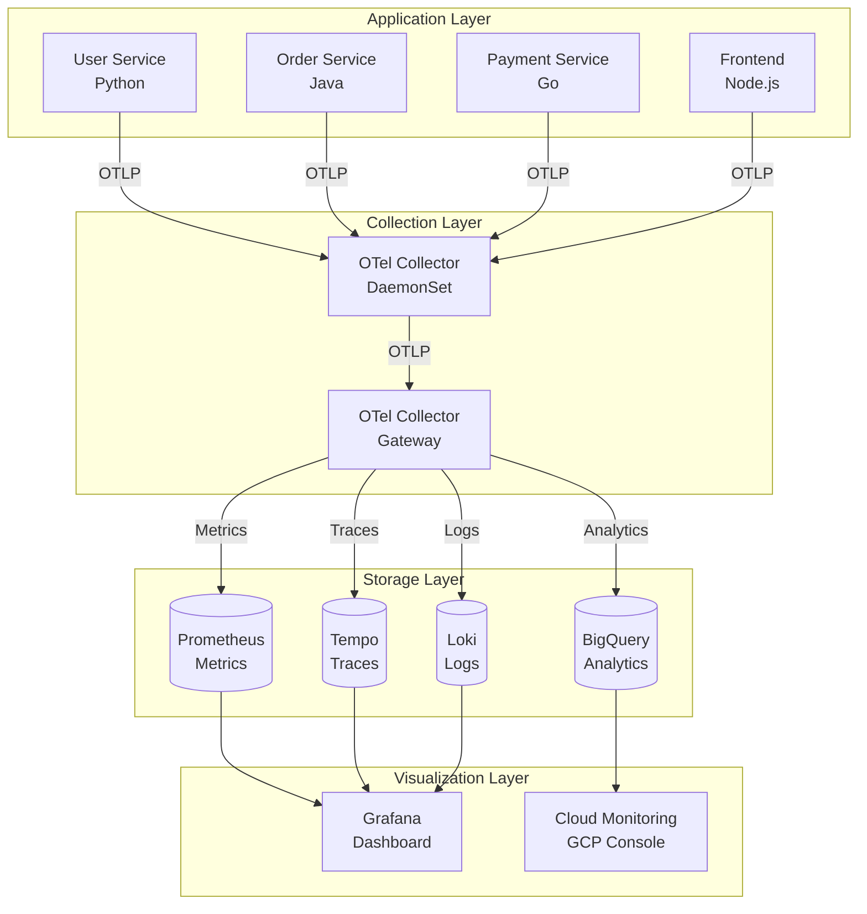
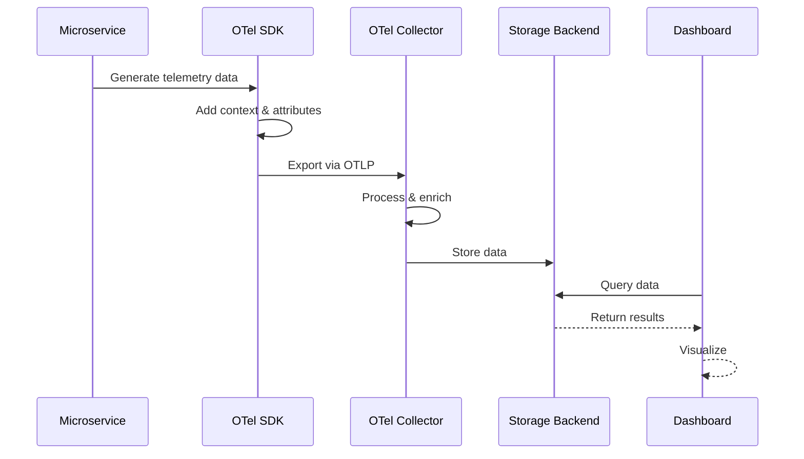
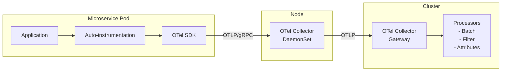
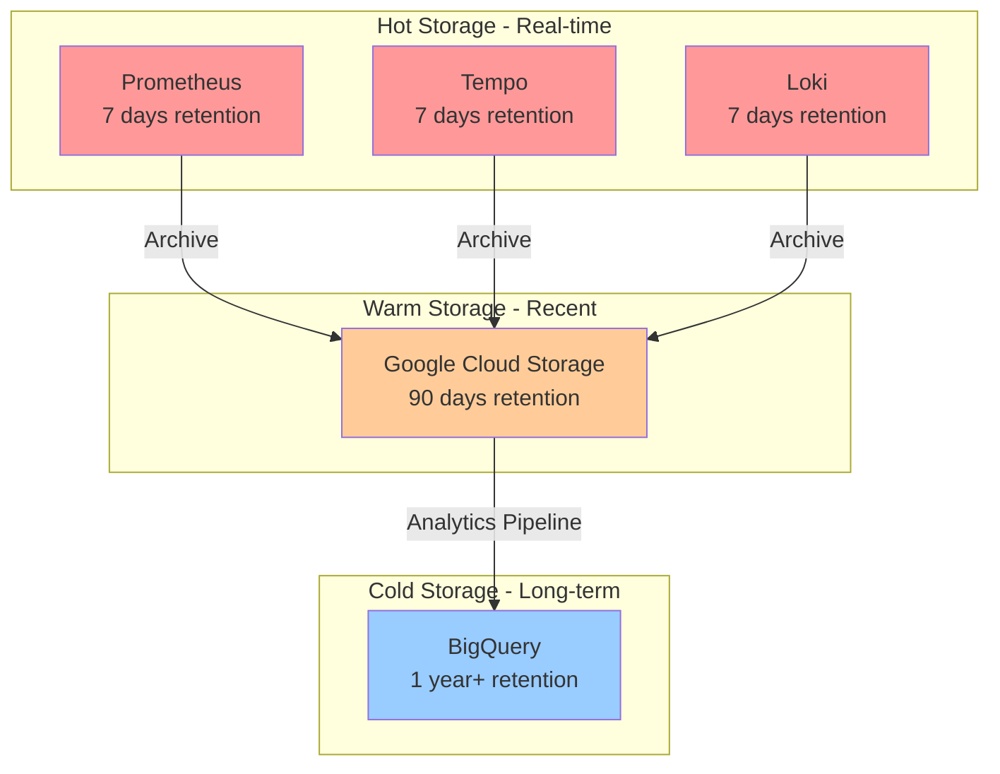

# Observability System Design with OpenTelemetry

## Executive Summary

This document outlines a comprehensive observability system design leveraging OpenTelemetry (OTel) for collecting, processing, and visualizing telemetry data across distributed microservices. The system supports metrics, traces, and logs from multiple programming languages, deployed on Google Cloud Platform (GCP) and Google Kubernetes Engine (GKE).

---

## Table of Contents

1. [System Overview](#system-overview)
2. [Architecture Design](#architecture-design)
3. [Component Details](#component-details)
4. [Data Collection Patterns](#data-collection-patterns)
5. [Storage & Aggregation](#storage--aggregation)
6. [Dashboard & Visualization](#dashboard--visualization)
7. [Implementation Examples](#implementation-examples)
8. [Deployment on GCP/GKE](#deployment-on-gcpgke)

---

## System Overview

### What is Observability?

Observability is the ability to understand the internal state of a system by examining its outputs. In modern distributed systems, observability relies on three pillars:

- **Metrics**: Numerical measurements over time (e.g., request rate, error rate, latency)
- **Traces**: Request flows through distributed systems
- **Logs**: Discrete event records with contextual information

### Why OpenTelemetry?

OpenTelemetry provides:
- **Vendor-neutral** standard for telemetry data
- **Multi-language support** (Java, Go, Python, Node.js, .NET, etc.)
- **Unified instrumentation** across metrics, traces, and logs
- **Flexible backends** (Prometheus, Jaeger, Grafana, etc.)

### Key Use Cases

1. **User Login Tracking**: Monitor authentication attempts, success/failure rates, login duration
2. **Page Viewing Analytics**: Track page views, user navigation patterns, session duration
3. **API Monitoring**: Measure API latency, throughput, error rates, and dependencies
4. **Error Tracking**: Collect and aggregate application errors with full context
5. **Business Metrics**: Custom metrics for KPIs (conversion rate, revenue, user engagement)

---

## Architecture Design

### High-Level Architecture



### Data Flow Architecture



### Component Architecture



---

## Component Details

### 1. OpenTelemetry SDK

The SDK is embedded in each application and provides:

- **Tracer**: Creates and manages spans for distributed tracing
- **Meter**: Records metrics (counters, gauges, histograms)
- **Logger**: Emits structured logs with trace context

**Configuration Example (Python):**

```python
from opentelemetry import trace, metrics
from opentelemetry.sdk.trace import TracerProvider
from opentelemetry.sdk.metrics import MeterProvider
from opentelemetry.exporter.otlp.proto.grpc.trace_exporter import OTLPSpanExporter
from opentelemetry.exporter.otlp.proto.grpc.metric_exporter import OTLPMetricExporter
from opentelemetry.sdk.trace.export import BatchSpanProcessor
from opentelemetry.sdk.metrics.export import PeriodicExportingMetricReader

# Setup Tracing
trace_provider = TracerProvider()
trace_provider.add_span_processor(
    BatchSpanProcessor(OTLPSpanExporter(endpoint="http://otel-collector:4317"))
)
trace.set_tracer_provider(trace_provider)

# Setup Metrics
metric_reader = PeriodicExportingMetricReader(
    OTLPMetricExporter(endpoint="http://otel-collector:4317")
)
meter_provider = MeterProvider(metric_readers=[metric_reader])
metrics.set_meter_provider(meter_provider)

# Get tracer and meter
tracer = trace.get_tracer(__name__)
meter = metrics.get_meter(__name__)
```

### 2. OpenTelemetry Collector

The collector receives, processes, and exports telemetry data.

**Key Components:**

- **Receivers**: Accept data in various formats (OTLP, Prometheus, Jaeger, etc.)
- **Processors**: Transform and enrich data (batch, filter, attributes)
- **Exporters**: Send data to backends (Prometheus, Tempo, Loki, etc.)

**Collector Configuration (YAML):**

```yaml
receivers:
  otlp:
    protocols:
      grpc:
        endpoint: 0.0.0.0:4317
      http:
        endpoint: 0.0.0.0:4318

processors:
  batch:
    timeout: 10s
    send_batch_size: 1024
  
  resource:
    attributes:
      - key: cluster.name
        value: production-gke
        action: insert
      - key: environment
        value: production
        action: insert
  
  attributes:
    actions:
      - key: http.user_agent
        action: delete
      - key: user.id
        action: hash
  
  filter/errors:
    error_mode: ignore
    traces:
      span:
        - 'attributes["http.status_code"] >= 400'

exporters:
  prometheus:
    endpoint: 0.0.0.0:8889
  
  otlp/tempo:
    endpoint: tempo:4317
    tls:
      insecure: true
  
  loki:
    endpoint: http://loki:3100/loki/api/v1/push
  
  googlecloud:
    project: my-gcp-project
    metric:
      prefix: custom.googleapis.com

service:
  pipelines:
    traces:
      receivers: [otlp]
      processors: [batch, resource, attributes]
      exporters: [otlp/tempo, googlecloud]
    
    metrics:
      receivers: [otlp]
      processors: [batch, resource]
      exporters: [prometheus, googlecloud]
    
    logs:
      receivers: [otlp]
      processors: [batch, resource, filter/errors]
      exporters: [loki, googlecloud]
```

### 3. Storage Backends

#### Prometheus (Metrics)
- Time-series database for metrics
- Efficient storage with data compression
- Powerful query language (PromQL)

#### Tempo (Traces)
- Distributed tracing backend
- Cost-effective object storage
- Deep integration with Grafana

#### Loki (Logs)
- Horizontally scalable log aggregation
- Labels-based indexing (inspired by Prometheus)
- Efficient log storage

#### BigQuery (Analytics)
- Long-term storage for analytics
- SQL-based querying
- Integration with GCP data ecosystem

---

## Data Collection Patterns

### Use Case 1: User Login Tracking

**Scenario**: Track user authentication events with success/failure metrics and distributed traces.

**Implementation (Python - Flask):**

```python
from flask import Flask, request, jsonify
from opentelemetry import trace, metrics
from opentelemetry.trace import Status, StatusCode
import time

app = Flask(__name__)
tracer = trace.get_tracer(__name__)
meter = metrics.get_meter(__name__)

# Create metrics
login_counter = meter.create_counter(
    name="user.login.attempts",
    description="Total login attempts",
    unit="1"
)

login_duration = meter.create_histogram(
    name="user.login.duration",
    description="Login operation duration",
    unit="ms"
)

@app.route('/api/login', methods=['POST'])
def login():
    with tracer.start_as_current_span("user.login") as span:
        start_time = time.time()
        
        # Extract user info
        data = request.json
        username = data.get('username')
        
        # Add span attributes
        span.set_attribute("user.name", username)
        span.set_attribute("http.method", request.method)
        span.set_attribute("http.url", request.url)
        
        try:
            # Authenticate user (simulated)
            if authenticate_user(username, data.get('password')):
                span.set_attribute("login.status", "success")
                span.set_status(Status(StatusCode.OK))
                
                # Record metrics
                login_counter.add(1, {
                    "status": "success",
                    "method": "password"
                })
                
                duration = (time.time() - start_time) * 1000
                login_duration.record(duration, {"status": "success"})
                
                return jsonify({"status": "success", "token": "abc123"}), 200
            else:
                span.set_attribute("login.status", "failed")
                span.set_attribute("login.failure_reason", "invalid_credentials")
                
                login_counter.add(1, {
                    "status": "failed",
                    "reason": "invalid_credentials"
                })
                
                duration = (time.time() - start_time) * 1000
                login_duration.record(duration, {"status": "failed"})
                
                return jsonify({"status": "failed"}), 401
                
        except Exception as e:
            span.record_exception(e)
            span.set_status(Status(StatusCode.ERROR, str(e)))
            
            login_counter.add(1, {
                "status": "error",
                "error_type": type(e).__name__
            })
            
            return jsonify({"status": "error"}), 500

def authenticate_user(username, password):
    # Simulate authentication logic
    with tracer.start_as_current_span("db.query.user") as span:
        span.set_attribute("db.system", "postgresql")
        span.set_attribute("db.operation", "SELECT")
        time.sleep(0.05)  # Simulate DB query
        return password == "secret123"
```

**Dashboard Query (PromQL):**

```promql
# Login success rate
sum(rate(user_login_attempts_total{status="success"}[5m])) / 
sum(rate(user_login_attempts_total[5m])) * 100

# P95 login duration
histogram_quantile(0.95, sum(rate(user_login_duration_bucket[5m])) by (le))

# Failed login attempts by reason
sum by (reason) (rate(user_login_attempts_total{status="failed"}[5m]))
```

### Use Case 2: Page View Tracking

**Scenario**: Track user navigation and page performance in a frontend application.

**Implementation (JavaScript - React):**

```javascript
import { WebTracerProvider } from '@opentelemetry/sdk-trace-web';
import { OTLPTraceExporter } from '@opentelemetry/exporter-trace-otlp-http';
import { BatchSpanProcessor } from '@opentelemetry/sdk-trace-base';
import { ZoneContextManager } from '@opentelemetry/context-zone';
import { registerInstrumentations } from '@opentelemetry/instrumentation';
import { DocumentLoadInstrumentation } from '@opentelemetry/instrumentation-document-load';
import { UserInteractionInstrumentation } from '@opentelemetry/instrumentation-user-interaction';

// Initialize provider
const provider = new WebTracerProvider();

// Configure exporter
provider.addSpanProcessor(
  new BatchSpanProcessor(
    new OTLPTraceExporter({
      url: 'https://otel-collector.example.com/v1/traces',
    })
  )
);

// Set context manager
provider.register({
  contextManager: new ZoneContextManager(),
});

// Register instrumentations
registerInstrumentations({
  instrumentations: [
    new DocumentLoadInstrumentation(),
    new UserInteractionInstrumentation({
      eventNames: ['click', 'submit'],
    }),
  ],
});

// Custom page view tracking
const tracer = provider.getTracer('frontend-app');

export function trackPageView(pageName, userId) {
  const span = tracer.startSpan('page.view', {
    attributes: {
      'page.name': pageName,
      'page.url': window.location.href,
      'user.id': userId,
      'browser.name': navigator.userAgent,
      'viewport.width': window.innerWidth,
      'viewport.height': window.innerHeight,
    },
  });

  // Track page load time
  window.addEventListener('load', () => {
    const loadTime = performance.timing.loadEventEnd - performance.timing.navigationStart;
    span.setAttribute('page.load_time', loadTime);
    span.end();
  });
}

// Track custom events
export function trackEvent(eventName, properties = {}) {
  const span = tracer.startSpan(`event.${eventName}`, {
    attributes: {
      'event.name': eventName,
      ...properties,
    },
  });
  span.end();
}

// Usage in React component
import React, { useEffect } from 'react';
import { trackPageView, trackEvent } from './telemetry';

function ProductPage({ productId, userId }) {
  useEffect(() => {
    trackPageView('product_detail', userId);
  }, [userId]);

  const handleAddToCart = () => {
    trackEvent('add_to_cart', {
      'product.id': productId,
      'user.id': userId,
    });
  };

  return (
    <div>
      <h1>Product Details</h1>
      <button onClick={handleAddToCart}>Add to Cart</button>
    </div>
  );
}
```

### Use Case 3: API Call Monitoring

**Scenario**: Monitor API performance, error rates, and dependencies.

**Implementation (Java - Spring Boot):**

```java
package com.example.observability;

import io.opentelemetry.api.GlobalOpenTelemetry;
import io.opentelemetry.api.metrics.LongCounter;
import io.opentelemetry.api.metrics.Meter;
import io.opentelemetry.api.trace.Span;
import io.opentelemetry.api.trace.StatusCode;
import io.opentelemetry.api.trace.Tracer;
import io.opentelemetry.context.Scope;
import org.springframework.web.bind.annotation.*;
import org.springframework.http.ResponseEntity;
import org.springframework.http.HttpStatus;

import java.time.Duration;
import java.time.Instant;

@RestController
@RequestMapping("/api/orders")
public class OrderController {

    private final Tracer tracer;
    private final Meter meter;
    private final LongCounter apiCallCounter;
    private final LongHistogram apiDurationHistogram;

    public OrderController() {
        this.tracer = GlobalOpenTelemetry.getTracer("order-service");
        this.meter = GlobalOpenTelemetry.getMeter("order-service");
        
        this.apiCallCounter = meter
            .counterBuilder("api.calls")
            .setDescription("Total API calls")
            .setUnit("1")
            .build();
            
        this.apiDurationHistogram = meter
            .histogramBuilder("api.duration")
            .setDescription("API call duration")
            .setUnit("ms")
            .build();
    }

    @PostMapping
    public ResponseEntity<Order> createOrder(@RequestBody OrderRequest request) {
        Instant startTime = Instant.now();
        Span span = tracer.spanBuilder("POST /api/orders")
            .setAttribute("http.method", "POST")
            .setAttribute("http.route", "/api/orders")
            .setAttribute("user.id", request.getUserId())
            .startSpan();

        try (Scope scope = span.makeCurrent()) {
            // Validate request
            validateOrder(request);
            
            // Process payment
            processPayment(request);
            
            // Create order in database
            Order order = saveOrder(request);
            
            // Record success metrics
            apiCallCounter.add(1, 
                Attributes.of(
                    AttributeKey.stringKey("endpoint"), "/api/orders",
                    AttributeKey.stringKey("method"), "POST",
                    AttributeKey.stringKey("status"), "success"
                )
            );
            
            long duration = Duration.between(startTime, Instant.now()).toMillis();
            apiDurationHistogram.record(duration,
                Attributes.of(
                    AttributeKey.stringKey("endpoint"), "/api/orders",
                    AttributeKey.stringKey("status"), "success"
                )
            );
            
            span.setStatus(StatusCode.OK);
            span.setAttribute("order.id", order.getId());
            span.setAttribute("order.total", order.getTotal());
            
            return ResponseEntity.ok(order);
            
        } catch (ValidationException e) {
            span.recordException(e);
            span.setStatus(StatusCode.ERROR, "Validation failed");
            
            apiCallCounter.add(1,
                Attributes.of(
                    AttributeKey.stringKey("endpoint"), "/api/orders",
                    AttributeKey.stringKey("method"), "POST",
                    AttributeKey.stringKey("status"), "validation_error"
                )
            );
            
            return ResponseEntity.badRequest().build();
            
        } catch (PaymentException e) {
            span.recordException(e);
            span.setStatus(StatusCode.ERROR, "Payment failed");
            
            apiCallCounter.add(1,
                Attributes.of(
                    AttributeKey.stringKey("endpoint"), "/api/orders",
                    AttributeKey.stringKey("method"), "POST",
                    AttributeKey.stringKey("status"), "payment_error"
                )
            );
            
            return ResponseEntity.status(HttpStatus.PAYMENT_REQUIRED).build();
            
        } finally {
            span.end();
        }
    }

    private void processPayment(OrderRequest request) {
        Span span = tracer.spanBuilder("payment.process")
            .setAttribute("payment.method", request.getPaymentMethod())
            .setAttribute("payment.amount", request.getTotal())
            .startSpan();
        
        try (Scope scope = span.makeCurrent()) {
            // Call payment service
            // ...
            span.setStatus(StatusCode.OK);
        } catch (Exception e) {
            span.recordException(e);
            span.setStatus(StatusCode.ERROR);
            throw new PaymentException("Payment processing failed", e);
        } finally {
            span.end();
        }
    }
}
```

### Use Case 4: Error Tracking

**Scenario**: Capture and aggregate application errors with full context.

**Implementation (Go):**

```go
package main

import (
    "context"
    "fmt"
    "log"
    "net/http"
    
    "go.opentelemetry.io/otel"
    "go.opentelemetry.io/otel/attribute"
    "go.opentelemetry.io/otel/codes"
    "go.opentelemetry.io/otel/exporters/otlp/otlptrace/otlptracegrpc"
    "go.opentelemetry.io/otel/sdk/resource"
    sdktrace "go.opentelemetry.io/otel/sdk/trace"
    semconv "go.opentelemetry.io/otel/semconv/v1.17.0"
    "go.opentelemetry.io/otel/trace"
)

var tracer trace.Tracer

func initTracer(ctx context.Context) func() {
    exporter, err := otlptracegrpc.New(ctx,
        otlptracegrpc.WithEndpoint("otel-collector:4317"),
        otlptracegrpc.WithInsecure(),
    )
    if err != nil {
        log.Fatal(err)
    }

    res := resource.NewWithAttributes(
        semconv.SchemaURL,
        semconv.ServiceName("payment-service"),
        semconv.ServiceVersion("1.0.0"),
        attribute.String("environment", "production"),
    )

    tp := sdktrace.NewTracerProvider(
        sdktrace.WithBatcher(exporter),
        sdktrace.WithResource(res),
    )
    
    otel.SetTracerProvider(tp)
    tracer = tp.Tracer("payment-service")

    return func() {
        _ = tp.Shutdown(ctx)
    }
}

type PaymentService struct {
    tracer trace.Tracer
}

func (s *PaymentService) ProcessPayment(ctx context.Context, paymentID string, amount float64) error {
    ctx, span := s.tracer.Start(ctx, "PaymentService.ProcessPayment",
        trace.WithAttributes(
            attribute.String("payment.id", paymentID),
            attribute.Float64("payment.amount", amount),
        ),
    )
    defer span.End()

    // Validate payment
    if err := s.validatePayment(ctx, amount); err != nil {
        span.RecordError(err)
        span.SetStatus(codes.Error, "Validation failed")
        span.SetAttributes(
            attribute.String("error.type", "validation_error"),
            attribute.String("error.message", err.Error()),
        )
        return fmt.Errorf("validation failed: %w", err)
    }

    // Call external payment gateway
    if err := s.callPaymentGateway(ctx, paymentID, amount); err != nil {
        span.RecordError(err)
        span.SetStatus(codes.Error, "Gateway error")
        span.SetAttributes(
            attribute.String("error.type", "gateway_error"),
            attribute.String("error.message", err.Error()),
            attribute.Bool("error.retryable", true),
        )
        return fmt.Errorf("gateway error: %w", err)
    }

    // Update database
    if err := s.updateDatabase(ctx, paymentID); err != nil {
        span.RecordError(err)
        span.SetStatus(codes.Error, "Database error")
        span.SetAttributes(
            attribute.String("error.type", "database_error"),
            attribute.String("error.message", err.Error()),
            attribute.Bool("error.critical", true),
        )
        return fmt.Errorf("database error: %w", err)
    }

    span.SetStatus(codes.Ok, "Payment processed successfully")
    span.SetAttributes(attribute.String("payment.status", "completed"))
    
    return nil
}

func (s *PaymentService) validatePayment(ctx context.Context, amount float64) error {
    _, span := s.tracer.Start(ctx, "validatePayment")
    defer span.End()

    if amount <= 0 {
        return fmt.Errorf("invalid amount: %.2f", amount)
    }
    if amount > 10000 {
        return fmt.Errorf("amount exceeds limit: %.2f", amount)
    }
    return nil
}

func (s *PaymentService) callPaymentGateway(ctx context.Context, paymentID string, amount float64) error {
    _, span := s.tracer.Start(ctx, "callPaymentGateway",
        trace.WithAttributes(
            attribute.String("gateway.name", "stripe"),
            attribute.String("gateway.endpoint", "https://api.stripe.com"),
        ),
    )
    defer span.End()

    // Simulate gateway call
    // In real scenario, this would make HTTP request
    
    return nil
}

func (s *PaymentService) updateDatabase(ctx context.Context, paymentID string) error {
    _, span := s.tracer.Start(ctx, "updateDatabase",
        trace.WithAttributes(
            attribute.String("db.system", "postgresql"),
            attribute.String("db.operation", "UPDATE"),
        ),
    )
    defer span.End()

    // Simulate database update
    
    return nil
}

func main() {
    ctx := context.Background()
    shutdown := initTracer(ctx)
    defer shutdown()

    service := &PaymentService{tracer: tracer}

    http.HandleFunc("/process-payment", func(w http.ResponseWriter, r *http.Request) {
        ctx := r.Context()
        
        // Extract payment details
        paymentID := r.URL.Query().Get("id")
        amount := 99.99 // Parse from request

        if err := service.ProcessPayment(ctx, paymentID, amount); err != nil {
            http.Error(w, err.Error(), http.StatusInternalServerError)
            return
        }

        w.WriteHeader(http.StatusOK)
        fmt.Fprintf(w, "Payment processed")
    })

    log.Fatal(http.ListenAndServe(":8080", nil))
}
```

---

## Storage & Aggregation

### Storage Strategy



### Data Aggregation Pipeline

**BigQuery Schema for Trace Analytics:**

```sql
CREATE TABLE `observability.traces` (
  trace_id STRING NOT NULL,
  span_id STRING NOT NULL,
  parent_span_id STRING,
  trace_state STRING,
  name STRING NOT NULL,
  kind STRING,
  start_time TIMESTAMP NOT NULL,
  end_time TIMESTAMP NOT NULL,
  duration_ms FLOAT64,
  status_code STRING,
  status_message STRING,
  
  -- Resource attributes
  service_name STRING,
  service_version STRING,
  deployment_environment STRING,
  
  -- Span attributes
  http_method STRING,
  http_status_code INT64,
  http_url STRING,
  http_target STRING,
  user_id STRING,
  
  -- Custom business attributes
  order_id STRING,
  payment_method STRING,
  error_type STRING,
  
  attributes ARRAY<STRUCT<key STRING, value STRING>>,
  events ARRAY<STRUCT<
    timestamp TIMESTAMP,
    name STRING,
    attributes ARRAY<STRUCT<key STRING, value STRING>>
  >>
)
PARTITION BY DATE(start_time)
CLUSTER BY service_name, name;

-- Example query: API latency analysis
SELECT
  service_name,
  name AS endpoint,
  COUNT(*) AS request_count,
  APPROX_QUANTILES(duration_ms, 100)[OFFSET(50)] AS p50_latency,
  APPROX_QUANTILES(duration_ms, 100)[OFFSET(95)] AS p95_latency,
  APPROX_QUANTILES(duration_ms, 100)[OFFSET(99)] AS p99_latency,
  COUNTIF(status_code = 'ERROR') AS error_count,
  COUNTIF(status_code = 'ERROR') / COUNT(*) * 100 AS error_rate
FROM `observability.traces`
WHERE DATE(start_time) >= DATE_SUB(CURRENT_DATE(), INTERVAL 7 DAY)
  AND kind = 'SERVER'
GROUP BY service_name, endpoint
ORDER BY request_count DESC
LIMIT 20;

-- Example query: User journey analysis
SELECT
  user_id,
  ARRAY_AGG(
    STRUCT(
      start_time,
      name AS action,
      duration_ms
    )
    ORDER BY start_time
  ) AS user_journey,
  COUNT(*) AS total_actions,
  SUM(duration_ms) AS total_duration
FROM `observability.traces`
WHERE user_id IS NOT NULL
  AND DATE(start_time) = CURRENT_DATE()
GROUP BY user_id
HAVING total_actions > 5
ORDER BY total_duration DESC
LIMIT 100;
```

### Metrics Aggregation Rules

**Prometheus Recording Rules:**

```yaml
groups:
  - name: api_metrics
    interval: 30s
    rules:
      # Request rate by service and endpoint
      - record: api:request_rate:5m
        expr: sum(rate(api_calls_total[5m])) by (service, endpoint)
      
      # Error rate by service
      - record: api:error_rate:5m
        expr: |
          sum(rate(api_calls_total{status=~"error|failed"}[5m])) by (service)
          /
          sum(rate(api_calls_total[5m])) by (service)
      
      # Latency percentiles
      - record: api:latency:p95:5m
        expr: |
          histogram_quantile(0.95,
            sum(rate(api_duration_bucket[5m])) by (le, service, endpoint)
          )
      
      - record: api:latency:p99:5m
        expr: |
          histogram_quantile(0.99,
            sum(rate(api_duration_bucket[5m])) by (le, service, endpoint)
          )

  - name: business_metrics
    interval: 1m
    rules:
      # Login success rate
      - record: business:login_success_rate:5m
        expr: |
          sum(rate(user_login_attempts_total{status="success"}[5m]))
          /
          sum(rate(user_login_attempts_total[5m]))
      
      # Page views by page
      - record: business:page_views:5m
        expr: sum(rate(page_view_total[5m])) by (page_name)
      
      # Order conversion rate
      - record: business:order_conversion_rate:1h
        expr: |
          sum(rate(order_created_total[1h]))
          /
          sum(rate(page_view_total{page_name="checkout"}[1h]))

  - name: slo_metrics
    interval: 30s
    rules:
      # Availability SLI
      - record: slo:availability:1h
        expr: |
          1 - (
            sum(rate(api_calls_total{status=~"error|5.."}[1h]))
            /
            sum(rate(api_calls_total[1h]))
          )
      
      # Latency SLI (% of requests under 500ms)
      - record: slo:latency_under_500ms:1h
        expr: |
          sum(rate(api_duration_bucket{le="500"}[1h]))
          /
          sum(rate(api_duration_count[1h]))
```

---

## Dashboard & Visualization

### Grafana Dashboard Configuration

**Dashboard JSON Structure:**

```json
{
  "dashboard": {
    "title": "Microservices Observability",
    "tags": ["opentelemetry", "microservices"],
    "timezone": "browser",
    "panels": [
      {
        "id": 1,
        "title": "Request Rate (requests/sec)",
        "type": "timeseries",
        "targets": [
          {
            "expr": "sum(rate(api_calls_total[5m])) by (service)",
            "legendFormat": "{{service}}"
          }
        ],
        "fieldConfig": {
          "defaults": {
            "unit": "reqps",
            "thresholds": {
              "mode": "absolute",
              "steps": [
                {"value": 0, "color": "green"},
                {"value": 100, "color": "yellow"},
                {"value": 500, "color": "red"}
              ]
            }
          }
        }
      },
      {
        "id": 2,
        "title": "Error Rate (%)",
        "type": "gauge",
        "targets": [
          {
            "expr": "api:error_rate:5m * 100",
            "legendFormat": "{{service}}"
          }
        ],
        "options": {
          "thresholds": {
            "mode": "absolute",
            "steps": [
              {"value": 0, "color": "green"},
              {"value": 1, "color": "yellow"},
              {"value": 5, "color": "red"}
            ]
          }
        }
      },
      {
        "id": 3,
        "title": "Latency Percentiles (ms)",
        "type": "timeseries",
        "targets": [
          {
            "expr": "api:latency:p50:5m",
            "legendFormat": "P50"
          },
          {
            "expr": "api:latency:p95:5m",
            "legendFormat": "P95"
          },
          {
            "expr": "api:latency:p99:5m",
            "legendFormat": "P99"
          }
        ]
      },
      {
        "id": 4,
        "title": "Service Dependencies",
        "type": "nodeGraph",
        "targets": [
          {
            "queryType": "traceql",
            "query": "{ service.name != \"\" }"
          }
        ]
      },
      {
        "id": 5,
        "title": "Top Errors",
        "type": "table",
        "targets": [
          {
            "expr": "topk(10, sum by (error_type, service) (rate(api_calls_total{status=\"error\"}[1h])))",
            "format": "table"
          }
        ]
      }
    ]
  }
}
```

### Dashboard Examples

#### 1. Service Health Dashboard

**Key Metrics:**
- Request rate (RPS)
- Error rate (%)
- Latency percentiles (P50, P95, P99)
- Saturation (CPU, Memory)

**PromQL Queries:**

```promql
# Golden Signals

# 1. Latency
histogram_quantile(0.95, 
  sum(rate(api_duration_bucket{service="user-service"}[5m])) by (le, endpoint)
)

# 2. Traffic
sum(rate(api_calls_total{service="user-service"}[5m])) by (endpoint)

# 3. Errors
sum(rate(api_calls_total{service="user-service", status=~"error|5.."}[5m])) 
/ 
sum(rate(api_calls_total{service="user-service"}[5m]))

# 4. Saturation
avg(container_cpu_usage_seconds_total{pod=~"user-service-.*"}) by (pod)
```

#### 2. Business Metrics Dashboard

**Key Metrics:**
- User registrations
- Login success rate
- Page views by page
- Order conversion funnel
- Revenue metrics

**Example Queries:**

```promql
# User registrations (last 24h)
increase(user_registration_total[24h])

# Login success rate
sum(rate(user_login_attempts_total{status="success"}[1h])) 
/ 
sum(rate(user_login_attempts_total[1h])) * 100

# Conversion funnel
sum(rate(page_view_total{page_name="product_detail"}[1h])) # Step 1
sum(rate(page_view_total{page_name="cart"}[1h]))           # Step 2
sum(rate(page_view_total{page_name="checkout"}[1h]))       # Step 3
sum(rate(order_created_total[1h]))                         # Step 4

# Average order value
sum(rate(order_total_amount[1h])) / sum(rate(order_created_total[1h]))
```

#### 3. Error Analysis Dashboard

**TraceQL Queries (Tempo):**

```traceql
# Find all traces with errors
{ status = error }

# Find slow traces (>5s)
{ duration > 5s }

# Find traces for specific user
{ resource.user.id = "user123" }

# Find traces with database errors
{ span.error.type = "database_error" }

# Complex query: Failed payments for high-value orders
{
  resource.service.name = "payment-service" 
  && status = error 
  && span.payment.amount > 1000
}
```

**Loki Log Queries:**

```logql
# All error logs
{service="user-service"} |= "ERROR"

# Errors with specific message
{service="payment-service"} |= "payment failed" | json

# Error rate by service
sum(rate({level="error"}[5m])) by (service)

# Errors for specific trace
{trace_id="abc123def456"} | json

# Pattern detection for errors
{service="order-service"} 
  |= "ERROR" 
  | pattern `<timestamp> <level> <message>`
  | line_format "{{.message}}"
```

### Alerting Rules

**Prometheus Alert Rules:**

```yaml
groups:
  - name: service_alerts
    rules:
      # High error rate
      - alert: HighErrorRate
        expr: api:error_rate:5m > 0.05
        for: 5m
        labels:
          severity: critical
          team: platform
        annotations:
          summary: "High error rate on {{ $labels.service }}"
          description: "Error rate is {{ $value | humanizePercentage }} (threshold: 5%)"
          runbook_url: "https://wiki.example.com/runbooks/high-error-rate"

      # High latency
      - alert: HighLatency
        expr: api:latency:p95:5m > 1000
        for: 10m
        labels:
          severity: warning
          team: platform
        annotations:
          summary: "High latency on {{ $labels.service }}/{{ $labels.endpoint }}"
          description: "P95 latency is {{ $value }}ms (threshold: 1000ms)"

      # Service down
      - alert: ServiceDown
        expr: up{job=~".*-service"} == 0
        for: 1m
        labels:
          severity: critical
          team: platform
        annotations:
          summary: "Service {{ $labels.job }} is down"
          description: "{{ $labels.instance }} has been down for more than 1 minute"

      # Low availability SLO burn
      - alert: SLOBurnRateHigh
        expr: |
          (
            slo:availability:1h < 0.999
            and
            slo:availability:5m < 0.999
          )
        labels:
          severity: critical
          team: platform
        annotations:
          summary: "SLO burn rate is high"
          description: "Availability SLO is {{ $value | humanizePercentage }} (target: 99.9%)"

  - name: business_alerts
    rules:
      # Low login success rate
      - alert: LowLoginSuccessRate
        expr: business:login_success_rate:5m < 0.90
        for: 15m
        labels:
          severity: warning
          team: identity
        annotations:
          summary: "Login success rate is low"
          description: "Success rate is {{ $value | humanizePercentage }} (threshold: 90%)"

      # Payment failures spike
      - alert: PaymentFailuresSpike
        expr: |
          (
            rate(api_calls_total{service="payment-service", status="error"}[5m])
            /
            rate(api_calls_total{service="payment-service"}[5m]) offset 1h
          ) > 2
        for: 5m
        labels:
          severity: critical
          team: payments
        annotations:
          summary: "Payment failures increased significantly"
          description: "Payment error rate is 2x higher than 1 hour ago"
```

---

## Deployment on GCP/GKE

### GKE Cluster Setup

**Terraform Configuration:**

```hcl
# terraform/gke-cluster.tf

resource "google_container_cluster" "observability_cluster" {
  name     = "observability-cluster"
  location = "us-central1"
  
  # We can't create a cluster with no node pool defined, but we want to only use
  # separately managed node pools. So we create the smallest possible default
  # node pool and immediately delete it.
  remove_default_node_pool = true
  initial_node_count       = 1

  # Enable Workload Identity
  workload_identity_config {
    workload_pool = "${var.project_id}.svc.id.goog"
  }

  # Enable GKE monitoring
  monitoring_config {
    enable_components = ["SYSTEM_COMPONENTS", "WORKLOADS"]
    
    managed_prometheus {
      enabled = true
    }
  }

  # Network configuration
  network    = google_compute_network.vpc.name
  subnetwork = google_compute_subnetwork.subnet.name

  ip_allocation_policy {
    cluster_secondary_range_name  = "pod-range"
    services_secondary_range_name = "service-range"
  }
}

resource "google_container_node_pool" "observability_nodes" {
  name       = "observability-node-pool"
  location   = "us-central1"
  cluster    = google_container_cluster.observability_cluster.name
  node_count = 3

  node_config {
    preemptible  = false
    machine_type = "n1-standard-4"

    # Google recommends custom service accounts with minimal permissions
    service_account = google_service_account.gke_sa.email
    oauth_scopes = [
      "https://www.googleapis.com/auth/cloud-platform"
    ]

    labels = {
      environment = "production"
      team        = "platform"
    }

    metadata = {
      disable-legacy-endpoints = "true"
    }

    workload_metadata_config {
      mode = "GKE_METADATA"
    }
  }

  autoscaling {
    min_node_count = 3
    max_node_count = 10
  }

  management {
    auto_repair  = true
    auto_upgrade = true
  }
}

# Service account for GKE nodes
resource "google_service_account" "gke_sa" {
  account_id   = "gke-observability-sa"
  display_name = "GKE Observability Service Account"
}

# Grant necessary permissions
resource "google_project_iam_member" "gke_sa_roles" {
  for_each = toset([
    "roles/logging.logWriter",
    "roles/monitoring.metricWriter",
    "roles/cloudtrace.agent",
  ])

  project = var.project_id
  role    = each.key
  member  = "serviceAccount:${google_service_account.gke_sa.email}"
}
```

### OpenTelemetry Collector Deployment

**DaemonSet Configuration (per-node collector):**

```yaml
# k8s/otel-collector-daemonset.yaml

apiVersion: v1
kind: ConfigMap
metadata:
  name: otel-collector-config
  namespace: observability
data:
  config.yaml: |
    receivers:
      otlp:
        protocols:
          grpc:
            endpoint: 0.0.0.0:4317
          http:
            endpoint: 0.0.0.0:4318
      
      # Collect host metrics
      hostmetrics:
        collection_interval: 30s
        scrapers:
          cpu:
          memory:
          disk:
          network:
          filesystem:
      
      # Kubernetes metrics
      kubeletstats:
        collection_interval: 30s
        auth_type: "serviceAccount"
        endpoint: "https://${K8S_NODE_NAME}:10250"
        insecure_skip_verify: true

    processors:
      batch:
        timeout: 10s
        send_batch_size: 1024
      
      resource:
        attributes:
          - key: cluster.name
            value: observability-cluster
            action: insert
          - key: k8s.node.name
            from_attribute: k8s.node.name
            action: insert
      
      resourcedetection:
        detectors: [gcp, env, system]
        timeout: 5s
      
      k8sattributes:
        auth_type: "serviceAccount"
        passthrough: false
        filter:
          node_from_env_var: K8S_NODE_NAME
        extract:
          metadata:
            - k8s.namespace.name
            - k8s.deployment.name
            - k8s.statefulset.name
            - k8s.daemonset.name
            - k8s.pod.name
            - k8s.pod.uid
            - k8s.node.name
            - k8s.container.name
        pod_association:
          - sources:
              - from: resource_attribute
                name: k8s.pod.ip
          - sources:
              - from: resource_attribute
                name: k8s.pod.uid
          - sources:
              - from: connection

    exporters:
      # Forward to gateway collector
      otlp:
        endpoint: otel-collector-gateway:4317
        tls:
          insecure: true
      
      # Direct export to Google Cloud
      googlecloud:
        project: ${GCP_PROJECT}
        metric:
          prefix: custom.googleapis.com
        log:
          default_log_name: opentelemetry.io/collector-exported-log

    service:
      pipelines:
        traces:
          receivers: [otlp]
          processors: [k8sattributes, resource, resourcedetection, batch]
          exporters: [otlp, googlecloud]
        
        metrics:
          receivers: [otlp, hostmetrics, kubeletstats]
          processors: [k8sattributes, resource, resourcedetection, batch]
          exporters: [otlp, googlecloud]
        
        logs:
          receivers: [otlp]
          processors: [k8sattributes, resource, resourcedetection, batch]
          exporters: [otlp, googlecloud]

---
apiVersion: apps/v1
kind: DaemonSet
metadata:
  name: otel-collector
  namespace: observability
spec:
  selector:
    matchLabels:
      app: otel-collector
  template:
    metadata:
      labels:
        app: otel-collector
    spec:
      serviceAccountName: otel-collector
      containers:
      - name: otel-collector
        image: otel/opentelemetry-collector-contrib:0.91.0
        args:
          - --config=/conf/config.yaml
        env:
          - name: K8S_NODE_NAME
            valueFrom:
              fieldRef:
                fieldPath: spec.nodeName
          - name: GCP_PROJECT
            value: "your-gcp-project"
          - name: GOGC
            value: "80"
        resources:
          requests:
            memory: 256Mi
            cpu: 200m
          limits:
            memory: 512Mi
            cpu: 500m
        ports:
          - containerPort: 4317
            name: otlp-grpc
            protocol: TCP
          - containerPort: 4318
            name: otlp-http
            protocol: TCP
        volumeMounts:
          - name: config
            mountPath: /conf
      volumes:
        - name: config
          configMap:
            name: otel-collector-config
      tolerations:
        - effect: NoSchedule
          operator: Exists

---
apiVersion: v1
kind: Service
metadata:
  name: otel-collector
  namespace: observability
spec:
  type: ClusterIP
  selector:
    app: otel-collector
  ports:
    - name: otlp-grpc
      port: 4317
      targetPort: 4317
      protocol: TCP
    - name: otlp-http
      port: 4318
      targetPort: 4318
      protocol: TCP
```

**Gateway Deployment (cluster-level aggregation):**

```yaml
# k8s/otel-collector-gateway.yaml

apiVersion: v1
kind: ConfigMap
metadata:
  name: otel-collector-gateway-config
  namespace: observability
data:
  config.yaml: |
    receivers:
      otlp:
        protocols:
          grpc:
            endpoint: 0.0.0.0:4317
          http:
            endpoint: 0.0.0.0:4318

    processors:
      batch:
        timeout: 10s
        send_batch_size: 2048
      
      memory_limiter:
        check_interval: 1s
        limit_mib: 2000
        spike_limit_mib: 400
      
      # Tail sampling for traces (keep errors and slow requests)
      tail_sampling:
        policies:
          - name: error-traces
            type: status_code
            status_code:
              status_codes: [ERROR]
          - name: slow-traces
            type: latency
            latency:
              threshold_ms: 1000
          - name: sample-successful
            type: probabilistic
            probabilistic:
              sampling_percentage: 10

    exporters:
      prometheus:
        endpoint: 0.0.0.0:8889
        namespace: otel
        const_labels:
          cluster: observability-cluster
      
      otlp/tempo:
        endpoint: tempo:4317
        tls:
          insecure: true
      
      loki:
        endpoint: http://loki:3100/loki/api/v1/push
        labels:
          resource:
            service.name: "service_name"
            k8s.namespace.name: "namespace"
      
      googlecloud:
        project: ${GCP_PROJECT}
        metric:
          prefix: custom.googleapis.com
        trace:
          endpoint: cloudtrace.googleapis.com:443
      
      # Export to BigQuery for long-term analytics
      googlebigquery:
        project: ${GCP_PROJECT}
        dataset: observability
        table: traces

    service:
      pipelines:
        traces:
          receivers: [otlp]
          processors: [memory_limiter, batch, tail_sampling]
          exporters: [otlp/tempo, googlecloud, googlebigquery]
        
        metrics:
          receivers: [otlp]
          processors: [memory_limiter, batch]
          exporters: [prometheus, googlecloud]
        
        logs:
          receivers: [otlp]
          processors: [memory_limiter, batch]
          exporters: [loki, googlecloud]

---
apiVersion: apps/v1
kind: Deployment
metadata:
  name: otel-collector-gateway
  namespace: observability
spec:
  replicas: 3
  selector:
    matchLabels:
      app: otel-collector-gateway
  template:
    metadata:
      labels:
        app: otel-collector-gateway
    spec:
      serviceAccountName: otel-collector-gateway
      containers:
      - name: otel-collector
        image: otel/opentelemetry-collector-contrib:0.91.0
        args:
          - --config=/conf/config.yaml
        env:
          - name: GCP_PROJECT
            value: "your-gcp-project"
        resources:
          requests:
            memory: 1Gi
            cpu: 500m
          limits:
            memory: 2Gi
            cpu: 1000m
        ports:
          - containerPort: 4317
            name: otlp-grpc
          - containerPort: 4318
            name: otlp-http
          - containerPort: 8889
            name: prometheus
        volumeMounts:
          - name: config
            mountPath: /conf
      volumes:
        - name: config
          configMap:
            name: otel-collector-gateway-config

---
apiVersion: v1
kind: Service
metadata:
  name: otel-collector-gateway
  namespace: observability
spec:
  type: ClusterIP
  selector:
    app: otel-collector-gateway
  ports:
    - name: otlp-grpc
      port: 4317
      targetPort: 4317
    - name: otlp-http
      port: 4318
      targetPort: 4318
    - name: prometheus
      port: 8889
      targetPort: 8889
```

### Storage Backend Deployment

**Prometheus Deployment:**

```yaml
# k8s/prometheus.yaml

apiVersion: v1
kind: ConfigMap
metadata:
  name: prometheus-config
  namespace: observability
data:
  prometheus.yml: |
    global:
      scrape_interval: 30s
      evaluation_interval: 30s
      external_labels:
        cluster: observability-cluster
        environment: production

    # Load recording and alerting rules
    rule_files:
      - /etc/prometheus/rules/*.yml

    # Scrape configurations
    scrape_configs:
      - job_name: 'otel-collector'
        static_configs:
          - targets: ['otel-collector-gateway:8889']

      - job_name: 'kubernetes-apiservers'
        kubernetes_sd_configs:
          - role: endpoints
        scheme: https
        tls_config:
          ca_file: /var/run/secrets/kubernetes.io/serviceaccount/ca.crt
        bearer_token_file: /var/run/secrets/kubernetes.io/serviceaccount/token
        relabel_configs:
          - source_labels: [__meta_kubernetes_namespace, __meta_kubernetes_service_name, __meta_kubernetes_endpoint_port_name]
            action: keep
            regex: default;kubernetes;https

      - job_name: 'kubernetes-pods'
        kubernetes_sd_configs:
          - role: pod
        relabel_configs:
          - source_labels: [__meta_kubernetes_pod_annotation_prometheus_io_scrape]
            action: keep
            regex: true
          - source_labels: [__meta_kubernetes_pod_annotation_prometheus_io_path]
            action: replace
            target_label: __metrics_path__
            regex: (.+)
          - source_labels: [__address__, __meta_kubernetes_pod_annotation_prometheus_io_port]
            action: replace
            regex: ([^:]+)(?::\d+)?;(\d+)
            replacement: $1:$2
            target_label: __address__

    # Remote write to Google Cloud Monitoring
    remote_write:
      - url: https://monitoring.googleapis.com/v1/projects/your-gcp-project/timeSeries
        queue_config:
          capacity: 10000
          max_shards: 200
          max_samples_per_send: 500

---
apiVersion: apps/v1
kind: StatefulSet
metadata:
  name: prometheus
  namespace: observability
spec:
  serviceName: prometheus
  replicas: 2
  selector:
    matchLabels:
      app: prometheus
  template:
    metadata:
      labels:
        app: prometheus
    spec:
      serviceAccountName: prometheus
      containers:
      - name: prometheus
        image: prom/prometheus:v2.48.0
        args:
          - '--config.file=/etc/prometheus/prometheus.yml'
          - '--storage.tsdb.path=/prometheus'
          - '--storage.tsdb.retention.time=7d'
          - '--web.enable-lifecycle'
          - '--web.enable-admin-api'
        ports:
          - containerPort: 9090
            name: http
        resources:
          requests:
            memory: 2Gi
            cpu: 1000m
          limits:
            memory: 4Gi
            cpu: 2000m
        volumeMounts:
          - name: config
            mountPath: /etc/prometheus
          - name: storage
            mountPath: /prometheus
      volumes:
        - name: config
          configMap:
            name: prometheus-config
  volumeClaimTemplates:
    - metadata:
        name: storage
      spec:
        accessModes: ["ReadWriteOnce"]
        storageClassName: "standard-rwo"
        resources:
          requests:
            storage: 100Gi

---
apiVersion: v1
kind: Service
metadata:
  name: prometheus
  namespace: observability
spec:
  selector:
    app: prometheus
  ports:
    - port: 9090
      targetPort: 9090
```

**Grafana Deployment:**

```yaml
# k8s/grafana.yaml

apiVersion: v1
kind: ConfigMap
metadata:
  name: grafana-datasources
  namespace: observability
data:
  datasources.yaml: |
    apiVersion: 1
    datasources:
      - name: Prometheus
        type: prometheus
        access: proxy
        url: http://prometheus:9090
        isDefault: true
        jsonData:
          timeInterval: 30s

      - name: Tempo
        type: tempo
        access: proxy
        url: http://tempo:3200
        jsonData:
          tracesToLogsV2:
            datasourceUid: loki
            spanStartTimeShift: '-1h'
            spanEndTimeShift: '1h'
            filterByTraceID: true
            filterBySpanID: false
          serviceMap:
            datasourceUid: prometheus
          nodeGraph:
            enabled: true

      - name: Loki
        type: loki
        access: proxy
        url: http://loki:3100
        jsonData:
          derivedFields:
            - datasourceUid: tempo
              matcherRegex: "trace_id=(\\w+)"
              name: TraceID
              url: "${__value.raw}"

      - name: Google Cloud Monitoring
        type: stackdriver
        access: proxy
        jsonData:
          authenticationType: gce
          defaultProject: your-gcp-project

---
apiVersion: apps/v1
kind: Deployment
metadata:
  name: grafana
  namespace: observability
spec:
  replicas: 1
  selector:
    matchLabels:
      app: grafana
  template:
    metadata:
      labels:
        app: grafana
    spec:
      serviceAccountName: grafana
      containers:
      - name: grafana
        image: grafana/grafana:10.2.2
        env:
          - name: GF_SECURITY_ADMIN_PASSWORD
            valueFrom:
              secretKeyRef:
                name: grafana-secrets
                key: admin-password
          - name: GF_INSTALL_PLUGINS
            value: grafana-piechart-panel,grafana-clock-panel
        ports:
          - containerPort: 3000
            name: http
        resources:
          requests:
            memory: 512Mi
            cpu: 250m
          limits:
            memory: 1Gi
            cpu: 500m
        volumeMounts:
          - name: datasources
            mountPath: /etc/grafana/provisioning/datasources
          - name: storage
            mountPath: /var/lib/grafana
      volumes:
        - name: datasources
          configMap:
            name: grafana-datasources
        - name: storage
          persistentVolumeClaim:
            claimName: grafana-storage

---
apiVersion: v1
kind: Service
metadata:
  name: grafana
  namespace: observability
spec:
  type: LoadBalancer
  selector:
    app: grafana
  ports:
    - port: 80
      targetPort: 3000
```

### Application Auto-Instrumentation

**OpenTelemetry Operator for Auto-Instrumentation:**

```yaml
# k8s/otel-operator.yaml

apiVersion: v1
kind: Namespace
metadata:
  name: opentelemetry-operator-system

---
# Install via Helm
# helm repo add open-telemetry https://open-telemetry.github.io/opentelemetry-helm-charts
# helm install opentelemetry-operator open-telemetry/opentelemetry-operator \
#   --namespace opentelemetry-operator-system

---
# Auto-instrumentation configuration for different languages
apiVersion: opentelemetry.io/v1alpha1
kind: Instrumentation
metadata:
  name: default-instrumentation
  namespace: default
spec:
  exporter:
    endpoint: http://otel-collector.observability:4317
  
  propagators:
    - tracecontext
    - baggage
    - b3
  
  sampler:
    type: parentbased_traceidratio
    argument: "0.25"  # Sample 25% of traces
  
  python:
    image: ghcr.io/open-telemetry/opentelemetry-operator/autoinstrumentation-python:latest
    env:
      - name: OTEL_EXPORTER_OTLP_ENDPOINT
        value: http://otel-collector.observability:4317
      - name: OTEL_METRICS_EXPORTER
        value: otlp
      - name: OTEL_LOGS_EXPORTER
        value: otlp
  
  java:
    image: ghcr.io/open-telemetry/opentelemetry-operator/autoinstrumentation-java:latest
    env:
      - name: OTEL_EXPORTER_OTLP_ENDPOINT
        value: http://otel-collector.observability:4317
  
  nodejs:
    image: ghcr.io/open-telemetry/opentelemetry-operator/autoinstrumentation-nodejs:latest
    env:
      - name: OTEL_EXPORTER_OTLP_ENDPOINT
        value: http://otel-collector.observability:4317
  
  go:
    image: ghcr.io/open-telemetry/opentelemetry-operator/autoinstrumentation-go:latest
    env:
      - name: OTEL_EXPORTER_OTLP_ENDPOINT
        value: http://otel-collector.observability:4317

---
# Example application deployment with auto-instrumentation
apiVersion: apps/v1
kind: Deployment
metadata:
  name: user-service
  namespace: default
spec:
  replicas: 3
  selector:
    matchLabels:
      app: user-service
  template:
    metadata:
      labels:
        app: user-service
      annotations:
        # Enable auto-instrumentation
        instrumentation.opentelemetry.io/inject-python: "true"
    spec:
      containers:
      - name: user-service
        image: gcr.io/your-project/user-service:latest
        ports:
          - containerPort: 8080
        env:
          - name: OTEL_SERVICE_NAME
            value: "user-service"
          - name: OTEL_RESOURCE_ATTRIBUTES
            value: "deployment.environment=production,service.version=1.0.0"
        resources:
          requests:
            memory: 256Mi
            cpu: 200m
          limits:
            memory: 512Mi
            cpu: 500m
```

---

## Implementation Examples

### Multi-Language Service Integration

#### Python Service with Manual Instrumentation

```python
# services/user-service/main.py

from flask import Flask, request, jsonify
from opentelemetry import trace, metrics
from opentelemetry.instrumentation.flask import FlaskInstrumentor
from opentelemetry.instrumentation.requests import RequestsInstrumentor
from opentelemetry.instrumentation.sqlalchemy import SQLAlchemyInstrumentor
from opentelemetry.sdk.trace import TracerProvider
from opentelemetry.sdk.metrics import MeterProvider
from opentelemetry.exporter.otlp.proto.grpc.trace_exporter import OTLPSpanExporter
from opentelemetry.exporter.otlp.proto.grpc.metric_exporter import OTLPMetricExporter
from opentelemetry.sdk.trace.export import BatchSpanProcessor
from opentelemetry.sdk.metrics.export import PeriodicExportingMetricReader
from opentelemetry.sdk.resources import Resource
import os

# Configure resource
resource = Resource.create({
    "service.name": "user-service",
    "service.version": "1.0.0",
    "deployment.environment": os.getenv("ENVIRONMENT", "production"),
})

# Setup tracing
trace_provider = TracerProvider(resource=resource)
trace_provider.add_span_processor(
    BatchSpanProcessor(
        OTLPSpanExporter(
            endpoint=os.getenv("OTEL_EXPORTER_OTLP_ENDPOINT", "http://otel-collector:4317"),
            insecure=True
        )
    )
)
trace.set_tracer_provider(trace_provider)

# Setup metrics
metric_reader = PeriodicExportingMetricReader(
    OTLPMetricExporter(
        endpoint=os.getenv("OTEL_EXPORTER_OTLP_ENDPOINT", "http://otel-collector:4317"),
        insecure=True
    )
)
meter_provider = MeterProvider(
    resource=resource,
    metric_readers=[metric_reader]
)
metrics.set_meter_provider(meter_provider)

# Initialize Flask app
app = Flask(__name__)

# Auto-instrument Flask
FlaskInstrumentor().instrument_app(app)
RequestsInstrumentor().instrument()

# Get tracer and meter
tracer = trace.get_tracer(__name__)
meter = metrics.get_meter(__name__)

# Create custom metrics
user_operations_counter = meter.create_counter(
    name="user.operations",
    description="User operations counter",
    unit="1"
)

user_cache_hits = meter.create_counter(
    name="user.cache.hits",
    description="Cache hit counter",
    unit="1"
)

active_users_gauge = meter.create_up_down_counter(
    name="user.active.count",
    description="Number of active users",
    unit="1"
)

# Database setup (example)
from sqlalchemy import create_engine
engine = create_engine(os.getenv("DATABASE_URL"))
SQLAlchemyInstrumentor().instrument(engine=engine)

@app.route('/api/users/<user_id>', methods=['GET'])
def get_user(user_id):
    with tracer.start_as_current_span("get_user") as span:
        span.set_attribute("user.id", user_id)
        
        # Check cache first
        cached_user = get_from_cache(user_id)
        if cached_user:
            user_cache_hits.add(1, {"operation": "get_user"})
            span.set_attribute("cache.hit", True)
            return jsonify(cached_user)
        
        span.set_attribute("cache.hit", False)
        
        # Fetch from database
        user = fetch_user_from_db(user_id)
        if not user:
            span.set_attribute("user.found", False)
            return jsonify({"error": "User not found"}), 404
        
        span.set_attribute("user.found", True)
        user_operations_counter.add(1, {
            "operation": "get_user",
            "status": "success"
        })
        
        # Cache the result
        cache_user(user_id, user)
        
        return jsonify(user)

def get_from_cache(user_id):
    with tracer.start_as_current_span("cache.get") as span:
        span.set_attribute("cache.key", f"user:{user_id}")
        # Implementation here
        return None

def fetch_user_from_db(user_id):
    with tracer.start_as_current_span("db.query.user") as span:
        span.set_attribute("db.system", "postgresql")
        span.set_attribute("db.operation", "SELECT")
        span.set_attribute("db.statement", "SELECT * FROM users WHERE id = ?")
        # Implementation here
        return {"id": user_id, "name": "John Doe"}

def cache_user(user_id, user):
    with tracer.start_as_current_span("cache.set") as span:
        span.set_attribute("cache.key", f"user:{user_id}")
        # Implementation here
        pass

if __name__ == '__main__':
    app.run(host='0.0.0.0', port=8080)
```

#### Java Service with Spring Boot

```java
// services/order-service/src/main/java/com/example/order/OrderServiceApplication.java

package com.example.order;

import io.opentelemetry.api.GlobalOpenTelemetry;
import io.opentelemetry.api.OpenTelemetry;
import io.opentelemetry.api.common.Attributes;
import io.opentelemetry.api.trace.Span;
import io.opentelemetry.api.trace.Tracer;
import io.opentelemetry.context.Scope;
import io.opentelemetry.sdk.OpenTelemetrySdk;
import io.opentelemetry.sdk.resources.Resource;
import io.opentelemetry.sdk.trace.SdkTracerProvider;
import io.opentelemetry.sdk.trace.export.BatchSpanProcessor;
import io.opentelemetry.exporter.otlp.trace.OtlpGrpcSpanExporter;
import io.opentelemetry.semconv.resource.attributes.ResourceAttributes;

import org.springframework.boot.SpringApplication;
import org.springframework.boot.autoconfigure.SpringBootApplication;
import org.springframework.context.annotation.Bean;
import org.springframework.web.bind.annotation.*;
import org.springframework.beans.factory.annotation.Autowired;

import javax.annotation.PostConstruct;

@SpringBootApplication
public class OrderServiceApplication {

    public static void main(String[] args) {
        SpringApplication.run(OrderServiceApplication.class, args);
    }

    @Bean
    public OpenTelemetry openTelemetry() {
        Resource resource = Resource.getDefault()
            .merge(Resource.create(Attributes.of(
                ResourceAttributes.SERVICE_NAME, "order-service",
                ResourceAttributes.SERVICE_VERSION, "1.0.0",
                ResourceAttributes.DEPLOYMENT_ENVIRONMENT, 
                    System.getenv().getOrDefault("ENVIRONMENT", "production")
            )));

        SdkTracerProvider sdkTracerProvider = SdkTracerProvider.builder()
            .addSpanProcessor(BatchSpanProcessor.builder(
                OtlpGrpcSpanExporter.builder()
                    .setEndpoint(System.getenv()
                        .getOrDefault("OTEL_EXPORTER_OTLP_ENDPOINT", 
                                     "http://otel-collector:4317"))
                    .build()
            ).build())
            .setResource(resource)
            .build();

        OpenTelemetry openTelemetry = OpenTelemetrySdk.builder()
            .setTracerProvider(sdkTracerProvider)
            .buildAndRegisterGlobal();

        return openTelemetry;
    }
}

// services/order-service/src/main/java/com/example/order/OrderController.java

package com.example.order;

import io.opentelemetry.api.GlobalOpenTelemetry;
import io.opentelemetry.api.trace.Span;
import io.opentelemetry.api.trace.StatusCode;
import io.opentelemetry.api.trace.Tracer;
import io.opentelemetry.context.Context;
import io.opentelemetry.context.Scope;

import org.springframework.web.bind.annotation.*;
import org.springframework.web.client.RestTemplate;
import org.springframework.http.ResponseEntity;
import org.springframework.beans.factory.annotation.Autowired;

@RestController
@RequestMapping("/api/orders")
public class OrderController {

    private final Tracer tracer;
    private final RestTemplate restTemplate;

    @Autowired
    public OrderController() {
        this.tracer = GlobalOpenTelemetry.getTracer("order-service");
        this.restTemplate = new RestTemplate();
    }

    @PostMapping
    public ResponseEntity<Order> createOrder(@RequestBody OrderRequest request) {
        Span span = tracer.spanBuilder("POST /api/orders").startSpan();
        
        try (Scope scope = span.makeCurrent()) {
            span.setAttribute("http.method", "POST");
            span.setAttribute("http.route", "/api/orders");
            span.setAttribute("user.id", request.getUserId());
            span.setAttribute("order.items.count", request.getItems().size());
            
            // Validate order
            validateOrder(request);
            
            // Check inventory
            boolean inventoryAvailable = checkInventory(request);
            if (!inventoryAvailable) {
                span.setStatus(StatusCode.ERROR, "Insufficient inventory");
                return ResponseEntity.badRequest().build();
            }
            
            // Process payment
            boolean paymentSuccess = processPayment(request);
            if (!paymentSuccess) {
                span.setStatus(StatusCode.ERROR, "Payment failed");
                return ResponseEntity.status(402).build();
            }
            
            // Create order
            Order order = saveOrder(request);
            
            span.setAttribute("order.id", order.getId());
            span.setAttribute("order.total", order.getTotal());
            span.setStatus(StatusCode.OK);
            
            return ResponseEntity.ok(order);
            
        } catch (Exception e) {
            span.recordException(e);
            span.setStatus(StatusCode.ERROR, e.getMessage());
            throw e;
        } finally {
            span.end();
        }
    }

    private void validateOrder(OrderRequest request) {
        Span span = tracer.spanBuilder("validateOrder").startSpan();
        try (Scope scope = span.makeCurrent()) {
            // Validation logic
            span.setStatus(StatusCode.OK);
        } finally {
            span.end();
        }
    }

    private boolean checkInventory(OrderRequest request) {
        Span span = tracer.spanBuilder("checkInventory").startSpan();
        try (Scope scope = span.makeCurrent()) {
            span.setAttribute("peer.service", "inventory-service");
            
            // Call inventory service
            String url = "http://inventory-service/api/check";
            ResponseEntity<Boolean> response = restTemplate.postForEntity(
                url, request.getItems(), Boolean.class
            );
            
            span.setAttribute("http.status_code", response.getStatusCodeValue());
            span.setStatus(StatusCode.OK);
            
            return response.getBody();
        } catch (Exception e) {
            span.recordException(e);
            span.setStatus(StatusCode.ERROR);
            return false;
        } finally {
            span.end();
        }
    }

    private boolean processPayment(OrderRequest request) {
        Span span = tracer.spanBuilder("processPayment").startSpan();
        try (Scope scope = span.makeCurrent()) {
            span.setAttribute("peer.service", "payment-service");
            span.setAttribute("payment.amount", request.getTotal());
            
            // Call payment service
            String url = "http://payment-service/api/process";
            ResponseEntity<PaymentResult> response = restTemplate.postForEntity(
                url, request.getPaymentInfo(), PaymentResult.class
            );
            
            span.setAttribute("payment.transaction_id", 
                response.getBody().getTransactionId());
            span.setStatus(StatusCode.OK);
            
            return response.getBody().isSuccess();
        } catch (Exception e) {
            span.recordException(e);
            span.setStatus(StatusCode.ERROR);
            return false;
        } finally {
            span.end();
        }
    }

    private Order saveOrder(OrderRequest request) {
        Span span = tracer.spanBuilder("saveOrder").startSpan();
        try (Scope scope = span.makeCurrent()) {
            span.setAttribute("db.system", "postgresql");
            span.setAttribute("db.operation", "INSERT");
            
            // Save to database
            Order order = new Order();
            // ... set order properties
            
            span.setStatus(StatusCode.OK);
            return order;
        } finally {
            span.end();
        }
    }
}
```

#### Node.js Service

```javascript
// services/frontend-service/server.js

const express = require('express');
const { NodeSDK } = require('@opentelemetry/sdk-node');
const { getNodeAutoInstrumentations } = require('@opentelemetry/auto-instrumentations-node');
const { OTLPTraceExporter } = require('@opentelemetry/exporter-trace-otlp-grpc');
const { OTLPMetricExporter } = require('@opentelemetry/exporter-metrics-otlp-grpc');
const { PeriodicExportingMetricReader } = require('@opentelemetry/sdk-metrics');
const { Resource } = require('@opentelemetry/resources');
const { SemanticResourceAttributes } = require('@opentelemetry/semantic-conventions');

// Initialize OpenTelemetry SDK
const sdk = new NodeSDK({
  resource: new Resource({
    [SemanticResourceAttributes.SERVICE_NAME]: 'frontend-service',
    [SemanticResourceAttributes.SERVICE_VERSION]: '1.0.0',
    [SemanticResourceAttributes.DEPLOYMENT_ENVIRONMENT]: 
      process.env.ENVIRONMENT || 'production',
  }),
  traceExporter: new OTLPTraceExporter({
    url: process.env.OTEL_EXPORTER_OTLP_ENDPOINT || 'http://otel-collector:4317',
  }),
  metricReader: new PeriodicExportingMetricReader({
    exporter: new OTLPMetricExporter({
      url: process.env.OTEL_EXPORTER_OTLP_ENDPOINT || 'http://otel-collector:4317',
    }),
  }),
  instrumentations: [
    getNodeAutoInstrumentations({
      '@opentelemetry/instrumentation-fs': {
        enabled: false,
      },
    }),
  ],
});

sdk.start();

// Initialize Express
const app = express();
const api = require('@opentelemetry/api');

const tracer = api.trace.getTracer('frontend-service');
const meter = api.metrics.getMeter('frontend-service');

// Create custom metrics
const pageViewCounter = meter.createCounter('page.views', {
  description: 'Total page views',
  unit: '1',
});

const sessionDurationHistogram = meter.createHistogram('session.duration', {
  description: 'Session duration in seconds',
  unit: 's',
});

app.use(express.json());

// Middleware to track page views
app.use((req, res, next) => {
  const span = tracer.startSpan('http.request', {
    attributes: {
      'http.method': req.method,
      'http.url': req.url,
      'http.target': req.path,
    },
  });

  const ctx = api.trace.setSpan(api.context.active(), span);
  
  res.on('finish', () => {
    span.setAttribute('http.status_code', res.statusCode);
    
    if (req.path.startsWith('/pages/')) {
      pageViewCounter.add(1, {
        page: req.path,
        user_agent: req.get('user-agent'),
      });
    }
    
    span.end();
  });

  api.context.with(ctx, next);
});

// Routes
app.get('/pages/:pageName', async (req, res) => {
  const span = api.trace.getActiveSpan();
  span.setAttribute('page.name', req.params.pageName);
  span.setAttribute('user.id', req.query.userId);
  
  try {
    // Fetch page data from backend
    const pageData = await fetchPageData(req.params.pageName);
    
    res.json(pageData);
  } catch (error) {
    span.recordException(error);
    span.setStatus({ code: api.SpanStatusCode.ERROR, message: error.message });
    res.status(500).json({ error: 'Failed to load page' });
  }
});

app.post('/api/track-event', (req, res) => {
  const { eventName, properties, userId } = req.body;
  
  const span = tracer.startSpan('track.event', {
    attributes: {
      'event.name': eventName,
      'user.id': userId,
      ...properties,
    },
  });
  
  // Process event
  console.log(`Event tracked: ${eventName} for user ${userId}`);
  
  span.end();
  res.json({ success: true });
});

async function fetchPageData(pageName) {
  const span = tracer.startSpan('fetch.page.data', {
    attributes: {
      'peer.service': 'backend-api',
      'page.name': pageName,
    },
  });
  
  try {
    const axios = require('axios');
    const response = await axios.get(
      `http://backend-api/api/pages/${pageName}`
    );
    
    span.setAttribute('http.status_code', response.status);
    span.setStatus({ code: api.SpanStatusCode.OK });
    
    return response.data;
  } catch (error) {
    span.recordException(error);
    span.setStatus({ code: api.SpanStatusCode.ERROR, message: error.message });
    throw error;
  } finally {
    span.end();
  }
}

// Graceful shutdown
process.on('SIGTERM', () => {
  sdk.shutdown()
    .then(() => console.log('Tracing terminated'))
    .catch((error) => console.log('Error terminating tracing', error))
    .finally(() => process.exit(0));
});

const PORT = process.env.PORT || 3000;
app.listen(PORT, () => {
  console.log(`Frontend service listening on port ${PORT}`);
});
```

#### Go Service

```go
// services/payment-service/main.go

package main

import (
    "context"
    "encoding/json"
    "fmt"
    "log"
    "net/http"
    "os"
    "time"

    "go.opentelemetry.io/contrib/instrumentation/net/http/otelhttp"
    "go.opentelemetry.io/otel"
    "go.opentelemetry.io/otel/attribute"
    "go.opentelemetry.io/otel/exporters/otlp/otlptrace/otlptracegrpc"
    "go.opentelemetry.io/otel/exporters/otlp/otlpmetric/otlpmetricgrpc"
    "go.opentelemetry.io/otel/metric"
    "go.opentelemetry.io/otel/propagation"
    "go.opentelemetry.io/otel/sdk/metric"
    sdkresource "go.opentelemetry.io/otel/sdk/resource"
    sdktrace "go.opentelemetry.io/otel/sdk/trace"
    semconv "go.opentelemetry.io/otel/semconv/v1.17.0"
    "go.opentelemetry.io/otel/trace"
)

var (
    tracer         trace.Tracer
    meter          metric.Meter
    paymentCounter metric.Int64Counter
    paymentLatency metric.Float64Histogram
)

func initTelemetry(ctx context.Context) (func(), error) {
    // Create resource
    res, err := sdkresource.New(ctx,
        sdkresource.WithAttributes(
            semconv.ServiceName("payment-service"),
            semconv.ServiceVersion("1.0.0"),
            semconv.DeploymentEnvironment(
                getEnv("ENVIRONMENT", "production"),
            ),
        ),
    )
    if err != nil {
        return nil, fmt.Errorf("failed to create resource: %w", err)
    }

    // Setup trace exporter
    traceExporter, err := otlptracegrpc.New(ctx,
        otlptracegrpc.WithEndpoint(
            getEnv("OTEL_EXPORTER_OTLP_ENDPOINT", "otel-collector:4317"),
        ),
        otlptracegrpc.WithInsecure(),
    )
    if err != nil {
        return nil, fmt.Errorf("failed to create trace exporter: %w", err)
    }

    // Setup trace provider
    tp := sdktrace.NewTracerProvider(
        sdktrace.WithBatcher(traceExporter),
        sdktrace.WithResource(res),
    )
    otel.SetTracerProvider(tp)
    otel.SetTextMapPropagator(
        propagation.NewCompositeTextMapPropagator(
            propagation.TraceContext{},
            propagation.Baggage{},
        ),
    )

    // Setup metric exporter
    metricExporter, err := otlpmetricgrpc.New(ctx,
        otlpmetricgrpc.WithEndpoint(
            getEnv("OTEL_EXPORTER_OTLP_ENDPOINT", "otel-collector:4317"),
        ),
        otlpmetricgrpc.WithInsecure(),
    )
    if err != nil {
        return nil, fmt.Errorf("failed to create metric exporter: %w", err)
    }

    // Setup metric provider
    mp := metricsdk.NewMeterProvider(
        metricsdk.WithReader(
            metricsdk.NewPeriodicReader(metricExporter),
        ),
        metricsdk.WithResource(res),
    )
    otel.SetMeterProvider(mp)

    // Get tracer and meter
    tracer = otel.Tracer("payment-service")
    meter = otel.Meter("payment-service")

    // Create custom metrics
    paymentCounter, err = meter.Int64Counter(
        "payment.transactions",
        metric.WithDescription("Total payment transactions"),
        metric.WithUnit("1"),
    )
    if err != nil {
        return nil, err
    }

    paymentLatency, err = meter.Float64Histogram(
        "payment.latency",
        metric.WithDescription("Payment processing latency"),
        metric.WithUnit("ms"),
    )
    if err != nil {
        return nil, err
    }

    // Return shutdown function
    return func() {
        ctx, cancel := context.WithTimeout(context.Background(), 5*time.Second)
        defer cancel()
        if err := tp.Shutdown(ctx); err != nil {
            log.Printf("Error shutting down tracer provider: %v", err)
        }
        if err := mp.Shutdown(ctx); err != nil {
            log.Printf("Error shutting down meter provider: %v", err)
        }
    }, nil
}

type PaymentRequest struct {
    UserID        string  `json:"user_id"`
    Amount        float64 `json:"amount"`
    Currency      string  `json:"currency"`
    PaymentMethod string  `json:"payment_method"`
}

type PaymentResponse struct {
    TransactionID string `json:"transaction_id"`
    Status        string `json:"status"`
    Message       string `json:"message"`
}

func processPaymentHandler(w http.ResponseWriter, r *http.Request) {
    ctx := r.Context()
    span := trace.SpanFromContext(ctx)
    startTime := time.Now()

    var req PaymentRequest
    if err := json.NewDecoder(r.Body).Decode(&req); err != nil {
        span.RecordError(err)
        http.Error(w, "Invalid request", http.StatusBadRequest)
        return
    }

    span.SetAttributes(
        attribute.String("payment.user_id", req.UserID),
        attribute.Float64("payment.amount", req.Amount),
        attribute.String("payment.currency", req.Currency),
        attribute.String("payment.method", req.PaymentMethod),
    )

    // Validate payment
    if err := validatePayment(ctx, req); err != nil {
        span.RecordError(err)
        paymentCounter.Add(ctx, 1, metric.WithAttributes(
            attribute.String("status", "validation_failed"),
        ))
        http.Error(w, err.Error(), http.StatusBadRequest)
        return
    }

    // Process with payment gateway
    transactionID, err := callPaymentGateway(ctx, req)
    if err != nil {
        span.RecordError(err)
        paymentCounter.Add(ctx, 1, metric.WithAttributes(
            attribute.String("status", "gateway_error"),
            attribute.String("error_type", "gateway_timeout"),
        ))
        
        resp := PaymentResponse{
            Status:  "failed",
            Message: "Payment gateway error",
        }
        w.WriteHeader(http.StatusServiceUnavailable)
        json.NewEncoder(w).Encode(resp)
        return
    }

    // Record success metrics
    duration := time.Since(startTime).Milliseconds()
    paymentLatency.Record(ctx, float64(duration), metric.WithAttributes(
        attribute.String("status", "success"),
        attribute.String("payment_method", req.PaymentMethod),
    ))

    paymentCounter.Add(ctx, 1, metric.WithAttributes(
        attribute.String("status", "success"),
        attribute.String("payment_method", req.PaymentMethod),
    ))

    span.SetAttributes(
        attribute.String("payment.transaction_id", transactionID),
        attribute.String("payment.status", "success"),
    )

    resp := PaymentResponse{
        TransactionID: transactionID,
        Status:        "success",
        Message:       "Payment processed successfully",
    }

    w.Header().Set("Content-Type", "application/json")
    json.NewEncoder(w).Encode(resp)
}

func validatePayment(ctx context.Context, req PaymentRequest) error {
    ctx, span := tracer.Start(ctx, "validatePayment")
    defer span.End()

    if req.Amount <= 0 {
        return fmt.Errorf("invalid amount: %.2f", req.Amount)
    }
    if req.Amount > 100000 {
        return fmt.Errorf("amount exceeds limit: %.2f", req.Amount)
    }
    if req.Currency == "" {
        return fmt.Errorf("currency is required")
    }

    span.SetAttributes(
        attribute.Bool("validation.passed", true),
    )

    return nil
}

func callPaymentGateway(ctx context.Context, req PaymentRequest) (string, error) {
    ctx, span := tracer.Start(ctx, "callPaymentGateway",
        trace.WithAttributes(
            attribute.String("gateway.name", "stripe"),
            attribute.Float64("gateway.amount", req.Amount),
        ),
    )
    defer span.End()

    // Simulate gateway call
    time.Sleep(100 * time.Millisecond)

    transactionID := fmt.Sprintf("txn_%d", time.Now().Unix())
    
    span.SetAttributes(
        attribute.String("gateway.transaction_id", transactionID),
        attribute.String("gateway.status", "approved"),
    )

    return transactionID, nil
}

func main() {
    ctx := context.Background()
    shutdown, err := initTelemetry(ctx)
    if err != nil {
        log.Fatal(err)
    }
    defer shutdown()

    // Create HTTP handler with instrumentation
    mux := http.NewServeMux()
    mux.HandleFunc("/api/process", processPaymentHandler)
    mux.HandleFunc("/health", func(w http.ResponseWriter, r *http.Request) {
        w.WriteHeader(http.StatusOK)
        fmt.Fprint(w, "OK")
    })

    // Wrap with OpenTelemetry middleware
    handler := otelhttp.NewHandler(mux, "payment-service")

    port := getEnv("PORT", "8080")
    log.Printf("Payment service listening on port %s", port)
    if err := http.ListenAndServe(":"+port, handler); err != nil {
        log.Fatal(err)
    }
}

func getEnv(key, defaultValue string) string {
    if value := os.Getenv(key); value != "" {
        return value
    }
    return defaultValue
}
```
