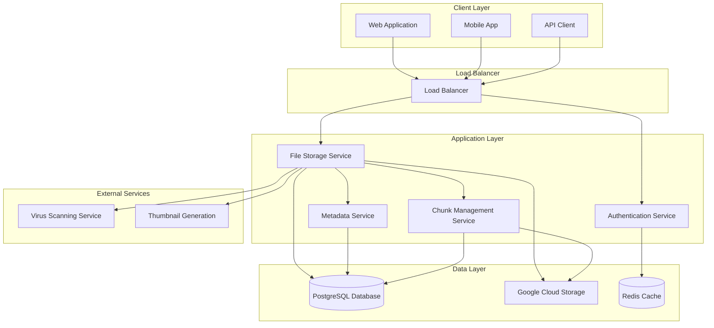
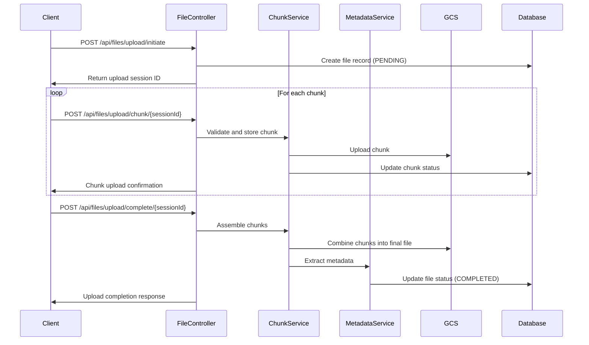

# File Storage Service Design Document

## Table of Contents
1. [Overview](#overview)
2. [System Architecture](#system-architecture)
3. [Core Components](#core-components)
4. [Database Design](#database-design)
5. [API Design](#api-design)
6. [File Chunking Strategy](#file-chunking-strategy)
7. [Implementation Examples](#implementation-examples)
8. [User Cases and Scenarios](#user-cases-and-scenarios)
9. [Security Considerations](#security-considerations)
10. [Monitoring and Observability](#monitoring-and-observability)
11. [External References](#external-references)

## Overview

The **FileStorageService** is a scalable, cloud-native file storage solution that provides comprehensive file management capabilities for project-related documents. The service leverages Google Cloud Storage (GCS) for reliable file storage and PostgreSQL for efficient metadata management.

### Key Features
- **Multi-format Support**: Handle various file types (documents, images, videos, etc.)
- **Chunked Upload**: Support for large files (>10MB) through frontend chunking
- **Metadata Management**: Rich file metadata stored in PostgreSQL
- **RESTful API**: Clean, intuitive API for file operations
- **Scalable Storage**: Leverages GCS for virtually unlimited storage
- **Security**: Built-in authentication, authorization, and data encryption

### Technology Stack
- **Storage Backend**: Google Cloud Storage (GCS)
- **Database**: PostgreSQL for metadata
- **Runtime**: Java with Spring Boot
- **Authentication**: JWT-based authentication
- **File Processing**: Apache Tika for metadata extraction

## System Architecture



## Core Components

### 1. File Storage Controller
Handles HTTP requests for file operations including upload, download, and metadata queries.

### 2. Chunk Management Service
Manages file chunking operations, including chunk assembly and validation.

### 3. Metadata Service
Handles file metadata extraction, storage, and retrieval operations.

### 4. GCS Integration Service
Provides abstraction layer for Google Cloud Storage operations.

### 5. Security Service
Manages authentication, authorization, and file access permissions.

## Database Design

### File Metadata Schema

```sql
-- Main files table
CREATE TABLE files (
    id UUID PRIMARY KEY DEFAULT gen_random_uuid(),
    original_name VARCHAR(255) NOT NULL,
    storage_path VARCHAR(500) NOT NULL,
    mime_type VARCHAR(100) NOT NULL,
    file_size BIGINT NOT NULL,
    checksum VARCHAR(64) NOT NULL,
    upload_status VARCHAR(20) DEFAULT 'PENDING',
    created_by UUID NOT NULL,
    created_at TIMESTAMP DEFAULT CURRENT_TIMESTAMP,
    updated_at TIMESTAMP DEFAULT CURRENT_TIMESTAMP,
    project_id UUID,
    tags JSONB,
    metadata JSONB,
    
    CONSTRAINT fk_created_by FOREIGN KEY (created_by) REFERENCES users(id),
    CONSTRAINT fk_project FOREIGN KEY (project_id) REFERENCES projects(id)
);

-- File chunks table for large file uploads
CREATE TABLE file_chunks (
    id UUID PRIMARY KEY DEFAULT gen_random_uuid(),
    file_id UUID NOT NULL,
    chunk_number INTEGER NOT NULL,
    chunk_size BIGINT NOT NULL,
    checksum VARCHAR(64) NOT NULL,
    storage_path VARCHAR(500) NOT NULL,
    upload_status VARCHAR(20) DEFAULT 'PENDING',
    created_at TIMESTAMP DEFAULT CURRENT_TIMESTAMP,
    
    CONSTRAINT fk_file_id FOREIGN KEY (file_id) REFERENCES files(id) ON DELETE CASCADE,
    CONSTRAINT uk_file_chunk UNIQUE (file_id, chunk_number)
);

-- File access permissions
CREATE TABLE file_permissions (
    id UUID PRIMARY KEY DEFAULT gen_random_uuid(),
    file_id UUID NOT NULL,
    user_id UUID,
    role_id UUID,
    permission_type VARCHAR(20) NOT NULL, -- READ, WRITE, DELETE
    granted_by UUID NOT NULL,
    granted_at TIMESTAMP DEFAULT CURRENT_TIMESTAMP,
    expires_at TIMESTAMP,
    
    CONSTRAINT fk_file_permission FOREIGN KEY (file_id) REFERENCES files(id) ON DELETE CASCADE,
    CONSTRAINT fk_user_permission FOREIGN KEY (user_id) REFERENCES users(id),
    CONSTRAINT fk_role_permission FOREIGN KEY (role_id) REFERENCES roles(id),
    CONSTRAINT fk_granted_by FOREIGN KEY (granted_by) REFERENCES users(id)
);

-- Indexes for performance
CREATE INDEX idx_files_created_by ON files(created_by);
CREATE INDEX idx_files_project_id ON files(project_id);
CREATE INDEX idx_files_upload_status ON files(upload_status);
CREATE INDEX idx_file_chunks_file_id ON file_chunks(file_id);
CREATE INDEX idx_file_permissions_file_id ON file_permissions(file_id);
CREATE INDEX idx_file_permissions_user_id ON file_permissions(user_id);
```

## API Design

### File Upload Flow



### REST API Endpoints

```java
@RestController
@RequestMapping("/api/files")
@Validated
public class FileStorageController {
    
    /**
     * Initiate file upload session
     * Supports both single file and chunked upload initialization
     */
    @PostMapping("/upload/initiate")
    public ResponseEntity<FileUploadSession> initiateUpload(
            @Valid @RequestBody FileUploadRequest request,
            Authentication authentication) {
        // Implementation details below
    }
    
    /**
     * Upload file chunk (for large files)
     */
    @PostMapping("/upload/chunk/{sessionId}")
    public ResponseEntity<ChunkUploadResponse> uploadChunk(
            @PathVariable String sessionId,
            @RequestParam("chunkNumber") int chunkNumber,
            @RequestParam("file") MultipartFile chunk,
            Authentication authentication) {
        // Implementation details below
    }
    
    /**
     * Complete chunked upload
     */
    @PostMapping("/upload/complete/{sessionId}")
    public ResponseEntity<FileMetadata> completeUpload(
            @PathVariable String sessionId,
            Authentication authentication) {
        // Implementation details below
    }
    
    /**
     * Direct upload for small files (<10MB)
     */
    @PostMapping("/upload/direct")
    public ResponseEntity<FileMetadata> directUpload(
            @RequestParam("file") MultipartFile file,
            @RequestParam(value = "projectId", required = false) String projectId,
            @RequestParam(value = "tags", required = false) String tags,
            Authentication authentication) {
        // Implementation details below
    }
    
    /**
     * Download file
     */
    @GetMapping("/download/{fileId}")
    public ResponseEntity<Resource> downloadFile(
            @PathVariable String fileId,
            Authentication authentication) {
        // Implementation details below
    }
    
    /**
     * Get file metadata
     */
    @GetMapping("/{fileId}/metadata")
    public ResponseEntity<FileMetadata> getFileMetadata(
            @PathVariable String fileId,
            Authentication authentication) {
        // Implementation details below
    }
    
    /**
     * Search files with filters
     */
    @GetMapping("/search")
    public ResponseEntity<Page<FileMetadata>> searchFiles(
            @RequestParam(value = "query", required = false) String query,
            @RequestParam(value = "mimeType", required = false) String mimeType,
            @RequestParam(value = "projectId", required = false) String projectId,
            @RequestParam(value = "tags", required = false) List<String> tags,
            @RequestParam(value = "page", defaultValue = "0") int page,
            @RequestParam(value = "size", defaultValue = "20") int size,
            Authentication authentication) {
        // Implementation details below
    }
}
```

## File Chunking Strategy

### Why Frontend Chunking?

Frontend chunking provides several advantages:

1. **Better User Experience**: Progress indication and resume capability
2. **Network Resilience**: Ability to retry individual chunks on failure
3. **Reduced Server Load**: Parallel chunk processing
4. **Memory Efficiency**: Server doesn't need to hold entire file in memory

### Chunking Algorithm

```javascript
// Frontend chunking implementation (JavaScript)
class FileChunker {
    constructor(file, chunkSize = 5 * 1024 * 1024) { // 5MB default
        this.file = file;
        this.chunkSize = chunkSize;
        this.totalChunks = Math.ceil(file.size / chunkSize);
    }
    
    async uploadFile(uploadUrl, onProgress) {
        // 1. Initiate upload session
        const sessionResponse = await fetch(`${uploadUrl}/initiate`, {
            method: 'POST',
            headers: {
                'Content-Type': 'application/json',
                'Authorization': `Bearer ${this.getAuthToken()}`
            },
            body: JSON.stringify({
                fileName: this.file.name,
                fileSize: this.file.size,
                mimeType: this.file.type,
                totalChunks: this.totalChunks,
                chunkSize: this.chunkSize
            })
        });
        
        const { sessionId } = await sessionResponse.json();
        
        // 2. Upload chunks in parallel (with concurrency limit)
        const concurrency = 3;
        const uploadPromises = [];
        
        for (let i = 0; i < this.totalChunks; i += concurrency) {
            const batch = [];
            for (let j = i; j < Math.min(i + concurrency, this.totalChunks); j++) {
                batch.push(this.uploadChunk(sessionId, j, uploadUrl, onProgress));
            }
            uploadPromises.push(Promise.all(batch));
        }
        
        await Promise.all(uploadPromises);
        
        // 3. Complete upload
        const completeResponse = await fetch(`${uploadUrl}/complete/${sessionId}`, {
            method: 'POST',
            headers: {
                'Authorization': `Bearer ${this.getAuthToken()}`
            }
        });
        
        return completeResponse.json();
    }
    
    async uploadChunk(sessionId, chunkNumber, uploadUrl, onProgress) {
        const start = chunkNumber * this.chunkSize;
        const end = Math.min(start + this.chunkSize, this.file.size);
        const chunk = this.file.slice(start, end);
        
        const formData = new FormData();
        formData.append('file', chunk);
        formData.append('chunkNumber', chunkNumber);
        
        const response = await fetch(`${uploadUrl}/chunk/${sessionId}`, {
            method: 'POST',
            headers: {
                'Authorization': `Bearer ${this.getAuthToken()}`
            },
            body: formData
        });
        
        if (onProgress) {
            onProgress(chunkNumber + 1, this.totalChunks);
        }
        
        return response.json();
    }
    
    getAuthToken() {
        // Implement your authentication token retrieval logic
        return localStorage.getItem('authToken');
    }
}
```

## Implementation Examples

### File Upload Service Implementation

```java
@Service
@Transactional
public class FileStorageService {
    
    private final FileRepository fileRepository;
    private final FileChunkRepository chunkRepository;
    private final GcsService gcsService;
    private final MetadataExtractionService metadataService;
    private final SecurityService securityService;
    
    /**
     * Initiates a file upload session
     * Creates a pending file record and prepares for chunked upload
     */
    public FileUploadSession initiateUpload(FileUploadRequest request, String userId) {
        // Validate request
        validateUploadRequest(request);
        
        // Check user permissions
        securityService.checkUploadPermission(userId, request.getProjectId());
        
        // Create file record
        FileEntity file = FileEntity.builder()
            .originalName(request.getFileName())
            .mimeType(request.getMimeType())
            .fileSize(request.getFileSize())
            .uploadStatus(UploadStatus.PENDING)
            .createdBy(UUID.fromString(userId))
            .projectId(request.getProjectId() != null ? 
                UUID.fromString(request.getProjectId()) : null)
            .build();
        
        file = fileRepository.save(file);
        
        // Generate storage path
        String storagePath = generateStoragePath(file.getId(), request.getFileName());
        file.setStoragePath(storagePath);
        fileRepository.save(file);
        
        // Create chunk records for large files
        if (request.getTotalChunks() > 1) {
            createChunkRecords(file.getId(), request.getTotalChunks(), 
                request.getChunkSize());
        }
        
        return FileUploadSession.builder()
            .sessionId(file.getId().toString())
            .storagePath(storagePath)
            .totalChunks(request.getTotalChunks())
            .expiresAt(LocalDateTime.now().plusHours(24))
            .build();
    }
    
    /**
     * Handles individual chunk upload
     * Validates chunk integrity and stores in GCS
     */
    public ChunkUploadResponse uploadChunk(String sessionId, int chunkNumber, 
            MultipartFile chunk, String userId) {
        
        UUID fileId = UUID.fromString(sessionId);
        
        // Validate session and permissions
        FileEntity file = fileRepository.findById(fileId)
            .orElseThrow(() -> new FileNotFoundException("Upload session not found"));
        
        securityService.checkUploadPermission(userId, 
            file.getProjectId() != null ? file.getProjectId().toString() : null);
        
        // Find chunk record
        FileChunkEntity chunkEntity = chunkRepository
            .findByFileIdAndChunkNumber(fileId, chunkNumber)
            .orElseThrow(() -> new InvalidChunkException("Invalid chunk number"));
        
        try {
            // Calculate chunk checksum
            String checksum = calculateChecksum(chunk.getInputStream());
            
            // Generate chunk storage path
            String chunkPath = generateChunkPath(fileId, chunkNumber);
            
            // Upload to GCS
            gcsService.uploadChunk(chunkPath, chunk.getInputStream(), 
                chunk.getSize());
            
            // Update chunk record
            chunkEntity.setStoragePath(chunkPath);
            chunkEntity.setChunkSize(chunk.getSize());
            chunkEntity.setChecksum(checksum);
            chunkEntity.setUploadStatus(UploadStatus.COMPLETED);
            chunkRepository.save(chunkEntity);
            
            return ChunkUploadResponse.builder()
                .chunkNumber(chunkNumber)
                .status("COMPLETED")
                .checksum(checksum)
                .build();
                
        } catch (Exception e) {
            // Mark chunk as failed
            chunkEntity.setUploadStatus(UploadStatus.FAILED);
            chunkRepository.save(chunkEntity);
            throw new ChunkUploadException("Failed to upload chunk", e);
        }
    }
    
    /**
     * Completes the chunked upload by assembling chunks
     * Extracts metadata and finalizes the file
     */
    public FileMetadata completeUpload(String sessionId, String userId) {
        UUID fileId = UUID.fromString(sessionId);
        
        FileEntity file = fileRepository.findById(fileId)
            .orElseThrow(() -> new FileNotFoundException("Upload session not found"));
        
        // Verify all chunks are uploaded
        List<FileChunkEntity> chunks = chunkRepository.findByFileIdOrderByChunkNumber(fileId);
        validateAllChunksUploaded(chunks);
        
        try {
            // Assemble chunks in GCS
            String finalPath = assembleChunks(file, chunks);
            
            // Calculate final file checksum
            String fileChecksum = calculateFinalChecksum(finalPath);
            
            // Extract metadata
            FileMetadata metadata = metadataService.extractMetadata(finalPath, 
                file.getMimeType());
            
            // Update file record
            file.setStoragePath(finalPath);
            file.setChecksum(fileChecksum);
            file.setUploadStatus(UploadStatus.COMPLETED);
            file.setMetadata(convertToJsonb(metadata));
            fileRepository.save(file);
            
            // Cleanup chunk records and temporary files
            cleanupChunks(chunks);
            
            // Generate thumbnails for images/videos (async)
            if (isImageOrVideo(file.getMimeType())) {
                thumbnailService.generateThumbnailAsync(file.getId(), finalPath);
            }
            
            return mapToFileMetadata(file);
            
        } catch (Exception e) {
            // Mark upload as failed
            file.setUploadStatus(UploadStatus.FAILED);
            fileRepository.save(file);
            throw new FileAssemblyException("Failed to complete upload", e);
        }
    }
    
    /**
     * Direct upload for small files
     * Bypasses chunking for files under the threshold
     */
    public FileMetadata directUpload(MultipartFile file, String projectId, 
            List<String> tags, String userId) {
        
        // Validate file size (should be under 10MB for direct upload)
        if (file.getSize() > 10 * 1024 * 1024) {
            throw new FileSizeException("File too large for direct upload");
        }
        
        securityService.checkUploadPermission(userId, projectId);
        
        try {
            // Create file record
            FileEntity fileEntity = FileEntity.builder()
                .originalName(file.getOriginalFilename())
                .mimeType(file.getContentType())
                .fileSize(file.getSize())
                .uploadStatus(UploadStatus.PENDING)
                .createdBy(UUID.fromString(userId))
                .projectId(projectId != null ? UUID.fromString(projectId) : null)
                .tags(convertTagsToJsonb(tags))
                .build();
            
            fileEntity = fileRepository.save(fileEntity);
            
            // Generate storage path and upload to GCS
            String storagePath = generateStoragePath(fileEntity.getId(), 
                file.getOriginalFilename());
            
            gcsService.uploadFile(storagePath, file.getInputStream(), file.getSize());
            
            // Calculate checksum and extract metadata
            String checksum = calculateChecksum(file.getInputStream());
            FileMetadata metadata = metadataService.extractMetadata(storagePath, 
                file.getContentType());
            
            // Update file record
            fileEntity.setStoragePath(storagePath);
            fileEntity.setChecksum(checksum);
            fileEntity.setUploadStatus(UploadStatus.COMPLETED);
            fileEntity.setMetadata(convertToJsonb(metadata));
            fileRepository.save(fileEntity);
            
            return mapToFileMetadata(fileEntity);
            
        } catch (Exception e) {
            throw new DirectUploadException("Failed to upload file", e);
        }
    }
    
    // Helper methods
    private void validateUploadRequest(FileUploadRequest request) {
        if (request.getFileName() == null || request.getFileName().trim().isEmpty()) {
            throw new InvalidRequestException("File name is required");
        }
        if (request.getFileSize() <= 0) {
            throw new InvalidRequestException("Invalid file size");
        }
        if (request.getFileSize() > MAX_FILE_SIZE) {
            throw new FileSizeException("File size exceeds maximum allowed");
        }
    }
    
    private String generateStoragePath(UUID fileId, String fileName) {
        String extension = getFileExtension(fileName);
        String datePath = LocalDate.now().format(DateTimeFormatter.ofPattern("yyyy/MM/dd"));
        return String.format("files/%s/%s%s", datePath, fileId.toString(), extension);
    }
    
    private String calculateChecksum(InputStream inputStream) throws IOException {
        return DigestUtils.sha256Hex(inputStream);
    }
}
```

### GCS Integration Service

```java
@Service
public class GcsService {
    
    private final Storage storage;
    private final String bucketName;
    
    public GcsService(@Value("${gcs.bucket.name}") String bucketName) {
        this.bucketName = bucketName;
        this.storage = StorageOptions.getDefaultInstance().getService();
    }
    
    /**
     * Uploads a file chunk to GCS
     */
    public void uploadChunk(String objectPath, InputStream inputStream, long size) {
        BlobId blobId = BlobId.of(bucketName, objectPath);
        BlobInfo blobInfo = BlobInfo.newBuilder(blobId)
            .setContentType("application/octet-stream")
            .build();
            
        try {
            storage.create(blobInfo, inputStream);
        } catch (StorageException e) {
            throw new GcsUploadException("Failed to upload chunk to GCS", e);
        }
    }
    
    /**
     * Assembles multiple chunks into a single file
     */
    public void assembleChunks(String finalPath, List<String> chunkPaths) {
        BlobId finalBlobId = BlobId.of(bucketName, finalPath);
        
        try {
            // Use GCS compose operation to combine chunks
            List<String> sourceNames = chunkPaths.stream()
                .map(path -> BlobId.of(bucketName, path).getName())
                .collect(Collectors.toList());
            
            Storage.ComposeRequest composeRequest = Storage.ComposeRequest.newBuilder()
                .setTarget(BlobInfo.newBuilder(finalBlobId).build())
                .addSource(sourceNames)
                .build();
                
            storage.compose(composeRequest);
            
            // Clean up individual chunks
            chunkPaths.forEach(this::deleteObject);
            
        } catch (StorageException e) {
            throw new GcsAssemblyException("Failed to assemble chunks", e);
        }
    }
    
    /**
     * Downloads a file from GCS
     */
    public byte[] downloadFile(String objectPath) {
        BlobId blobId = BlobId.of(bucketName, objectPath);
        Blob blob = storage.get(blobId);
        
        if (blob == null) {
            throw new FileNotFoundException("File not found in GCS: " + objectPath);
        }
        
        return blob.getContent();
    }
    
    /**
     * Generates a signed URL for direct file access
     */
    public String generateSignedUrl(String objectPath, Duration expiration) {
        BlobId blobId = BlobId.of(bucketName, objectPath);
        BlobInfo blobInfo = BlobInfo.newBuilder(blobId).build();
        
        return storage.signUrl(blobInfo, expiration.toMinutes(), TimeUnit.MINUTES,
            Storage.SignUrlOption.httpMethod(HttpMethod.GET)).toString();
    }
    
    private void deleteObject(String objectPath) {
        BlobId blobId = BlobId.of(bucketName, objectPath);
        storage.delete(blobId);
    }
}
```

## User Cases and Scenarios

### Use Case 1: Project Document Upload

**Scenario**: A project manager needs to upload a 50MB project specification document.

**Flow**:
1. **Frontend**: File is selected and chunked into 10 chunks (5MB each)
2. **Initiation**: Upload session created with metadata
3. **Chunk Upload**: Each chunk uploaded with retry capability
4. **Assembly**: Chunks combined into final document
5. **Metadata Extraction**: Document properties extracted (author, creation date, etc.)
6. **Completion**: File marked as available with full-text search indexing

```java
// Example usage
@Test
public void testLargeDocumentUpload() {
    // Simulate 50MB document upload
    FileUploadRequest request = FileUploadRequest.builder()
        .fileName("project_spec_v2.pdf")
        .fileSize(50L * 1024 * 1024)
        .mimeType("application/pdf")
        .totalChunks(10)
        .chunkSize(5L * 1024 * 1024)
        .projectId("project-123")
        .build();
    
    // Initiate upload
    FileUploadSession session = fileStorageService.initiateUpload(request, "user-456");
    assertThat(session.getSessionId()).isNotNull();
    
    // Simulate chunk uploads
    for (int i = 0; i < 10; i++) {
        MockMultipartFile chunk = createMockChunk(i, 5 * 1024 * 1024);
        ChunkUploadResponse response = fileStorageService.uploadChunk(
            session.getSessionId(), i, chunk, "user-456");
        assertThat(response.getStatus()).isEqualTo("COMPLETED");
    }
    
    // Complete upload
    FileMetadata metadata = fileStorageService.completeUpload(
        session.getSessionId(), "user-456");
    
    assertThat(metadata.getUploadStatus()).isEqualTo("COMPLETED");
    assertThat(metadata.getFileSize()).isEqualTo(50L * 1024 * 1024);
}
```

### Use Case 2: Image Gallery Upload

**Scenario**: A designer uploads multiple high-resolution images for a marketing campaign.

**Features Demonstrated**:
- Batch upload handling
- Automatic thumbnail generation
- Image metadata extraction (EXIF data)
- Content-based organization

### Use Case 3: Video Asset Management

**Scenario**: A media company manages large video files with preview generation.

**Features Demonstrated**:
- Large file chunking (>1GB files)
- Video metadata extraction (duration, resolution, codec)
- Thumbnail and preview generation
- Streaming-optimized storage

## Security Considerations

### Authentication & Authorization

```java
@Component
public class FileSecurityService {
    
    /**
     * Checks if user has permission to upload files to a project
     */
    public boolean hasUploadPermission(String userId, String projectId) {
        if (projectId == null) {
            return true; // Personal uploads allowed
        }
        
        // Check project membership and roles
        return projectService.hasRole(userId, projectId, 
            Arrays.asList("OWNER", "EDITOR", "UPLOADER"));
    }
    
    /**
     * Checks file access permissions
     */
    public boolean hasFileAccess(String userId, String fileId, String permission) {
        FileEntity file = fileRepository.findById(UUID.fromString(fileId))
            .orElseThrow(() -> new FileNotFoundException("File not found"));
        
        // Owner always has access
        if (file.getCreatedBy().toString().equals(userId)) {
            return true;
        }
        
        // Check explicit permissions
        return filePermissionRepository.hasPermission(
            UUID.fromString(fileId), 
            UUID.fromString(userId), 
            permission);
    }
}
```

### File Validation & Virus Scanning

```java
@Service
public class FileValidationService {
    
    private static final List<String> ALLOWED_MIME_TYPES = Arrays.asList(
        "application/pdf", "image/jpeg", "image/png", "video/mp4",
        "application/msword", "text/plain"
    );
    
    /**
     * Validates file before upload
     */
    public void validateFile(MultipartFile file) {
        // Check mime type
        if (!ALLOWED_MIME_TYPES.contains(file.getContentType())) {
            throw new InvalidFileTypeException("File type not allowed");
        }
        
        // Check file signature (magic numbers)
        validateFileSignature(file);
        
        // Scan for viruses (integration with external service)
        scanForViruses(file);
    }
    
    private void validateFileSignature(MultipartFile file) {
        try {
            byte[] header = new byte[8];
            file.getInputStream().read(header);
            
            // Validate based on magic numbers
            String mimeType = file.getContentType();
            if (!isValidFileSignature(header, mimeType)) {
                throw new InvalidFileException("File signature doesn't match mime type");
            }
        } catch (IOException e) {
            throw new FileValidationException("Unable to read file header", e);
        }
    }
}
```

## Monitoring and Observability

### Metrics and Health Checks

```java
@Component
public class FileStorageMetrics {
    
    private final MeterRegistry meterRegistry;
    private final Counter uploadCounter;
    private final Timer uploadTimer;
    private final Gauge storageUsage;
    
    public FileStorageMetrics(MeterRegistry meterRegistry) {
        this.meterRegistry = meterRegistry;
        this.uploadCounter = Counter.builder("file.uploads.total")
            .description("Total file uploads")
            .register(meterRegistry);
        this.uploadTimer = Timer.builder("file.upload.duration")
            .description("File upload duration")
            .register(meterRegistry);
        this.storageUsage = Gauge.builder("storage.usage.bytes")
            .description("Total storage usage in bytes")
            .register(meterRegistry, this, FileStorageMetrics::getCurrentStorageUsage);
    }
    
    public void recordUpload(String fileType, long fileSize, Duration duration) {
        uploadCounter.increment(Tags.of("file.type", fileType, "size.category", 
            categorizeFileSize(fileSize)));
        uploadTimer.record(duration);
    }
    
    private String categorizeFileSize(long bytes) {
        if (bytes < 1024 * 1024) return "small";
        if (bytes < 10 * 1024 * 1024) return "medium";
        if (bytes < 100 * 1024 * 1024) return "large";
        return "xlarge";
    }
    
    private double getCurrentStorageUsage() {
        return fileRepository.getTotalStorageUsed();
    }
}
```

### Health Check Implementation

```java
@Component
public class FileStorageHealthCheck implements HealthIndicator {
    
    private final GcsService gcsService;
    private final FileRepository fileRepository;
    
    @Override
    public Health health() {
        try {
            // Check database connectivity
            long fileCount = fileRepository.count();
            
            // Check GCS connectivity
            boolean gcsHealthy = gcsService.checkConnectivity();
            
            // Check pending uploads (potential issues)
            long pendingUploads = fileRepository.countByUploadStatus(UploadStatus.PENDING);
            
            Health.Builder builder = pendingUploads > 100 ? 
                Health.down() : Health.up();
                
            return builder
                .withDetail("database.files.total", fileCount)
                .withDetail("gcs.connectivity", gcsHealthy)
                .withDetail("uploads.pending", pendingUploads)
                .withDetail("storage.usage", getCurrentStorageUsageGB())
                .build();
                
        } catch (Exception e) {
            return Health.down()
                .withException(e)
                .build();
        }
    }
    
    private double getCurrentStorageUsageGB() {
        return fileRepository.getTotalStorageUsed() / (1024.0 * 1024.0 * 1024.0);
    }
}
```

### Logging Configuration

```java
@Aspect
@Component
@Slf4j
public class FileOperationLogger {
    
    @Around("@annotation(LogFileOperation)")
    public Object logFileOperation(ProceedingJoinPoint joinPoint) throws Throwable {
        String operation = joinPoint.getSignature().getName();
        Object[] args = joinPoint.getArgs();
        
        MDC.put("operation", operation);
        
        if (args.length > 0 && args[0] instanceof String) {
            MDC.put("fileId", args[0].toString());
        }
        
        long startTime = System.currentTimeMillis();
        
        try {
            Object result = joinPoint.proceed();
            
            long duration = System.currentTimeMillis() - startTime;
            log.info("File operation completed successfully: {} in {}ms", 
                operation, duration);
            
            return result;
            
        } catch (Exception e) {
            long duration = System.currentTimeMillis() - startTime;
            log.error("File operation failed: {} after {}ms", operation, duration, e);
            throw e;
            
        } finally {
            MDC.clear();
        }
    }
}
```

## Performance Optimization

### Caching Strategy

```java
@Service
@CacheConfig(cacheNames = "file-metadata")
public class CachedFileMetadataService {
    
    @Cacheable(key = "#fileId")
    public FileMetadata getFileMetadata(String fileId) {
        return fileRepository.findById(UUID.fromString(fileId))
            .map(this::mapToFileMetadata)
            .orElseThrow(() -> new FileNotFoundException("File not found"));
    }
    
    @CacheEvict(key = "#fileId")
    public void evictFileMetadata(String fileId) {
        // Cache eviction handled automatically
    }
    
    @Cacheable(key = "'search:' + #query + ':' + #page + ':' + #size")
    public Page<FileMetadata> searchFiles(String query, int page, int size) {
        // Implement search logic with caching
        return fileRepository.searchFiles(query, PageRequest.of(page, size))
            .map(this::mapToFileMetadata);
    }
}
```

### Database Query Optimization

```sql
-- Optimized query for file search with filters
CREATE OR REPLACE VIEW file_search_view AS
SELECT 
    f.id,
    f.original_name,
    f.mime_type,
    f.file_size,
    f.created_at,
    f.created_by,
    f.project_id,
    f.tags,
    f.metadata,
    u.username as created_by_username,
    p.name as project_name,
    -- Full text search vector
    to_tsvector('english', 
        f.original_name || ' ' || 
        COALESCE(f.metadata->>'title', '') || ' ' ||
        COALESCE(f.metadata->>'description', '')
    ) as search_vector
FROM files f
LEFT JOIN users u ON f.created_by = u.id
LEFT JOIN projects p ON f.project_id = p.id
WHERE f.upload_status = 'COMPLETED';

-- Index for full text search
CREATE INDEX idx_file_search_vector 
ON files USING gin(to_tsvector('english', original_name));

-- Composite indexes for common query patterns
CREATE INDEX idx_files_project_created_at 
ON files(project_id, created_at DESC) 
WHERE upload_status = 'COMPLETED';

CREATE INDEX idx_files_user_created_at 
ON files(created_by, created_at DESC) 
WHERE upload_status = 'COMPLETED';
```

## Error Handling and Recovery

### Retry Mechanism for Chunk Uploads

```java
@Component
public class ChunkUploadRetryHandler {
    
    private static final int MAX_RETRIES = 3;
    private static final Duration RETRY_DELAY = Duration.ofSeconds(2);
    
    @Retryable(
        value = {ChunkUploadException.class, GcsException.class},
        maxAttempts = MAX_RETRIES,
        backoff = @Backoff(delay = 2000, multiplier = 2)
    )
    public ChunkUploadResponse uploadChunkWithRetry(String sessionId, 
            int chunkNumber, MultipartFile chunk, String userId) {
        
        log.info("Attempting chunk upload - Session: {}, Chunk: {}", 
            sessionId, chunkNumber);
        
        try {
            return fileStorageService.uploadChunk(sessionId, chunkNumber, chunk, userId);
            
        } catch (Exception e) {
            log.warn("Chunk upload failed - Session: {}, Chunk: {}, Attempt: {}", 
                sessionId, chunkNumber, getCurrentAttempt(), e);
            throw e;
        }
    }
    
    @Recover
    public ChunkUploadResponse recover(ChunkUploadException ex, String sessionId, 
            int chunkNumber, MultipartFile chunk, String userId) {
        
        log.error("Chunk upload failed after {} retries - Session: {}, Chunk: {}", 
            MAX_RETRIES, sessionId, chunkNumber, ex);
        
        // Mark chunk as failed and notify user
        chunkFailureService.handleFailedChunk(sessionId, chunkNumber, ex);
        
        throw new MaxRetriesExceededException("Chunk upload failed after retries", ex);
    }
}
```

### Orphaned Upload Cleanup

```java
@Component
@Slf4j
public class OrphanedUploadCleanupService {
    
    private final FileRepository fileRepository;
    private final FileChunkRepository chunkRepository;
    private final GcsService gcsService;
    
    @Scheduled(cron = "0 0 2 * * ?") // Daily at 2 AM
    public void cleanupOrphanedUploads() {
        log.info("Starting orphaned upload cleanup");
        
        LocalDateTime cutoffTime = LocalDateTime.now().minusHours(24);
        
        // Find stale pending uploads
        List<FileEntity> orphanedFiles = fileRepository
            .findByUploadStatusAndCreatedAtBefore(UploadStatus.PENDING, cutoffTime);
        
        for (FileEntity file : orphanedFiles) {
            try {
                cleanupOrphanedFile(file);
                log.info("Cleaned up orphaned file: {}", file.getId());
                
            } catch (Exception e) {
                log.error("Failed to cleanup orphaned file: {}", file.getId(), e);
            }
        }
        
        log.info("Completed orphaned upload cleanup. Processed {} files", 
            orphanedFiles.size());
    }
    
    private void cleanupOrphanedFile(FileEntity file) {
        // Delete chunks from GCS
        List<FileChunkEntity> chunks = chunkRepository.findByFileId(file.getId());
        for (FileChunkEntity chunk : chunks) {
            if (chunk.getStoragePath() != null) {
                gcsService.deleteObject(chunk.getStoragePath());
            }
        }
        
        // Delete chunk records
        chunkRepository.deleteByFileId(file.getId());
        
        // Delete file record
        fileRepository.delete(file);
    }
}
```

## Advanced Features

### File Versioning

```java
@Entity
@Table(name = "file_versions")
public class FileVersionEntity {
    
    @Id
    private UUID id;
    
    @Column(name = "file_id")
    private UUID fileId;
    
    @Column(name = "version_number")
    private Integer versionNumber;
    
    @Column(name = "storage_path")
    private String storagePath;
    
    @Column(name = "file_size")
    private Long fileSize;
    
    @Column(name = "checksum")
    private String checksum;
    
    @Column(name = "created_by")
    private UUID createdBy;
    
    @Column(name = "created_at")
    private LocalDateTime createdAt;
    
    @Column(name = "is_current")
    private Boolean isCurrent;
    
    @Column(name = "change_description")
    private String changeDescription;
    
    // Constructors, getters, setters
}

@Service
public class FileVersioningService {
    
    /**
     * Creates a new version of an existing file
     */
    public FileMetadata createNewVersion(String fileId, MultipartFile newFile, 
            String changeDescription, String userId) {
        
        FileEntity originalFile = fileRepository.findById(UUID.fromString(fileId))
            .orElseThrow(() -> new FileNotFoundException("Original file not found"));
        
        // Check permissions
        securityService.checkWritePermission(userId, fileId);
        
        // Get current version number
        Integer currentVersion = versionRepository
            .findMaxVersionByFileId(UUID.fromString(fileId))
            .orElse(0);
        
        // Create new version record
        FileVersionEntity newVersion = FileVersionEntity.builder()
            .fileId(UUID.fromString(fileId))
            .versionNumber(currentVersion + 1)
            .createdBy(UUID.fromString(userId))
            .changeDescription(changeDescription)
            .fileSize(newFile.getSize())
            .isCurrent(true)
            .build();
        
        // Upload new version
        String versionPath = generateVersionPath(fileId, newVersion.getVersionNumber());
        gcsService.uploadFile(versionPath, newFile.getInputStream(), newFile.getSize());
        
        newVersion.setStoragePath(versionPath);
        newVersion.setChecksum(calculateChecksum(newFile.getInputStream()));
        
        // Mark previous version as not current
        versionRepository.markVersionsAsNotCurrent(UUID.fromString(fileId));
        
        // Save new version
        versionRepository.save(newVersion);
        
        // Update main file record
        originalFile.setFileSize(newFile.getSize());
        originalFile.setStoragePath(versionPath);
        originalFile.setChecksum(newVersion.getChecksum());
        originalFile.setUpdatedAt(LocalDateTime.now());
        fileRepository.save(originalFile);
        
        return mapToFileMetadata(originalFile);
    }
    
    /**
     * Retrieves version history for a file
     */
    public List<FileVersionMetadata> getVersionHistory(String fileId, String userId) {
        securityService.checkReadPermission(userId, fileId);
        
        return versionRepository.findByFileIdOrderByVersionNumberDesc(
            UUID.fromString(fileId))
            .stream()
            .map(this::mapToVersionMetadata)
            .collect(Collectors.toList());
    }
}
```

### Full-Text Search Integration

```java
@Service
public class FileSearchService {
    
    private final FileRepository fileRepository;
    private final ElasticsearchTemplate elasticsearchTemplate;
    
    /**
     * Advanced file search with full-text capabilities
     */
    public Page<FileMetadata> advancedSearch(FileSearchRequest request, String userId) {
        BoolQueryBuilder queryBuilder = QueryBuilders.boolQuery();
        
        // Text search across file name and extracted content
        if (StringUtils.hasText(request.getQuery())) {
            queryBuilder.must(QueryBuilders.multiMatchQuery(request.getQuery())
                .field("originalName", 2.0f)  // Boost file name matches
                .field("extractedText")
                .field("metadata.title")
                .field("metadata.description")
                .type(MultiMatchQueryBuilder.Type.BEST_FIELDS));
        }
        
        // File type filter
        if (StringUtils.hasText(request.getMimeType())) {
            queryBuilder.filter(QueryBuilders.termQuery("mimeType", request.getMimeType()));
        }
        
        // Date range filter
        if (request.getDateFrom() != null || request.getDateTo() != null) {
            RangeQueryBuilder rangeQuery = QueryBuilders.rangeQuery("createdAt");
            if (request.getDateFrom() != null) {
                rangeQuery.gte(request.getDateFrom());
            }
            if (request.getDateTo() != null) {
                rangeQuery.lte(request.getDateTo());
            }
            queryBuilder.filter(rangeQuery);
        }
        
        // Size range filter
        if (request.getMinSize() != null || request.getMaxSize() != null) {
            RangeQueryBuilder sizeQuery = QueryBuilders.rangeQuery("fileSize");
            if (request.getMinSize() != null) {
                sizeQuery.gte(request.getMinSize());
            }
            if (request.getMaxSize() != null) {
                sizeQuery.lte(request.getMaxSize());
            }
            queryBuilder.filter(sizeQuery);
        }
        
        // Project filter
        if (StringUtils.hasText(request.getProjectId())) {
            queryBuilder.filter(QueryBuilders.termQuery("projectId", request.getProjectId()));
        }
        
        // User permissions filter
        queryBuilder.filter(createPermissionFilter(userId));
        
        // Build search request
        SearchRequest searchRequest = SearchRequest.of(s -> s
            .index("files")
            .query(queryBuilder)
            .sort(SortOptions.of(so -> so
                .field(FieldSort.of(f -> f
                    .field(request.getSortField())
                    .order(request.getSortDirection())))))
            .from(request.getPage() * request.getSize())
            .size(request.getSize())
            .highlight(Highlight.of(h -> h
                .fields("originalName", HightlightField.of(hf -> hf))
                .fields("extractedText", HightlightField.of(hf -> hf)))));
        
        // Execute search
        SearchResponse<FileDocument> response = elasticsearchTemplate.search(
            searchRequest, FileDocument.class);
        
        // Convert results
        List<FileMetadata> results = response.hits().hits().stream()
            .map(hit -> mapToFileMetadata(hit.source(), hit.highlight()))
            .collect(Collectors.toList());
        
        return new PageImpl<>(results, 
            PageRequest.of(request.getPage(), request.getSize()),
            response.hits().total().value());
    }
    
    private Query createPermissionFilter(String userId) {
        // Create filter that ensures user can only see files they have access to
        return QueryBuilders.boolQuery()
            .should(QueryBuilders.termQuery("createdBy", userId))
            .should(QueryBuilders.termQuery("permissions.userId", userId))
            .should(QueryBuilders.termQuery("isPublic", true))
            .minimumShouldMatch(1);
    }
}
```

## Deployment Configuration

### Docker Configuration

```dockerfile
# Dockerfile for File Storage Service
FROM openjdk:17-jdk-slim

# Install required tools
RUN apt-get update && apt-get install -y \
    curl \
    imagemagick \
    ffmpeg \
    && rm -rf /var/lib/apt/lists/*

# Create application directory
WORKDIR /app

# Copy application JAR
COPY target/file-storage-service-*.jar app.jar

# Copy configuration files
COPY src/main/resources/application*.yml ./

# Create uploads directory
RUN mkdir -p /tmp/uploads

# Set up non-root user
RUN addgroup --system appgroup && adduser --system appuser --ingroup appgroup
RUN chown -R appuser:appgroup /app /tmp/uploads
USER appuser

# Health check
HEALTHCHECK --interval=30s --timeout=10s --start-period=60s --retries=3 \
    CMD curl -f http://localhost:8080/actuator/health || exit 1

# Expose port
EXPOSE 8080

# JVM options for containerized environment
ENV JAVA_OPTS="-Xmx1g -Xms512m -XX:+UseG1GC -XX:MaxGCPauseMillis=200"

# Run application
ENTRYPOINT ["sh", "-c", "java $JAVA_OPTS -jar app.jar"]
```

### Kubernetes Deployment

```yaml
# file-storage-deployment.yaml
apiVersion: apps/v1
kind: Deployment
metadata:
  name: file-storage-service
  labels:
    app: file-storage-service
spec:
  replicas: 3
  selector:
    matchLabels:
      app: file-storage-service
  template:
    metadata:
      labels:
        app: file-storage-service
    spec:
      containers:
      - name: file-storage-service
        image: your-registry/file-storage-service:latest
        ports:
        - containerPort: 8080
        env:
        - name: SPRING_PROFILES_ACTIVE
          value: "production"
        - name: DATABASE_URL
          valueFrom:
            secretKeyRef:
              name: db-credentials
              key: url
        - name: DATABASE_USERNAME
          valueFrom:
            secretKeyRef:
              name: db-credentials
              key: username
        - name: DATABASE_PASSWORD
          valueFrom:
            secretKeyRef:
              name: db-credentials
              key: password
        - name: GCS_BUCKET_NAME
          valueFrom:
            configMapKeyRef:
              name: app-config
              key: gcs-bucket-name
        resources:
          limits:
            memory: "2Gi"
            cpu: "1000m"
          requests:
            memory: "1Gi"
            cpu: "500m"
        volumeMounts:
        - name: tmp-volume
          mountPath: /tmp
        livenessProbe:
          httpGet:
            path: /actuator/health/liveness
            port: 8080
          initialDelaySeconds: 60
          periodSeconds: 30
        readinessProbe:
          httpGet:
            path: /actuator/health/readiness
            port: 8080
          initialDelaySeconds: 30
          periodSeconds: 15
      volumes:
      - name: tmp-volume
        emptyDir: {}
---
apiVersion: v1
kind: Service
metadata:
  name: file-storage-service
spec:
  selector:
    app: file-storage-service
  ports:
  - protocol: TCP
    port: 80
    targetPort: 8080
  type: LoadBalancer
```

## Testing Strategy

### Integration Tests

```java
@SpringBootTest
@TestPropertySource(locations = "classpath:application-test.properties")
@DirtiesContext(classMode = DirtiesContext.ClassMode.AFTER_EACH_TEST_METHOD)
class FileStorageServiceIntegrationTest {
    
    @Autowired
    private FileStorageService fileStorageService;
    
    @Autowired
    private TestContainers testContainers;
    
    @MockBean
    private GcsService gcsService;
    
    @Test
    @DisplayName("Should successfully upload and retrieve large file via chunking")
    void testChunkedFileUpload() throws Exception {
        // Arrange
        String userId = "test-user-123";
        byte[] fileContent = generateTestFileContent(50 * 1024 * 1024); // 50MB
        MockMultipartFile originalFile = new MockMultipartFile(
            "file", "test-large-file.pdf", "application/pdf", fileContent);
        
        // Mock GCS operations
        when(gcsService.uploadChunk(anyString(), any(InputStream.class), anyLong()))
            .thenReturn(true);
        when(gcsService.assembleChunks(anyString(), anyList()))
            .thenReturn("final-path");
        
        // Act - Initiate upload
        FileUploadRequest request = FileUploadRequest.builder()
            .fileName("test-large-file.pdf")
            .fileSize((long) fileContent.length)
            .mimeType("application/pdf")
            .totalChunks(10)
            .chunkSize(5L * 1024 * 1024)
            .build();
            
        FileUploadSession session = fileStorageService.initiateUpload(request, userId);
        
        // Act - Upload chunks
        int chunkSize = 5 * 1024 * 1024;
        for (int i = 0; i < 10; i++) {
            int start = i * chunkSize;
            int end = Math.min(start + chunkSize, fileContent.length);
            byte[] chunkData = Arrays.copyOfRange(fileContent, start, end);
            
            MockMultipartFile chunk = new MockMultipartFile(
                "chunk", "chunk-" + i, "application/octet-stream", chunkData);
            
            ChunkUploadResponse response = fileStorageService.uploadChunk(
                session.getSessionId(), i, chunk, userId);
            
            assertThat(response.getStatus()).isEqualTo("COMPLETED");
        }
        
        // Act - Complete upload
        FileMetadata result = fileStorageService.completeUpload(session.getSessionId(), userId);
        
        // Assert
        assertThat(result).isNotNull();
        assertThat(result.getOriginalName()).isEqualTo("test-large-file.pdf");
        assertThat(result.getFileSize()).isEqualTo(fileContent.length);
        assertThat(result.getUploadStatus()).isEqualTo("COMPLETED");
        
        // Verify GCS interactions
        verify(gcsService, times(10)).uploadChunk(anyString(), any(InputStream.class), anyLong());
        verify(gcsService, times(1)).assembleChunks(anyString(), anyList());
    }
    
    @Test
    @DisplayName("Should handle chunk upload failure and retry")
    void testChunkUploadFailureAndRetry() throws Exception {
        // Test retry logic for failed chunk uploads
        // Implementation details...
    }
    
    @Test
    @DisplayName("Should search files with complex filters")
    void testAdvancedFileSearch() throws Exception {
        // Test search functionality
        // Implementation details...
    }
    
    private byte[] generateTestFileContent(int size) {
        byte[] content = new byte[size];
        new Random().nextBytes(content);
        return content;
    }
}
```

### Performance Tests

```java
@SpringBootTest
class FileStoragePerformanceTest {
    
    @Test
    @DisplayName("Should handle concurrent chunk uploads")
    void testConcurrentChunkUploads() throws Exception {
        int concurrentUsers = 10;
        int chunksPerUser = 20;
        ExecutorService executor = Executors.newFixedThreadPool(concurrentUsers);
        CountDownLatch latch = new CountDownLatch(concurrentUsers);
        
        List<Future<Boolean>> results = new ArrayList<>();
        
        for (int user = 0; user < concurrentUsers; user++) {
            final int userId = user;
            Future<Boolean> future = executor.submit(() -> {
                try {
                    return uploadFileWithChunks("user-" + userId, chunksPerUser);
                } finally {
                    latch.countDown();
                }
            });
            results.add(future);
        }
        
        // Wait for completion with timeout
        boolean completed = latch.await(60, TimeUnit.SECONDS);
        assertThat(completed).isTrue();
        
        // Verify all uploads succeeded
        for (Future<Boolean> result : results) {
            assertThat(result.get()).isTrue();
        }
        
        executor.shutdown();
    }
    
    private boolean uploadFileWithChunks(String userId, int chunkCount) {
        // Implementation for performance test
        return true;
    }
}
```

## External References

### Documentation and Standards
- [Google Cloud Storage Documentation](https://cloud.google.com/storage/docs)
- [PostgreSQL Documentation](https://www.postgresql.org/docs/)
- [Spring Boot File Upload Guide](https://spring.io/guides/gs/uploading-files/)
- [RESTful API Design Best Practices](https://restfulapi.net/)

### Libraries and Dependencies
- [Spring Boot Starter Web](https://docs.spring.io/spring-boot/docs/current/reference/html/web.html)
- [Google Cloud Storage Client Library](https://cloud.google.com/java/docs/reference/google-cloud-storage/latest)
- [Apache Tika](https://tika.apache.org/) - Content Analysis Toolkit
- [Spring Boot Actuator](https://docs.spring.io/spring-boot/docs/current/reference/html/actuator.html) - Monitoring
- [Micrometer Metrics](https://micrometer.io/) - Application Metrics

### Security Resources
- [OWASP File Upload Security](https://owasp.org/www-community/vulnerabilities/Unrestricted_File_Upload)
- [JWT Authentication Best Practices](https://auth0.com/blog/a-look-at-the-latest-draft-for-jwt-bcp/)
- [Google Cloud IAM Best Practices](https://cloud.google.com/iam/docs/using-iam-securely)

### Performance and Scaling
- [Database Indexing Strategies](https://use-the-index-luke.com/)
- [Redis Caching Patterns](https://redis.io/docs/manual/patterns/)
- [Kubernetes Resource Management](https://kubernetes.io/docs/concepts/configuration/manage-resources-containers/)

### Monitoring and Observability
- [Prometheus Monitoring](https://prometheus.io/docs/introduction/overview/)
- [Grafana Dashboards](https://grafana.com/docs/grafana/latest/)
- [Distributed Tracing with Jaeger](https://www.jaegertracing.io/docs/)

---

## Conclusion

This File Storage Service design provides a comprehensive, scalable solution for managing project-related files with the following key benefits:

### Key Advantages
1. **Scalability**: Leverages cloud-native storage (GCS) with virtually unlimited capacity
2. **Performance**: Chunked uploads with parallel processing for large files
3. **Reliability**: Comprehensive error handling, retry mechanisms, and monitoring
4. **Security**: Multi-layered security with authentication, authorization, and file validation
5. **Maintainability**: Clean architecture with separation of concerns and comprehensive testing

### Production Readiness Features
- Health checks and metrics for monitoring
- Comprehensive logging and observability
- Database optimization with proper indexing
- Container-ready with Docker and Kubernetes configurations
- Automated cleanup processes for data hygiene

### Extensibility
The service is designed for easy extension with additional features such as:
- File versioning and revision history
- Advanced metadata extraction and AI-powered content analysis
- Integration with content delivery networks (CDN)
- Advanced search capabilities with Elasticsearch
- Workflow integration for file approval processes

This architecture provides a solid foundation for enterprise-grade file storage requirements while maintaining flexibility for future enhancements.