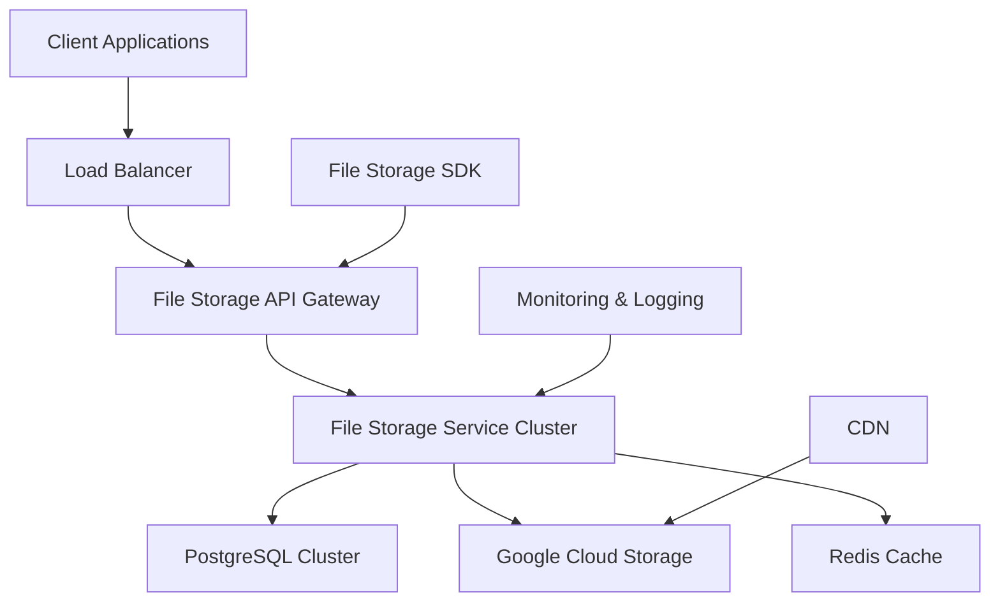
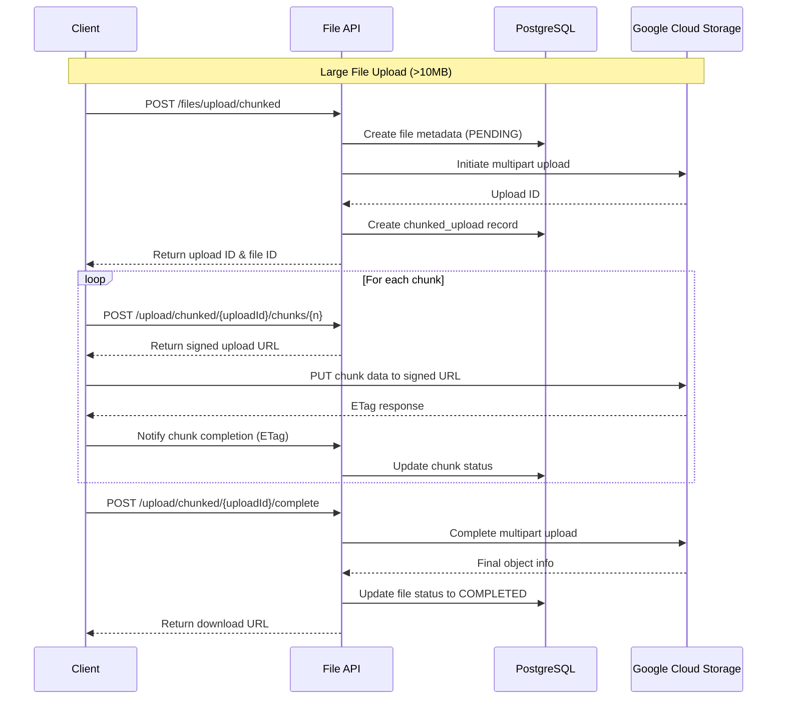

# File Storage Service Design Guide

## System Architecture Overview

A production-ready File Storage Service requires careful consideration of scalability, reliability, security, and performance. This service acts as a centralized file management system that abstracts the complexity of cloud storage while providing rich metadata capabilities through PostgreSQL.



The architecture follows a microservices pattern where the File Storage Service is independently deployable and scalable. The service handles both file operations and metadata management, ensuring data consistency and providing high availability.

**Interview Insight**: *When asked about system architecture decisions, emphasize the separation of concerns - metadata in PostgreSQL for complex queries and actual files in GCS for scalability and durability.*

## Database Schema Design

The PostgreSQL schema is designed to support various file types, track upload progress for chunked uploads, and maintain audit trails.

```sql
-- Files table for storing file metadata
CREATE TABLE files (
    id UUID PRIMARY KEY DEFAULT gen_random_uuid(),
    filename VARCHAR(255) NOT NULL,
    original_filename VARCHAR(255) NOT NULL,
    file_size BIGINT NOT NULL,
    mime_type VARCHAR(100) NOT NULL,
    file_hash VARCHAR(64) NOT NULL, -- SHA-256 hash for deduplication
    gcs_bucket VARCHAR(100) NOT NULL,
    gcs_object_key VARCHAR(500) NOT NULL,
    upload_status VARCHAR(20) NOT NULL DEFAULT 'PENDING', -- PENDING, UPLOADING, COMPLETED, FAILED
    created_by UUID NOT NULL,
    project_id UUID,
    tags JSONB,
    metadata JSONB, -- Extensible metadata storage
    created_at TIMESTAMP WITH TIME ZONE DEFAULT NOW(),
    updated_at TIMESTAMP WITH TIME ZONE DEFAULT NOW(),
    expires_at TIMESTAMP WITH TIME ZONE, -- For temporary files
    
    CONSTRAINT valid_upload_status CHECK (upload_status IN ('PENDING', 'UPLOADING', 'COMPLETED', 'FAILED'))
);

-- Chunked uploads table for managing large file uploads
CREATE TABLE chunked_uploads (
    id UUID PRIMARY KEY DEFAULT gen_random_uuid(),
    file_id UUID REFERENCES files(id) ON DELETE CASCADE,
    upload_id VARCHAR(255) NOT NULL, -- GCS multipart upload ID
    total_chunks INTEGER NOT NULL,
    completed_chunks INTEGER DEFAULT 0,
    chunk_size INTEGER NOT NULL,
    created_at TIMESTAMP WITH TIME ZONE DEFAULT NOW(),
    expires_at TIMESTAMP WITH TIME ZONE NOT NULL -- Cleanup incomplete uploads
);

-- Chunks table for tracking individual chunk uploads
CREATE TABLE chunks (
    id UUID PRIMARY KEY DEFAULT gen_random_uuid(),
    chunked_upload_id UUID REFERENCES chunked_uploads(id) ON DELETE CASCADE,
    chunk_number INTEGER NOT NULL,
    chunk_size INTEGER NOT NULL,
    etag VARCHAR(255), -- GCS ETag for the chunk
    uploaded_at TIMESTAMP WITH TIME ZONE,
    
    UNIQUE(chunked_upload_id, chunk_number)
);

-- File access logs for audit and analytics
CREATE TABLE file_access_logs (
    id UUID PRIMARY KEY DEFAULT gen_random_uuid(),
    file_id UUID REFERENCES files(id) ON DELETE SET NULL,
    access_type VARCHAR(20) NOT NULL, -- UPLOAD, DOWNLOAD, DELETE, VIEW
    user_id UUID NOT NULL,
    ip_address INET,
    user_agent TEXT,
    accessed_at TIMESTAMP WITH TIME ZONE DEFAULT NOW()
);

-- Indexes for performance
CREATE INDEX idx_files_project_id ON files(project_id);
CREATE INDEX idx_files_created_by ON files(created_by);
CREATE INDEX idx_files_file_hash ON files(file_hash);
CREATE INDEX idx_files_upload_status ON files(upload_status);
CREATE INDEX idx_files_created_at ON files(created_at DESC);
CREATE INDEX idx_chunked_uploads_file_id ON chunked_uploads(file_id);
CREATE INDEX idx_chunks_chunked_upload_id ON chunks(chunked_upload_id);
CREATE INDEX idx_file_access_logs_file_id ON file_access_logs(file_id);
CREATE INDEX idx_file_access_logs_user_id ON file_access_logs(user_id);
```

**Interview Insight**: *The schema design demonstrates understanding of ACID properties, referential integrity, and performance optimization. The JSONB fields provide flexibility while maintaining query performance.*

## Core Service Implementation

### File Service Interface

```java
public interface FileStorageService {
    
    /**
     * Initiate a single file upload
     */
    FileUploadResponse uploadFile(FileUploadRequest request);
    
    /**
     * Initiate a chunked upload for large files
     */
    ChunkedUploadResponse initiateChunkedUpload(ChunkedUploadRequest request);
    
    /**
     * Upload a single chunk
     */
    ChunkUploadResponse uploadChunk(ChunkUploadRequest request);
    
    /**
     * Complete chunked upload
     */
    FileUploadResponse completeChunkedUpload(CompleteChunkedUploadRequest request);
    
    /**
     * Generate signed download URL
     */
    FileDownloadResponse getDownloadUrl(String fileId, Duration expiration);
    
    /**
     * Query files with filtering and pagination
     */
    FileQueryResponse queryFiles(FileQueryRequest request);
    
    /**
     * Delete a file
     */
    void deleteFile(String fileId, String userId);
    
    /**
     * Get file metadata
     */
    FileMetadata getFileMetadata(String fileId);
}
```

### File Storage Service Implementation

```java
@Service
@Transactional
public class FileStorageServiceImpl implements FileStorageService {
    
    private final FileRepository fileRepository;
    private final ChunkedUploadRepository chunkedUploadRepository;
    private final GcsStorageClient gcsClient;
    private final FileAccessLogger accessLogger;
    private final RedisTemplate<String, Object> redisTemplate;
    
    @Override
    public FileUploadResponse uploadFile(FileUploadRequest request) {
        validateUploadRequest(request);
        
        // Check for file deduplication
        Optional<FileEntity> existingFile = fileRepository
            .findByFileHashAndProjectId(request.getFileHash(), request.getProjectId());
        
        if (existingFile.isPresent() && request.isAllowDeduplication()) {
            return createDeduplicationResponse(existingFile.get());
        }
        
        // Create file entity
        FileEntity fileEntity = FileEntity.builder()
            .filename(generateUniqueFilename(request.getOriginalFilename()))
            .originalFilename(request.getOriginalFilename())
            .fileSize(request.getFileSize())
            .mimeType(request.getMimeType())
            .fileHash(request.getFileHash())
            .gcsBucket(gcsClient.getDefaultBucket())
            .gcsObjectKey(generateObjectKey(request))
            .uploadStatus(UploadStatus.PENDING)
            .createdBy(request.getUserId())
            .projectId(request.getProjectId())
            .tags(request.getTags())
            .metadata(request.getMetadata())
            .build();
        
        fileEntity = fileRepository.save(fileEntity);
        
        try {
            // Generate signed upload URL
            String signedUrl = gcsClient.generateSignedUploadUrl(
                fileEntity.getGcsBucket(),
                fileEntity.getGcsObjectKey(),
                request.getMimeType(),
                Duration.ofHours(1)
            );
            
            // Cache upload session
            cacheUploadSession(fileEntity.getId(), request.getUserId());
            
            return FileUploadResponse.builder()
                .fileId(fileEntity.getId())
                .uploadUrl(signedUrl)
                .expiresAt(Instant.now().plus(Duration.ofHours(1)))
                .build();
                
        } catch (Exception e) {
            fileEntity.setUploadStatus(UploadStatus.FAILED);
            fileRepository.save(fileEntity);
            throw new FileUploadException("Failed to generate upload URL", e);
        }
    }
    
    @Override
    public ChunkedUploadResponse initiateChunkedUpload(ChunkedUploadRequest request) {
        validateChunkedUploadRequest(request);
        
        // Create file entity
        FileEntity fileEntity = createFileEntity(request);
        fileEntity = fileRepository.save(fileEntity);
        
        try {
            // Initiate multipart upload in GCS
            String uploadId = gcsClient.initiateMultipartUpload(
                fileEntity.getGcsBucket(),
                fileEntity.getGcsObjectKey(),
                request.getMimeType()
            );
            
            // Create chunked upload entity
            ChunkedUploadEntity chunkedUpload = ChunkedUploadEntity.builder()
                .fileId(fileEntity.getId())
                .uploadId(uploadId)
                .totalChunks(request.getTotalChunks())
                .chunkSize(request.getChunkSize())
                .expiresAt(Instant.now().plus(Duration.ofDays(1)))
                .build();
            
            chunkedUpload = chunkedUploadRepository.save(chunkedUpload);
            
            return ChunkedUploadResponse.builder()
                .fileId(fileEntity.getId())
                .uploadId(chunkedUpload.getId())
                .expiresAt(chunkedUpload.getExpiresAt())
                .build();
                
        } catch (Exception e) {
            fileEntity.setUploadStatus(UploadStatus.FAILED);
            fileRepository.save(fileEntity);
            throw new FileUploadException("Failed to initiate chunked upload", e);
        }
    }
    
    @Override
    public ChunkUploadResponse uploadChunk(ChunkUploadRequest request) {
        ChunkedUploadEntity chunkedUpload = chunkedUploadRepository
            .findById(request.getUploadId())
            .orElseThrow(() -> new ChunkedUploadNotFoundException("Upload not found"));
        
        validateChunkUploadRequest(request, chunkedUpload);
        
        try {
            // Generate signed URL for chunk upload
            String signedUrl = gcsClient.generateSignedChunkUploadUrl(
                chunkedUpload.getUploadId(),
                request.getChunkNumber(),
                Duration.ofHours(1)
            );
            
            return ChunkUploadResponse.builder()
                .chunkUploadUrl(signedUrl)
                .expiresAt(Instant.now().plus(Duration.ofHours(1)))
                .build();
                
        } catch (Exception e) {
            throw new ChunkUploadException("Failed to generate chunk upload URL", e);
        }
    }
    
    @Override
    public FileDownloadResponse getDownloadUrl(String fileId, Duration expiration) {
        FileEntity fileEntity = fileRepository.findById(UUID.fromString(fileId))
            .orElseThrow(() -> new FileNotFoundException("File not found"));
        
        if (fileEntity.getUploadStatus() != UploadStatus.COMPLETED) {
            throw new FileNotAvailableException("File is not available for download");
        }
        
        try {
            String signedUrl = gcsClient.generateSignedDownloadUrl(
                fileEntity.getGcsBucket(),
                fileEntity.getGcsObjectKey(),
                expiration
            );
            
            // Log access
            accessLogger.logAccess(fileId, AccessType.DOWNLOAD);
            
            return FileDownloadResponse.builder()
                .downloadUrl(signedUrl)
                .filename(fileEntity.getOriginalFilename())
                .fileSize(fileEntity.getFileSize())
                .mimeType(fileEntity.getMimeType())
                .expiresAt(Instant.now().plus(expiration))
                .build();
                
        } catch (Exception e) {
            throw new FileDownloadException("Failed to generate download URL", e);
        }
    }
}
```

**Interview Insight**: *This implementation demonstrates proper error handling, transaction management, and separation of concerns. The use of signed URLs ensures security while offloading bandwidth from your servers.*

## API Endpoints Design

### REST API Specification

```java
@RestController
@RequestMapping("/api/v1/files")
@Validated
public class FileController {
    
    private final FileStorageService fileStorageService;
    
    /**
     * Upload a single file (< 10MB)
     * POST /api/v1/files/upload
     */
    @PostMapping("/upload")
    public ResponseEntity<FileUploadResponse> uploadFile(
            @Valid @RequestBody FileUploadRequest request) {
        
        FileUploadResponse response = fileStorageService.uploadFile(request);
        return ResponseEntity.ok(response);
    }
    
    /**
     * Initiate chunked upload for large files
     * POST /api/v1/files/upload/chunked
     */
    @PostMapping("/upload/chunked")
    public ResponseEntity<ChunkedUploadResponse> initiateChunkedUpload(
            @Valid @RequestBody ChunkedUploadRequest request) {
        
        ChunkedUploadResponse response = fileStorageService.initiateChunkedUpload(request);
        return ResponseEntity.status(HttpStatus.CREATED).body(response);
    }
    
    /**
     * Get upload URL for a specific chunk
     * POST /api/v1/files/upload/chunked/{uploadId}/chunks/{chunkNumber}
     */
    @PostMapping("/upload/chunked/{uploadId}/chunks/{chunkNumber}")
    public ResponseEntity<ChunkUploadResponse> getChunkUploadUrl(
            @PathVariable String uploadId,
            @PathVariable Integer chunkNumber) {
        
        ChunkUploadRequest request = ChunkUploadRequest.builder()
            .uploadId(uploadId)
            .chunkNumber(chunkNumber)
            .build();
        
        ChunkUploadResponse response = fileStorageService.uploadChunk(request);
        return ResponseEntity.ok(response);
    }
    
    /**
     * Complete chunked upload
     * POST /api/v1/files/upload/chunked/{uploadId}/complete
     */
    @PostMapping("/upload/chunked/{uploadId}/complete")
    public ResponseEntity<FileUploadResponse> completeChunkedUpload(
            @PathVariable String uploadId,
            @Valid @RequestBody CompleteChunkedUploadRequest request) {
        
        request.setUploadId(uploadId);
        FileUploadResponse response = fileStorageService.completeChunkedUpload(request);
        return ResponseEntity.ok(response);
    }
    
    /**
     * Get file download URL
     * GET /api/v1/files/{fileId}/download
     */
    @GetMapping("/{fileId}/download")
    public ResponseEntity<FileDownloadResponse> getDownloadUrl(
            @PathVariable String fileId,
            @RequestParam(defaultValue = "3600") Long expirationSeconds) {
        
        Duration expiration = Duration.ofSeconds(expirationSeconds);
        FileDownloadResponse response = fileStorageService.getDownloadUrl(fileId, expiration);
        return ResponseEntity.ok(response);
    }
    
    /**
     * Query files with filtering and pagination
     * GET /api/v1/files
     */
    @GetMapping
    public ResponseEntity<FileQueryResponse> queryFiles(
            @RequestParam(required = false) String projectId,
            @RequestParam(required = false) List<String> mimeTypes,
            @RequestParam(required = false) String createdBy,
            @RequestParam(required = false) @DateTimeFormat(iso = DateTimeFormat.ISO.DATE_TIME) Instant createdAfter,
            @RequestParam(required = false) @DateTimeFormat(iso = DateTimeFormat.ISO.DATE_TIME) Instant createdBefore,
            @RequestParam(defaultValue = "0") Integer page,
            @RequestParam(defaultValue = "20") Integer size,
            @RequestParam(defaultValue = "createdAt,desc") String sort) {
        
        FileQueryRequest request = FileQueryRequest.builder()
            .projectId(projectId)
            .mimeTypes(mimeTypes)
            .createdBy(createdBy)
            .createdAfter(createdAfter)
            .createdBefore(createdBefore)
            .page(page)
            .size(size)
            .sort(sort)
            .build();
        
        FileQueryResponse response = fileStorageService.queryFiles(request);
        return ResponseEntity.ok(response);
    }
    
    /**
     * Get file metadata
     * GET /api/v1/files/{fileId}
     */
    @GetMapping("/{fileId}")
    public ResponseEntity<FileMetadata> getFileMetadata(@PathVariable String fileId) {
        FileMetadata metadata = fileStorageService.getFileMetadata(fileId);
        return ResponseEntity.ok(metadata);
    }
    
    /**
     * Delete file
     * DELETE /api/v1/files/{fileId}
     */
    @DeleteMapping("/{fileId}")
    public ResponseEntity<Void> deleteFile(
            @PathVariable String fileId,
            @RequestHeader("X-User-Id") String userId) {
        
        fileStorageService.deleteFile(fileId, userId);
        return ResponseEntity.noContent().build();
    }
}
```

### API Request/Response Models

```java
// Request models
@Data
@Builder
@NoArgsConstructor
@AllArgsConstructor
public class FileUploadRequest {
    @NotNull
    @Size(min = 1, max = 255)
    private String originalFilename;
    
    @NotNull
    @Min(1)
    private Long fileSize;
    
    @NotNull
    @Size(min = 1, max = 100)
    private String mimeType;
    
    @NotNull
    @Size(min = 64, max = 64)
    private String fileHash; // SHA-256
    
    @NotNull
    private String userId;
    
    private String projectId;
    
    @Valid
    private Map<String, String> tags;
    
    @Valid
    private Map<String, Object> metadata;
    
    @Builder.Default
    private Boolean allowDeduplication = true;
}

@Data
@Builder
@NoArgsConstructor
@AllArgsConstructor
public class ChunkedUploadRequest {
    @NotNull
    @Size(min = 1, max = 255)
    private String originalFilename;
    
    @NotNull
    @Min(1)
    private Long fileSize;
    
    @NotNull
    @Size(min = 1, max = 100)
    private String mimeType;
    
    @NotNull
    @Size(min = 64, max = 64)
    private String fileHash;
    
    @NotNull
    private String userId;
    
    private String projectId;
    
    @NotNull
    @Min(2)
    @Max(10000)
    private Integer totalChunks;
    
    @NotNull
    @Min(1048576) // 1MB minimum
    @Max(104857600) // 100MB maximum
    private Integer chunkSize;
    
    private Map<String, String> tags;
    private Map<String, Object> metadata;
}

// Response models
@Data
@Builder
public class FileUploadResponse {
    private String fileId;
    private String uploadUrl;
    private Instant expiresAt;
    private Boolean isDuplicate;
}

@Data
@Builder
public class ChunkedUploadResponse {
    private String fileId;
    private String uploadId;
    private Instant expiresAt;
}

@Data
@Builder
public class FileDownloadResponse {
    private String downloadUrl;
    private String filename;
    private Long fileSize;
    private String mimeType;
    private Instant expiresAt;
}
```

## File Storage SDK Implementation

### SDK Architecture

The SDK provides a clean abstraction layer for client applications, handling authentication, retries, and error handling automatically.

```java
public class FileStorageSDK {
    
    private final FileStorageClient client;
    private final RetryPolicy retryPolicy;
    private final AuthenticationProvider authProvider;
    
    public FileStorageSDK(FileStorageConfig config) {
        this.client = new FileStorageClient(config);
        this.retryPolicy = createRetryPolicy(config);
        this.authProvider = new AuthenticationProvider(config);
    }
    
    /**
     * Upload a single file
     */
    public CompletableFuture<FileUploadResult> uploadFile(File file, UploadOptions options) {
        return CompletableFuture.supplyAsync(() -> {
            try {
                validateFile(file);
                
                if (file.length() > options.getChunkThreshold()) {
                    return uploadFileInChunks(file, options);
                } else {
                    return uploadSingleFile(file, options);
                }
            } catch (Exception e) {
                throw new FileUploadException("Upload failed", e);
            }
        });
    }
    
    /**
     * Download a file
     */
    public CompletableFuture<File> downloadFile(String fileId, File destination) {
        return CompletableFuture.supplyAsync(() -> {
            try {
                FileDownloadResponse response = client.getDownloadUrl(fileId);
                return downloadFromSignedUrl(response.getDownloadUrl(), destination);
            } catch (Exception e) {
                throw new FileDownloadException("Download failed", e);
            }
        });
    }
    
    /**
     * Upload file with progress callback
     */
    public CompletableFuture<FileUploadResult> uploadFileWithProgress(
            File file, 
            UploadOptions options, 
            ProgressCallback callback) {
        
        if (file.length() <= options.getChunkThreshold()) {
            return uploadSingleFileWithProgress(file, options, callback);
        } else {
            return uploadFileInChunksWithProgress(file, options, callback);
        }
    }
    
    private FileUploadResult uploadFileInChunksWithProgress(
            File file, 
            UploadOptions options, 
            ProgressCallback callback) {
        
        try {
            // Calculate file hash
            String fileHash = calculateSHA256(file);
            
            // Calculate chunks
            long chunkSize = options.getChunkSize();
            int totalChunks = (int) Math.ceil((double) file.length() / chunkSize);
            
            // Initiate chunked upload
            ChunkedUploadRequest request = ChunkedUploadRequest.builder()
                .originalFilename(file.getName())
                .fileSize(file.length())
                .mimeType(detectMimeType(file))
                .fileHash(fileHash)
                .userId(options.getUserId())
                .projectId(options.getProjectId())
                .totalChunks(totalChunks)
                .chunkSize((int) chunkSize)
                .tags(options.getTags())
                .metadata(options.getMetadata())
                .build();
            
            ChunkedUploadResponse uploadResponse = client.initiateChunkedUpload(request);
            
            // Upload chunks
            List<ChunkInfo> chunkInfos = new ArrayList<>();
            try (RandomAccessFile raf = new RandomAccessFile(file, "r")) {
                for (int i = 0; i < totalChunks; i++) {
                    long offset = (long) i * chunkSize;
                    long currentChunkSize = Math.min(chunkSize, file.length() - offset);
                    
                    ChunkUploadResponse chunkResponse = client.getChunkUploadUrl(
                        uploadResponse.getUploadId(), i + 1);
                    
                    // Upload chunk to GCS
                    byte[] chunkData = new byte[(int) currentChunkSize];
                    raf.seek(offset);
                    raf.readFully(chunkData);
                    
                    String etag = uploadChunkToGCS(chunkResponse.getChunkUploadUrl(), chunkData);
                    
                    chunkInfos.add(new ChunkInfo(i + 1, etag));
                    
                    // Update progress
                    if (callback != null) {
                        callback.onProgress((double) (i + 1) / totalChunks);
                    }
                }
            }
            
            // Complete upload
            CompleteChunkedUploadRequest completeRequest = CompleteChunkedUploadRequest.builder()
                .uploadId(uploadResponse.getUploadId())
                .chunks(chunkInfos)
                .build();
            
            FileUploadResponse finalResponse = client.completeChunkedUpload(completeRequest);
            
            if (callback != null) {
                callback.onComplete();
            }
            
            return FileUploadResult.builder()
                .fileId(finalResponse.getFileId())
                .filename(file.getName())
                .fileSize(file.length())
                .uploadedAt(Instant.now())
                .build();
                
        } catch (Exception e) {
            if (callback != null) {
                callback.onError(e);
            }
            throw new FileUploadException("Chunked upload failed", e);
        }
    }
    
    /**
     * Query files with fluent API
     */
    public FileQuery queryFiles() {
        return new FileQuery(client);
    }
    
    /**
     * Fluent query builder
     */
    public static class FileQuery {
        private final FileStorageClient client;
        private final FileQueryRequest.FileQueryRequestBuilder builder;
        
        public FileQuery(FileStorageClient client) {
            this.client = client;
            this.builder = FileQueryRequest.builder();
        }
        
        public FileQuery inProject(String projectId) {
            builder.projectId(projectId);
            return this;
        }
        
        public FileQuery withMimeTypes(String... mimeTypes) {
            builder.mimeTypes(Arrays.asList(mimeTypes));
            return this;
        }
        
        public FileQuery createdBy(String userId) {
            builder.createdBy(userId);
            return this;
        }
        
        public FileQuery createdAfter(Instant after) {
            builder.createdAfter(after);
            return this;
        }
        
        public FileQuery pageSize(int size) {
            builder.size(size);
            return this;
        }
        
        public FileQuery page(int page) {
            builder.page(page);
            return this;
        }
        
        public CompletableFuture<FileQueryResult> execute() {
            return CompletableFuture.supplyAsync(() -> {
                try {
                    FileQueryResponse response = client.queryFiles(builder.build());
                    return FileQueryResult.from(response);
                } catch (Exception e) {
                    throw new FileQueryException("Query failed", e);
                }
            });
        }
    }
}
```

### SDK Usage Examples

```java
// Initialize SDK
FileStorageConfig config = FileStorageConfig.builder()
    .baseUrl("https://api.example.com")
    .apiKey("your-api-key")
    .timeout(Duration.ofMinutes(5))
    .chunkSize(5 * 1024 * 1024) // 5MB chunks
    .build();

FileStorageSDK sdk = new FileStorageSDK(config);

// Simple file upload
File document = new File("document.pdf");
UploadOptions options = UploadOptions.builder()
    .userId("user-123")
    .projectId("project-456")
    .tag("category", "documents")
    .metadata("department", "engineering")
    .build();

CompletableFuture<FileUploadResult> uploadFuture = sdk.uploadFile(document, options);
FileUploadResult result = uploadFuture.join();
System.out.println("File uploaded: " + result.getFileId());

// Upload with progress tracking
sdk.uploadFileWithProgress(document, options, new ProgressCallback() {
    @Override
    public void onProgress(double progress) {
        System.out.printf("Upload progress: %.2f%%\n", progress * 100);
    }
    
    @Override
    public void onComplete() {
        System.out.println("Upload completed!");
    }
    
    @Override
    public void onError(Exception error) {
        System.err.println("Upload failed: " + error.getMessage());
    }
});

// Query files
CompletableFuture<FileQueryResult> queryFuture = sdk.queryFiles()
    .inProject("project-456")
    .withMimeTypes("application/pdf", "image/jpeg")
    .createdAfter(Instant.now().minus(Duration.ofDays(30)))
    .pageSize(50)
    .execute();

FileQueryResult queryResult = queryFuture.join();
queryResult.getFiles().forEach(file -> {
    System.out.println("File: " + file.getFilename() + " (" + file.getFileSize() + " bytes)");
});

// Download file
CompletableFuture<File> downloadFuture = sdk.downloadFile(
    result.getFileId(), 
    new File("downloads/document.pdf")
);
File downloadedFile = downloadFuture.join();
```

**Interview Insight**: *The SDK design demonstrates understanding of asynchronous programming, builder patterns, and clean API design. The fluent query interface shows advanced Java skills.*

## Chunked Upload Flow

The chunked upload mechanism handles large files efficiently by splitting them into manageable chunks and uploading them in parallel when possible.



### Chunked Upload Implementation Details

```java
@Component
public class ChunkedUploadHandler {
    
    private final ChunkedUploadRepository chunkedUploadRepository;
    private final ChunkRepository chunkRepository;
    private final GcsStorageClient gcsClient;
    private final TaskExecutor taskExecutor;
    
    /**
     * Process chunk completion asynchronously
     */
    @Async
    public CompletableFuture<Void> handleChunkCompletion(
            String uploadId, 
            Integer chunkNumber, 
            String etag) {
        
        return CompletableFuture.runAsync(() -> {
            try {
                ChunkedUploadEntity upload = chunkedUploadRepository.findById(uploadId)
                    .orElseThrow(() -> new ChunkedUploadNotFoundException("Upload not found"));
                
                // Update or create chunk record
                ChunkEntity chunk = chunkRepository
                    .findByChunkedUploadIdAndChunkNumber(uploadId, chunkNumber)
                    .orElse(ChunkEntity.builder()
                        .chunkedUploadId(uploadId)
                        .chunkNumber(chunkNumber)
                        .build());
                
                chunk.setEtag(etag);
                chunk.setUploadedAt(Instant.now());
                chunkRepository.save(chunk);
                
                // Update completed chunks count
                upload.setCompletedChunks(upload.getCompletedChunks() + 1);
                chunkedUploadRepository.save(upload);
                
                // Check if all chunks are completed
                if (upload.getCompletedChunks().equals(upload.getTotalChunks())) {
                    notifyUploadCompletion(uploadId);
                }
                
            } catch (Exception e) {
                log.error("Failed to handle chunk completion for upload: {}, chunk: {}", 
                    uploadId, chunkNumber, e);
                throw new ChunkProcessingException("Chunk processing failed", e);
            }
        }, taskExecutor);
    }
    
    /**
     * Auto-complete upload when all chunks are received
     */
    private void notifyUploadCompletion(String uploadId) {
        // Use event-driven approach for loose coupling
        applicationEventPublisher.publishEvent(
            new ChunkedUploadCompletedEvent(uploadId)
        );
    }
}
```

**Interview Insight**: *The asynchronous processing of chunk completions demonstrates understanding of event-driven architecture and prevents blocking the upload API.*

## Security and Authentication

### API Security Implementation

```java
@Component
public class FileSecurityService {
    
    private final JwtTokenProvider jwtTokenProvider;
    private final PermissionService permissionService;
    private final RateLimitService rateLimitService;
    
    /**
     * Validate file access permissions
     */
    public void validateFileAccess(String fileId, String userId, FileOperation operation) {
        // Check rate limits
        if (!rateLimitService.isAllowed(userId, operation)) {
            throw new RateLimitExceededException("Rate limit exceeded");
        }
        
        // Validate file ownership or permissions
        FileEntity file = fileRepository.findById(UUID.fromString(fileId))
            .orElseThrow(() -> new FileNotFoundException("File not found"));
        
        if (!canUserAccessFile(file, userId, operation)) {
            throw new AccessDeniedException("Insufficient permissions");
        }
        
        // Validate file status for downloads
        if (operation == FileOperation.DOWNLOAD && 
            file.getUploadStatus() != UploadStatus.COMPLETED) {
            throw new FileNotAvailableException("File not available");
        }
        
        // Check file expiration
        if (file.getExpiresAt() != null && 
            file.getExpiresAt().isBefore(Instant.now())) {
            throw new FileExpiredException("File has expired");
        }
    }
    
    private boolean canUserAccessFile(FileEntity file, String userId, FileOperation operation) {
        // Owner always has full access
        if (file.getCreatedBy().equals(UUID.fromString(userId))) {
            return true;
        }
        
        // Check project-level permissions
        if (file.getProjectId() != null) {
            return permissionService.hasProjectPermission(
                userId, 
                file.getProjectId().toString(), 
                operation.toPermission()
            );
        }
        
        // Check organization-level permissions for non-project files
        return permissionService.hasOrganizationPermission(
            userId, 
            operation.toPermission()
        );
    }
    
    /**
     * Generate secure signed URLs with additional validation
     */
    public String generateSecureSignedUrl(String fileId, String userId, Duration expiration) {
        validateFileAccess(fileId, userId, FileOperation.DOWNLOAD);
        
        FileEntity file = fileRepository.findById(UUID.fromString(fileId))
            .orElseThrow(() -> new FileNotFoundException("File not found"));
        
        // Generate signed URL with custom headers for validation
        Map<String, String> customHeaders = Map.of(
            "x-user-id", userId,
            "x-file-id", fileId,
            "x-timestamp", String.valueOf(Instant.now().getEpochSecond())
        );
        
        return gcsClient.generateSignedDownloadUrl(
            file.getGcsBucket(),
            file.getGcsObjectKey(),
            expiration,
            customHeaders
        );
    }
}

/**
 * Security interceptor for file operations
 */
@Component
public class FileSecurityInterceptor implements HandlerInterceptor {
    
    private final FileSecurityService securityService;
    private final JwtTokenProvider jwtTokenProvider;
    
    @Override
    public boolean preHandle(HttpServletRequest request, 
                           HttpServletResponse response, 
                           Object handler) throws Exception {
        
        String token = extractTokenFromRequest(request);
        if (token == null || !jwtTokenProvider.validateToken(token)) {
            response.setStatus(HttpStatus.UNAUTHORIZED.value());
            return false;
        }
        
        String userId = jwtTokenProvider.getUserIdFromToken(token);
        
        // Extract file ID from path
        String fileId = extractFileIdFromPath(request.getRequestURI());
        if (fileId != null) {
            FileOperation operation = determineOperation(request.getMethod(), request.getRequestURI());
            securityService.validateFileAccess(fileId, userId, operation);
        }
        
        // Set user context for the request
        SecurityContextHolder.getContext().setUserId(userId);
        
        return true;
    }
}
```

## Performance Optimization

### Caching Strategy

```java
@Service
public class FileCacheService {
    
    private final RedisTemplate<String, Object> redisTemplate;
    private final CacheManager cacheManager;
    
    private static final String METADATA_CACHE_PREFIX = "file:metadata:";
    private static final String DOWNLOAD_URL_CACHE_PREFIX = "file:download:";
    private static final Duration METADATA_CACHE_TTL = Duration.ofMinutes(30);
    private static final Duration DOWNLOAD_URL_CACHE_TTL = Duration.ofMinutes(5);
    
    /**
     * Cache file metadata with intelligent TTL
     */
    @Cacheable(value = "fileMetadata", key = "#fileId")
    public FileMetadata getFileMetadata(String fileId) {
        // Cache miss - load from database
        FileEntity file = fileRepository.findById(UUID.fromString(fileId))
            .orElseThrow(() -> new FileNotFoundException("File not found"));
        
        FileMetadata metadata = FileMetadata.from(file);
        
        // Cache with adaptive TTL based on file age
        Duration ttl = calculateAdaptiveTTL(file.getCreatedAt());
        cacheMetadataWithTTL(fileId, metadata, ttl);
        
        return metadata;
    }
    
    /**
     * Cache download URLs with short TTL for security
     */
    public String getCachedDownloadUrl(String fileId, String userId) {
        String cacheKey = DOWNLOAD_URL_CACHE_PREFIX + fileId + ":" + userId;
        return (String) redisTemplate.opsForValue().get(cacheKey);
    }
    
    public void cacheDownloadUrl(String fileId, String userId, String url, Duration expiration) {
        String cacheKey = DOWNLOAD_URL_CACHE_PREFIX + fileId + ":" + userId;
        Duration cacheTTL = expiration.compareTo(DOWNLOAD_URL_CACHE_TTL) < 0 ? 
            expiration : DOWNLOAD_URL_CACHE_TTL;
        
        redisTemplate.opsForValue().set(cacheKey, url, cacheTTL);
    }
    
    /**
     * Invalidate cache when file is updated or deleted
     */
    @CacheEvict(value = "fileMetadata", key = "#fileId")
    public void invalidateFileCache(String fileId) {
        // Also clear download URL caches for this file
        Set<String> keys = redisTemplate.keys(DOWNLOAD_URL_CACHE_PREFIX + fileId + ":*");
        if (!keys.isEmpty()) {
            redisTemplate.delete(keys);
        }
    }
    
    /**
     * Calculate adaptive TTL based on file characteristics
     */
    private Duration calculateAdaptiveTTL(Instant createdAt) {
        Duration age = Duration.between(createdAt, Instant.now());
        
        // Older files get longer cache TTL as they're less likely to change
        if (age.toDays() > 30) {
            return Duration.ofHours(2);
        } else if (age.toDays() > 7) {
            return Duration.ofMinutes(60);
        } else {
            return Duration.ofMinutes(15);
        }
    }
}

/**
 * Database query optimization
 */
@Repository
public class OptimizedFileRepository {
    
    @PersistenceContext
    private EntityManager entityManager;
    
    /**
     * Optimized query for file listing with filtering
     */
    @Query(value = """
        SELECT f.*, 
               COUNT(*) OVER() as total_count
        FROM files f
        WHERE (?1 IS NULL OR f.project_id = ?1::uuid)
          AND (?2 IS NULL OR f.mime_type = ANY(?2))
          AND (?3 IS NULL OR f.created_by = ?3::uuid)
          AND (?4 IS NULL OR f.created_at >= ?4)
          AND (?5 IS NULL OR f.created_at <= ?5)
          AND f.upload_status = 'COMPLETED'
        ORDER BY f.created_at DESC
        LIMIT ?6 OFFSET ?7
        """, nativeQuery = true)
    List<FileProjection> findFilesOptimized(
        String projectId,
        String[] mimeTypes,
        String createdBy,
        Instant createdAfter,
        Instant createdBefore,
        int limit,
        int offset
    );
    
    /**
     * Bulk operations for cleanup
     */
    @Modifying
    @Query("DELETE FROM FileEntity f WHERE f.uploadStatus = 'FAILED' AND f.createdAt < :cutoffDate")
    int deleteFailedUploadsOlderThan(@Param("cutoffDate") Instant cutoffDate);
    
    @Modifying
    @Query("""
        UPDATE FileEntity f 
        SET f.uploadStatus = 'EXPIRED' 
        WHERE f.expiresAt < :now AND f.uploadStatus = 'COMPLETED'
        """)
    int markExpiredFiles(@Param("now") Instant now);
}
```

### Monitoring and Observability

```java
@Component
public class FileStorageMetrics {
    
    private final MeterRegistry meterRegistry;
    private final Counter uploadCounter;
    private final Counter downloadCounter;
    private final Timer uploadTimer;
    private final Gauge activeUploadsGauge;
    private final DistributionSummary fileSizeDistribution;
    
    public FileStorageMetrics(MeterRegistry meterRegistry) {
        this.meterRegistry = meterRegistry;
        this.uploadCounter = Counter.builder("file_uploads_total")
            .description("Total number of file uploads")
            .register(meterRegistry);
        
        this.downloadCounter = Counter.builder("file_downloads_total")
            .description("Total number of file downloads")
            .register(meterRegistry);
        
        this.uploadTimer = Timer.builder("file_upload_duration")
            .description("File upload duration")
            .register(meterRegistry);
        
        this.fileSizeDistribution = DistributionSummary.builder("file_size_bytes")
            .description("Distribution of file sizes")
            .register(meterRegistry);
    }
    
    public void recordUpload(String mimeType, long fileSize, Duration duration, boolean successful) {
        uploadCounter.increment(
            Tags.of(
                "mime_type", mimeType,
                "status", successful ? "success" : "failure"
            )
        );
        
        if (successful) {
            uploadTimer.record(duration);
            fileSizeDistribution.record(fileSize);
        }
    }
    
    public void recordDownload(String mimeType) {
        downloadCounter.increment(Tags.of("mime_type", mimeType));
    }
    
    @Scheduled(fixedRate = 30000) // Every 30 seconds
    public void updateActiveUploadsGauge() {
        long activeUploads = chunkedUploadRepository.countByStatusIn(
            Arrays.asList(UploadStatus.PENDING, UploadStatus.UPLOADING)
        );
        
        Gauge.builder("file_uploads_active")
            .description("Number of active uploads")
            .register(meterRegistry, this, unused -> activeUploads);
    }
}
```

## Error Handling and Resilience

### Comprehensive Error Handling

```java
@ControllerAdvice
public class FileStorageExceptionHandler {
    
    private static final Logger log = LoggerFactory.getLogger(FileStorageExceptionHandler.class);
    
    @ExceptionHandler(FileNotFoundException.class)
    public ResponseEntity<ErrorResponse> handleFileNotFound(FileNotFoundException e) {
        log.warn("File not found: {}", e.getMessage());
        return ResponseEntity.status(HttpStatus.NOT_FOUND)
            .body(ErrorResponse.builder()
                .error("FILE_NOT_FOUND")
                .message(e.getMessage())
                .timestamp(Instant.now())
                .build());
    }
    
    @ExceptionHandler(FileUploadException.class)
    public ResponseEntity<ErrorResponse> handleUploadException(FileUploadException e) {
        log.error("File upload failed", e);
        return ResponseEntity.status(HttpStatus.BAD_REQUEST)
            .body(ErrorResponse.builder()
                .error("UPLOAD_FAILED")
                .message("File upload failed: " + e.getMessage())
                .timestamp(Instant.now())
                .details(extractErrorDetails(e))
                .build());
    }
    
    @ExceptionHandler(RateLimitExceededException.class)
    public ResponseEntity<ErrorResponse> handleRateLimit(RateLimitExceededException e) {
        log.warn("Rate limit exceeded: {}", e.getMessage());
        return ResponseEntity.status(HttpStatus.TOO_MANY_REQUESTS)
            .header("Retry-After", "60")
            .body(ErrorResponse.builder()
                .error("RATE_LIMIT_EXCEEDED")
                .message("Too many requests. Please try again later.")
                .timestamp(Instant.now())
                .build());
    }
    
    @ExceptionHandler(StorageQuotaExceededException.class)
    public ResponseEntity<ErrorResponse> handleQuotaExceeded(StorageQuotaExceededException e) {
        log.warn("Storage quota exceeded: {}", e.getMessage());
        return ResponseEntity.status(HttpStatus.INSUFFICIENT_STORAGE)
            .body(ErrorResponse.builder()
                .error("QUOTA_EXCEEDED")
                .message("Storage quota exceeded. Please upgrade your plan or delete some files.")
                .timestamp(Instant.now())
                .build());
    }
}

/**
 * Circuit breaker for GCS operations
 */
@Component
public class ResilientGcsClient {
    
    private final Storage storage;
    private final CircuitBreaker circuitBreaker;
    private final RetryTemplate retryTemplate;
    
    public ResilientGcsClient(Storage storage) {
        this.storage = storage;
        this.circuitBreaker = CircuitBreaker.builder("gcs-operations")
            .slidingWindow(10, 5, CircuitBreaker.SlidingWindowType.COUNT_BASED)
            .failureThreshold(50.0f)
            .waitInterval(Duration.ofSeconds(30))
            .build();
        
        this.retryTemplate = RetryTemplate.builder()
            .maxAttempts(3)
            .exponentialBackoff(1000, 2, 10000)
            .retryOn(StorageException.class)
            .build();
    }
    
    public String generateSignedUrl(String bucket, String objectName, Duration expiration) {
        return circuitBreaker.supply(() -> 
            retryTemplate.execute(context -> {
                try {
                    BlobInfo blobInfo = BlobInfo.newBuilder(bucket, objectName).build();
                    return storage.signUrl(blobInfo, expiration.toMillis(), TimeUnit.MILLISECONDS)
                        .toString();
                } catch (StorageException e) {
                    log.error("Failed to generate signed URL for {}/{}", bucket, objectName, e);
                    throw e;
                }
            })
        );
    }
}
```

## Deployment and Infrastructure

### Docker Configuration

```dockerfile
# Multi-stage build for production optimization
FROM openjdk:17-jdk-slim AS builder

WORKDIR /app
COPY gradlew .
COPY gradle gradle
COPY build.gradle settings.gradle ./
COPY src src

RUN ./gradlew build -x test --no-daemon

FROM openjdk:17-jre-slim

# Security: Create non-root user
RUN groupadd -r fileservice && useradd -r -g fileservice fileservice

# Install required packages
RUN apt-get update && apt-get install -y \
    curl \
    && rm -rf /var/lib/apt/lists/*

WORKDIR /app

# Copy application jar
COPY --from=builder /app/build/libs/file-storage-service-*.jar app.jar

# Copy configuration files
COPY --chown=fileservice:fileservice docker/application-docker.yml application.yml

# Health check
HEALTHCHECK --interval=30s --timeout=10s --start-period=60s --retries=3 \
  CMD curl -f http://localhost:8080/actuator/health || exit 1

# Switch to non-root user
USER fileservice

# JVM optimization for containers
ENV JAVA_OPTS="-XX:+UseContainerSupport -XX:MaxRAMPercentage=75.0 -XX:+UseG1GC"

EXPOSE 8080

ENTRYPOINT ["sh", "-c", "java $JAVA_OPTS -jar app.jar"]
```

### Kubernetes Deployment

```yaml
# deployment.yaml
apiVersion: apps/v1
kind: Deployment
metadata:
  name: file-storage-service
  namespace: file-storage
spec:
  replicas: 3
  strategy:
    type: RollingUpdate
    rollingUpdate:
      maxUnavailable: 1
      maxSurge: 1
  selector:
    matchLabels:
      app: file-storage-service
  template:
    metadata:
      labels:
        app: file-storage-service
    spec:
      containers:
      - name: file-storage-service
        image: file-storage-service:latest
        ports:
        - containerPort: 8080
        env:
        - name: SPRING_PROFILES_ACTIVE
          value: "kubernetes"
        - name: DB_HOST
          valueFrom:
            secretKeyRef:
              name: postgres-secret
              key: host
        - name: DB_PASSWORD
          valueFrom:
            secretKeyRef:
              name: postgres-secret
              key: password
        - name: GOOGLE_APPLICATION_CREDENTIALS
          value: "/etc/gcp/service-account.json"
        volumeMounts:
        - name: gcp-service-account
          mountPath: /etc/gcp
          readOnly: true
        resources:
          requests:
            memory: "512Mi"
            cpu: "250m"
          limits:
            memory: "1Gi"
            cpu: "1000m"
        livenessProbe:
          httpGet:
            path: /actuator/health/liveness
            port: 8080
          initialDelaySeconds: 60
          periodSeconds: 30
        readinessProbe:
          httpGet:
            path: /actuator/health/readiness
            port: 8080
          initialDelaySeconds: 30
          periodSeconds: 10
      volumes:
      - name: gcp-service-account
        secret:
          secretName: gcp-service-account

---
# service.yaml
apiVersion: v1
kind: Service
metadata:
  name: file-storage-service
  namespace: file-storage
spec:
  selector:
    app: file-storage-service
  ports:
  - protocol: TCP
    port: 80
    targetPort: 8080
  type: ClusterIP

---
# hpa.yaml
apiVersion: autoscaling/v2
kind: HorizontalPodAutoscaler
metadata:
  name: file-storage-hpa
  namespace: file-storage
spec:
  scaleTargetRef:
    apiVersion: apps/v1
    kind: Deployment
    name: file-storage-service
  minReplicas: 3
  maxReplicas: 10
  metrics:
  - type: Resource
    resource:
      name: cpu
      target:
        type: Utilization
        averageUtilization: 70
  - type: Resource
    resource:
      name: memory
      target:
        type: Utilization
        averageUtilization: 80
```

## Testing Strategy

### Integration Testing

```java
@SpringBootTest(webEnvironment = SpringBootTest.WebEnvironment.RANDOM_PORT)
@TestPropertySource(locations = "classpath:application-test.properties")
@Testcontainers
class FileStorageIntegrationTest {
    
    @Container
    static PostgreSQLContainer<?> postgres = new PostgreSQLContainer<>("postgres:13")
            .withDatabaseName("filetest")
            .withUsername("test")
            .withPassword("test");
    
    @Container
    static GenericContainer<?> redis = new GenericContainer<>("redis:6-alpine")
            .withExposedPorts(6379);
    
    @Autowired
    private TestRestTemplate restTemplate;
    
    @MockBean
    private GcsStorageClient gcsClient;
    
    @Test
    void shouldUploadFileSuccessfully() {
        // Given
        FileUploadRequest request = FileUploadRequest.builder()
            .originalFilename("test.pdf")
            .fileSize(1024L)
            .mimeType("application/pdf")
            .fileHash("abcd1234")
            .userId("user-123")
            .projectId("project-456")
            .build();
        
        when(gcsClient.generateSignedUploadUrl(any(), any(), any(), any()))
            .thenReturn("https://storage.googleapis.com/signed-url");
        
        // When
        ResponseEntity<FileUploadResponse> response = restTemplate.postForEntity(
            "/api/v1/files/upload",
            request,
            FileUploadResponse.class
        );
        
        // Then
        assertThat(response.getStatusCode()).isEqualTo(HttpStatus.OK);
        assertThat(response.getBody().getFileId()).isNotNull();
        assertThat(response.getBody().getUploadUrl()).contains("signed-url");
    }
    
    @Test
    void shouldHandleChunkedUploadFlow() {
        // Given
        ChunkedUploadRequest request = ChunkedUploadRequest.builder()
            .originalFilename("large-file.zip")
            .fileSize(50_000_000L)
            .mimeType("application/zip")
            .fileHash("efgh5678")
            .userId("user-123")
            .totalChunks(10)
            .chunkSize(5_000_000)
            .build();
        
        when(gcsClient.initiateMultipartUpload(any(), any(), any()))
            .thenReturn("multipart-upload-id");
        
        // When - Initiate chunked upload
        ResponseEntity<ChunkedUploadResponse> initResponse = restTemplate.postForEntity(
            "/api/v1/files/upload/chunked",
            request,
            ChunkedUploadResponse.class
        );
        
        // Then
        assertThat(initResponse.getStatusCode()).isEqualTo(HttpStatus.CREATED);
        String uploadId = initResponse.getBody().getUploadId();
        
        // When - Get chunk upload URLs
        for (int i = 1; i <= 10; i++) {
            when(gcsClient.generateSignedChunkUploadUrl(any(), eq(i), any()))
                .thenReturn("https://storage.googleapis.com/chunk-" + i);
            
            ResponseEntity<ChunkUploadResponse> chunkResponse = restTemplate.postForEntity(
                "/api/v1/files/upload/chunked/" + uploadId + "/chunks/" + i,
                null,
                ChunkUploadResponse.class
            );
            
            assertThat(chunkResponse.getStatusCode()).isEqualTo(HttpStatus.OK);
        }
        
        // When - Complete upload
        CompleteChunkedUploadRequest completeRequest = CompleteChunkedUploadRequest.builder()
            .uploadId(uploadId)
            .chunks(IntStream.rangeClosed(1, 10)
                .mapToObj(i -> new ChunkInfo(i, "etag-" + i))
                .collect(Collectors.toList()))
            .build();
        
        when(gcsClient.completeMultipartUpload(any(), any()))
            .thenReturn("final-object-key");
        
        ResponseEntity<FileUploadResponse> completeResponse = restTemplate.postForEntity(
            "/api/v1/files/upload/chunked/" + uploadId + "/complete",
            completeRequest,
            FileUploadResponse.class
        );
        
        // Then
        assertThat(completeResponse.getStatusCode()).isEqualTo(HttpStatus.OK);
        assertThat(completeResponse.getBody().getFileId()).isNotNull();
    }
}
```

## Common Interview Questions & Answers

**Q: How do you handle concurrent uploads of the same file?**

A: We implement file deduplication using SHA-256 hashes. When a file upload request comes in, we first check if a file with the same hash already exists for that project. If deduplication is enabled and the file exists, we return a reference to the existing file instead of creating a duplicate. For concurrent uploads of different files, we use database transactions and optimistic locking to handle race conditions.

**Q: How do you ensure data consistency during chunked uploads?**

A: We use a multi-phase approach:
1. Database transactions ensure atomicity of metadata operations
2. Each chunk upload is tracked individually with ETags from GCS
3. We implement a completion verification step that validates all chunks before finalizing
4. Failed uploads are automatically cleaned up using scheduled tasks
5. We use optimistic locking on the chunked_uploads table to prevent race conditions

**Q: How do you handle failures during large file uploads?**

A: Our resilience strategy includes:
1. **Retry mechanisms**: Exponential backoff for transient failures
2. **Circuit breakers**: Prevent cascading failures to GCS
3. **Cleanup jobs**: Remove orphaned uploads after expiration
4. **Resume capability**: Clients can query upload status and resume from the last successful chunk
5. **Monitoring**: Real-time alerts for high failure rates

**Q: How do you scale the service horizontally?**

A: The service is designed to be stateless and cloud-native:
1. **Stateless design**: All upload state is stored in PostgreSQL/Redis
2. **Load balancing**: Multiple service instances behind a load balancer
3. **Database connection pooling**: Efficient resource utilization
4. **Caching**: Redis for frequently accessed metadata
5. **Auto-scaling**: Kubernetes HPA based on CPU/memory metrics
6. **CDN integration**: CloudFront for global file delivery

**Q: How do you handle different file types and validation?**

A: We implement a comprehensive validation framework:

```java
@Component
public class FileValidator {
    
    private final Map<String, FileTypeValidator> validators;
    private final VirusScanner virusScanner;
    
    public ValidationResult validateFile(FileUploadRequest request, InputStream fileStream) {
        ValidationResult result = ValidationResult.success();
        
        // Basic validations
        result.merge(validateFileSize(request.getFileSize()));
        result.merge(validateMimeType(request.getMimeType()));
        result.merge(validateFilename(request.getOriginalFilename()));
        
        // Content-specific validation
        FileTypeValidator validator = validators.get(request.getMimeType());
        if (validator != null) {
            result.merge(validator.validate(fileStream));
        }
        
        // Security scan
        if (result.isValid()) {
            result.merge(virusScanner.scan(fileStream));
        }
        
        return result;
    }
}
```

**Q: How do you implement file versioning?**

A: File versioning can be implemented by extending the schema:

```sql
-- Add version tracking to files table
ALTER TABLE files ADD COLUMN version_number INTEGER DEFAULT 1;
ALTER TABLE files ADD COLUMN parent_file_id UUID REFERENCES files(id);
ALTER TABLE files ADD COLUMN is_latest_version BOOLEAN DEFAULT true;

-- Index for efficient version queries
CREATE INDEX idx_files_parent_version ON files(parent_file_id, version_number);
```

This allows tracking file history while maintaining backward compatibility with existing APIs.

## Best Practices and Recommendations

### Production Deployment Checklist

- **Security**: Implement proper authentication, authorization, and input validation
- **Monitoring**: Set up comprehensive logging, metrics, and alerting
- **Performance**: Implement caching, connection pooling, and query optimization
- **Reliability**: Use circuit breakers, retry mechanisms, and graceful degradation
- **Scalability**: Design for horizontal scaling with stateless services
- **Data Protection**: Implement backup strategies and disaster recovery
- **Compliance**: Ensure GDPR/compliance requirements for file metadata and deletion

### External Resources

- [Google Cloud Storage Best Practices](https://cloud.google.com/storage/docs/best-practices)
- [PostgreSQL Performance Tuning](https://wiki.postgresql.org/wiki/Performance_Optimization)
- [Spring Boot Production Guidelines](https://docs.spring.io/spring-boot/docs/current/reference/html/actuator.html)
- [Kubernetes File Storage Patterns](https://kubernetes.io/docs/concepts/storage/)
- [Microservices Observability](https://microservices.io/patterns/observability/audit-logging.html)

This comprehensive guide provides a production-ready foundation for building a scalable, secure, and maintainable file storage service. The modular design allows for easy extension and customization based on specific business requirements.