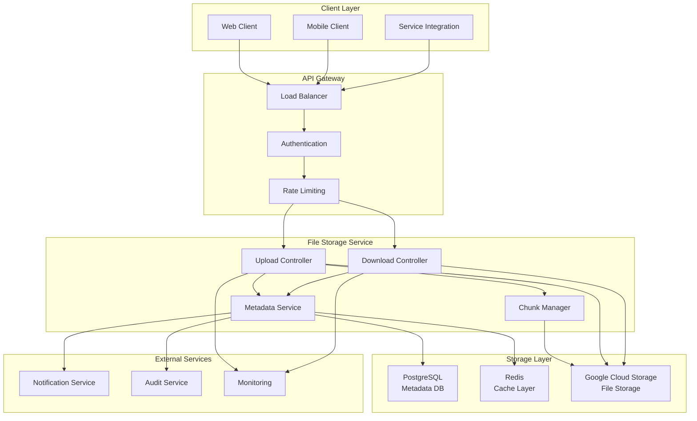
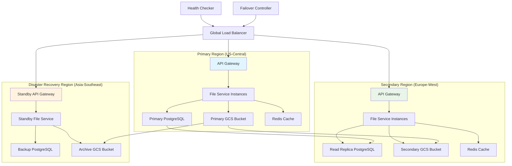

# File Storage Service Design - Production Ready Architecture

## System Overview

The File Storage Service is a robust, scalable solution for handling file uploads, storage, and retrieval operations. Built on Google Cloud Storage (GCS) and PostgreSQL, it provides enterprise-grade file management capabilities with comprehensive SDK support for seamless integration.

### Architecture Goals
- **Scalability**: Handle millions of files with horizontal scaling
- **Reliability**: 99.9% uptime with fault tolerance
- **Security**: End-to-end encryption and access control
- **Performance**: Sub-second response times for file operations
- **Cost Efficiency**: Intelligent storage tiering and lifecycle management

## High-Level Architecture



## Core Components Deep Dive

### File Upload Service

The upload service handles both single-shot uploads and chunked uploads for large files, implementing resumable upload patterns for reliability.

```java
@RestController
@RequestMapping("/api/v1/files")
public class FileUploadController {

	private final FileUploadService fileUploadService;
	private final ChunkManagerService chunkManagerService;
	private final FileValidationService validationService;

	@PostMapping("/upload")
	public ResponseEntity<FileUploadResponse> uploadFile(
			@RequestParam("file") MultipartFile file,
			@RequestParam(value = "projectId", required = false) String projectId,
			@RequestParam(value = "metadata", required = false) String metadata) {

		// Validate file
		validationService.validateFile(file);

		// Determine upload strategy
		if (file.getSize() > MAX_SINGLE_UPLOAD_SIZE) {
			return initiateChunkedUpload(file, projectId, metadata);
		} else {
			return uploadDirectly(file, projectId, metadata);
		}
	}

	@PostMapping("/upload/chunked/initiate")
	public ResponseEntity<ChunkedUploadResponse> initiateChunkedUpload(
			@RequestBody ChunkedUploadRequest request) {

		String uploadId = UUID.randomUUID().toString();
		ChunkedUploadSession session = chunkManagerService.createUploadSession(
				uploadId, request.getFileName(), request.getTotalSize(),
				request.getChunkSize(), request.getProjectId()
		);

		return ResponseEntity.ok(ChunkedUploadResponse.builder()
				.uploadId(uploadId)
				.totalChunks(session.getTotalChunks())
				.chunkSize(session.getChunkSize())
				.build());
	}

	@PutMapping("/upload/chunked/{uploadId}/chunk/{chunkNumber}")
	public ResponseEntity<ChunkUploadResponse> uploadChunk(
			@PathVariable String uploadId,
			@PathVariable int chunkNumber,
			@RequestParam("chunk") MultipartFile chunk) {

		ChunkUploadResult result = chunkManagerService.uploadChunk(
				uploadId, chunkNumber, chunk
		);

		if (result.isComplete()) {
			// All chunks uploaded, finalize the file
			FileMetadata fileMetadata = chunkManagerService.finalizeUpload(uploadId);
			return ResponseEntity.ok(ChunkUploadResponse.builder()
					.chunkNumber(chunkNumber)
					.completed(true)
					.fileUrl(fileMetadata.getDownloadUrl())
					.fileId(fileMetadata.getFileId())
					.build());
		}

		return ResponseEntity.ok(ChunkUploadResponse.builder()
				.chunkNumber(chunkNumber)
				.completed(false)
				.build());
	}
}
```

### Chunk Management System

For files larger than 10MB, the system implements intelligent chunking with resumable uploads:

```java
@Service
public class ChunkManagerService {

	private final RedisTemplate<String, Object> redisTemplate;
	private final GcsService gcsService;
	private final FileMetadataRepository metadataRepository;

	private static final int DEFAULT_CHUNK_SIZE = 5 * 1024 * 1024; // 5MB
	private static final String CHUNK_SESSION_PREFIX = "chunk_session:";

	public ChunkedUploadSession createUploadSession(String uploadId,
			String fileName, long totalSize, int chunkSize, String projectId) {

		int totalChunks = (int) Math.ceil((double) totalSize / chunkSize);

		ChunkedUploadSession session = ChunkedUploadSession.builder()
				.uploadId(uploadId)
				.fileName(fileName)
				.totalSize(totalSize)
				.chunkSize(chunkSize)
				.totalChunks(totalChunks)
				.projectId(projectId)
				.uploadedChunks(new BitSet(totalChunks))
				.createdAt(Instant.now())
				.expiresAt(Instant.now().plus(Duration.ofHours(24)))
				.build();

		// Store session in Redis with TTL
		redisTemplate.opsForValue().set(
				CHUNK_SESSION_PREFIX + uploadId,
				session,
				Duration.ofHours(24)
		);

		return session;
	}

	@Transactional
	public ChunkUploadResult uploadChunk(String uploadId, int chunkNumber,
			MultipartFile chunk) {

		ChunkedUploadSession session = getUploadSession(uploadId);
		if (session == null) {
			throw new UploadSessionNotFoundException("Upload session not found: " + uploadId);
		}

		// Validate chunk
		validateChunk(session, chunkNumber, chunk);

		// Upload chunk to GCS with temporary naming
		String tempChunkPath = generateTempChunkPath(uploadId, chunkNumber);
		gcsService.uploadChunk(chunk.getInputStream(), tempChunkPath);

		// Update session state
		session.getUploadedChunks().set(chunkNumber - 1);
		updateUploadSession(session);

		// Check if all chunks are uploaded
		boolean isComplete = session.getUploadedChunks().cardinality() == session.getTotalChunks();

		return ChunkUploadResult.builder()
				.chunkNumber(chunkNumber)
				.complete(isComplete)
				.build();
	}

	@Transactional
	public FileMetadata finalizeUpload(String uploadId) {
		ChunkedUploadSession session = getUploadSession(uploadId);

		// Combine all chunks into final file
		String finalFilePath = generateFinalFilePath(session);
		List<String> chunkPaths = generateChunkPaths(uploadId, session.getTotalChunks());

		gcsService.combineChunks(chunkPaths, finalFilePath);

		// Create file metadata
		FileMetadata metadata = FileMetadata.builder()
				.fileId(UUID.randomUUID().toString())
				.originalFileName(session.getFileName())
				.gcsPath(finalFilePath)
				.fileSize(session.getTotalSize())
				.projectId(session.getProjectId())
				.uploadedAt(Instant.now())
				.downloadUrl(gcsService.generateSignedUrl(finalFilePath, Duration.ofDays(365)))
				.build();

		metadataRepository.save(metadata);

		// Clean up chunks and session
		cleanupChunks(chunkPaths);
		deleteUploadSession(uploadId);

		return metadata;
	}
}
```

### Database Schema Design

The PostgreSQL schema is optimized for query performance and supports file versioning:

```sql
-- Files table for storing file metadata
CREATE TABLE files (
    file_id VARCHAR(36) PRIMARY KEY,
    original_filename VARCHAR(255) NOT NULL,
    content_type VARCHAR(100),
    file_size BIGINT NOT NULL,
    gcs_bucket VARCHAR(100) NOT NULL,
    gcs_path VARCHAR(500) NOT NULL,
    project_id VARCHAR(36),
    upload_session_id VARCHAR(36),
    checksum_md5 VARCHAR(32),
    checksum_sha256 VARCHAR(64),
    encryption_key_id VARCHAR(36),
    created_at TIMESTAMP WITH TIME ZONE DEFAULT NOW(),
    updated_at TIMESTAMP WITH TIME ZONE DEFAULT NOW(),
    deleted_at TIMESTAMP WITH TIME ZONE,
    created_by VARCHAR(36),
    tags JSONB,
    metadata JSONB
);

-- File versions for supporting file versioning
CREATE TABLE file_versions (
    version_id VARCHAR(36) PRIMARY KEY,
    file_id VARCHAR(36) REFERENCES files(file_id),
    version_number INTEGER NOT NULL,
    gcs_path VARCHAR(500) NOT NULL,
    file_size BIGINT NOT NULL,
    checksum_md5 VARCHAR(32),
    created_at TIMESTAMP WITH TIME ZONE DEFAULT NOW(),
    created_by VARCHAR(36),
    change_description TEXT
);

-- Upload sessions for chunked uploads
CREATE TABLE upload_sessions (
    session_id VARCHAR(36) PRIMARY KEY,
    original_filename VARCHAR(255) NOT NULL,
    total_size BIGINT NOT NULL,
    chunk_size INTEGER NOT NULL,
    total_chunks INTEGER NOT NULL,
    uploaded_chunks_bitmap TEXT,
    project_id VARCHAR(36),
    status VARCHAR(20) DEFAULT 'IN_PROGRESS',
    created_at TIMESTAMP WITH TIME ZONE DEFAULT NOW(),
    expires_at TIMESTAMP WITH TIME ZONE NOT NULL,
    created_by VARCHAR(36)
);

-- Indexes for performance optimization
CREATE INDEX idx_files_project_id ON files(project_id);
CREATE INDEX idx_files_created_at ON files(created_at);
CREATE INDEX idx_files_deleted_at ON files(deleted_at) WHERE deleted_at IS NULL;
CREATE INDEX idx_files_tags ON files USING GIN(tags);
CREATE INDEX idx_file_versions_file_id ON file_versions(file_id);
CREATE INDEX idx_upload_sessions_expires_at ON upload_sessions(expires_at);

-- Partitioning for large datasets (optional)
CREATE TABLE files_2024 PARTITION OF files
    FOR VALUES FROM ('2024-01-01') TO ('2025-01-01');
```

### GCS Integration Service

The GCS service handles actual file storage with intelligent lifecycle management:

```java
@Service
public class GcsService {

	private final Storage storage;
	private final String bucketName;
	private final String cdnDomain;

	private static final Duration DEFAULT_SIGNED_URL_DURATION = Duration.ofHours(1);

	public String uploadFile(InputStream inputStream, String fileName,
			String contentType, Map<String, String> metadata) {

		String gcsPath = generateGcsPath(fileName);

		BlobId blobId = BlobId.of(bucketName, gcsPath);
		BlobInfo.Builder blobInfoBuilder = BlobInfo.newBuilder(blobId)
				.setContentType(contentType)
				.setCacheControl("public, max-age=31536000"); // 1 year cache

		// Add custom metadata
		if (metadata != null) {
			blobInfoBuilder.setMetadata(metadata);
		}

		// Set storage class based on file characteristics
		StorageClass storageClass = determineStorageClass(fileName, metadata);
		blobInfoBuilder.setStorageClass(storageClass);

		BlobInfo blobInfo = blobInfoBuilder.build();

		try {
			Blob blob = storage.create(blobInfo, inputStream);
			return blob.getName();
		} catch (Exception e) {
			throw new FileStorageException("Failed to upload file to GCS", e);
		}
	}

	public String generateSignedUrl(String gcsPath, Duration duration) {
		BlobId blobId = BlobId.of(bucketName, gcsPath);

		URL signedUrl = storage.signUrl(
				BlobInfo.newBuilder(blobId).build(),
				duration.toMillis(),
				TimeUnit.MILLISECONDS,
				Storage.SignUrlOption.httpMethod(HttpMethod.GET)
		);

		return signedUrl.toString();
	}

	public void combineChunks(List<String> chunkPaths, String finalPath) {
		BlobId finalBlobId = BlobId.of(bucketName, finalPath);

		// Use GCS compose operation for efficient chunk combination
		Storage.ComposeRequest.Builder composeBuilder = Storage.ComposeRequest.newBuilder()
				.setTarget(BlobInfo.newBuilder(finalBlobId).build());

		for (String chunkPath : chunkPaths) {
			BlobId chunkBlobId = BlobId.of(bucketName, chunkPath);
			composeBuilder.addSource(chunkBlobId);
		}

		storage.compose(composeBuilder.build());
	}

	private StorageClass determineStorageClass(String fileName, Map<String, String> metadata) {
		// Intelligent storage class selection based on file type and metadata
		String fileExtension = getFileExtension(fileName);

		// Archive files go to coldline storage
		if (isArchiveFile(fileExtension)) {
			return StorageClass.COLDLINE;
		}

		// Frequently accessed files use standard storage
		return StorageClass.STANDARD;
	}

	// Lifecycle management
	@Scheduled(cron = "0 2 * * *") // Daily at 2 AM
	public void optimizeStorageClasses() {
		// Move infrequently accessed files to cheaper storage classes
		// This could be based on access patterns, file age, etc.
	}
}
```

## File Storage SDK Design

The SDK provides a clean, intuitive interface for client applications:

```java
public class FileStorageClient {

	private final String baseUrl;
	private final String apiKey;
	private final OkHttpClient httpClient;
	private final ObjectMapper objectMapper;

	public FileStorageClient(String baseUrl, String apiKey) {
		this.baseUrl = baseUrl;
		this.apiKey = apiKey;
		this.httpClient = createHttpClient();
		this.objectMapper = new ObjectMapper();
	}

	/**
	 * Upload a single file
	 */
	public FileUploadResult uploadFile(File file, UploadOptions options) {
		if (file.length() > options.getChunkThreshold()) {
			return uploadFileChunked(file, options);
		} else {
			return uploadFileDirect(file, options);
		}
	}

	/**
	 * Upload file with progress callback
	 */
	public FileUploadResult uploadFile(File file, UploadOptions options,
			ProgressCallback progressCallback) {

		return uploadFileChunked(file, options, progressCallback);
	}

	/**
	 * Download file by ID
	 */
	public InputStream downloadFile(String fileId) throws IOException {
		FileMetadata metadata = getFileMetadata(fileId);
		return downloadFileByUrl(metadata.getDownloadUrl());
	}

	/**
	 * Get file metadata
	 */
	public FileMetadata getFileMetadata(String fileId) throws IOException {
		Request request = new Request.Builder()
				.url(baseUrl + "/api/v1/files/" + fileId + "/metadata")
				.addHeader("Authorization", "Bearer " + apiKey)
				.build();

		try (Response response = httpClient.newCall(request).execute()) {
			if (!response.isSuccessful()) {
				throw new IOException("Failed to get file metadata: " + response.code());
			}

			return objectMapper.readValue(response.body().string(), FileMetadata.class);
		}
	}

	/**
	 * List files with pagination and filtering
	 */
	public PagedResult<FileMetadata> listFiles(FileQuery query) throws IOException {
		HttpUrl.Builder urlBuilder = HttpUrl.parse(baseUrl + "/api/v1/files").newBuilder();

		if (query.getProjectId() != null) {
			urlBuilder.addQueryParameter("projectId", query.getProjectId());
		}
		if (query.getFileType() != null) {
			urlBuilder.addQueryParameter("fileType", query.getFileType());
		}
		urlBuilder.addQueryParameter("page", String.valueOf(query.getPage()));
		urlBuilder.addQueryParameter("size", String.valueOf(query.getSize()));

		Request request = new Request.Builder()
				.url(urlBuilder.build())
				.addHeader("Authorization", "Bearer " + apiKey)
				.build();

		try (Response response = httpClient.newCall(request).execute()) {
			if (!response.isSuccessful()) {
				throw new IOException("Failed to list files: " + response.code());
			}

			TypeReference<PagedResult<FileMetadata>> typeRef =
					new TypeReference<PagedResult<FileMetadata>>() {};
			return objectMapper.readValue(response.body().string(), typeRef);
		}
	}

	/**
	 * Delete file (soft delete)
	 */
	public void deleteFile(String fileId) throws IOException {
		Request request = new Request.Builder()
				.url(baseUrl + "/api/v1/files/" + fileId)
				.delete()
				.addHeader("Authorization", "Bearer " + apiKey)
				.build();

		try (Response response = httpClient.newCall(request).execute()) {
			if (!response.isSuccessful()) {
				throw new IOException("Failed to delete file: " + response.code());
			}
		}
	}

	private FileUploadResult uploadFileChunked(File file, UploadOptions options,
			ProgressCallback progressCallback) {

		try {
			// Initiate chunked upload
			ChunkedUploadResponse initResponse = initiateChunkedUpload(file, options);

			long uploadedBytes = 0;
			int chunkSize = initResponse.getChunkSize();

			try (FileInputStream fis = new FileInputStream(file)) {
				for (int chunkNumber = 1; chunkNumber <= initResponse.getTotalChunks(); chunkNumber++) {
					byte[] buffer = new byte[Math.min(chunkSize, (int) (file.length() - uploadedBytes))];
					int bytesRead = fis.read(buffer);

					if (bytesRead > 0) {
						uploadChunk(initResponse.getUploadId(), chunkNumber,
								Arrays.copyOf(buffer, bytesRead));
						uploadedBytes += bytesRead;

						if (progressCallback != null) {
							progressCallback.onProgress(uploadedBytes, file.length());
						}
					}
				}
			}

			// All chunks uploaded successfully
			return FileUploadResult.builder()
					.fileId(initResponse.getFinalFileId())
					.downloadUrl(initResponse.getFinalDownloadUrl())
					.build();

		} catch (Exception e) {
			throw new FileUploadException("Failed to upload file", e);
		}
	}
}
```

## Security Implementation

### Authentication and Authorization

```java
@Component
public class FileAccessSecurityService {

	private final JwtTokenProvider tokenProvider;
	private final UserService userService;
	private final ProjectService projectService;

	public boolean canAccessFile(String userId, String fileId, FileOperation operation) {
		FileMetadata fileMetadata = getFileMetadata(fileId);
		User user = userService.getUser(userId);

		// Check project-level permissions
		if (fileMetadata.getProjectId() != null) {
			ProjectPermission permission = projectService.getUserPermission(
					userId, fileMetadata.getProjectId()
			);

			return hasRequiredPermission(permission, operation);
		}

		// Check file-level permissions
		return fileMetadata.getCreatedBy().equals(userId) || user.isAdmin();
	}

	@PreAuthorize("@fileAccessSecurityService.canAccessFile(authentication.name, #fileId, 'READ')")
	public FileMetadata getFile(String fileId) {
		return fileMetadataRepository.findById(fileId)
				.orElseThrow(() -> new FileNotFoundException("File not found: " + fileId));
	}

	private boolean hasRequiredPermission(ProjectPermission permission, FileOperation operation) {
		switch (operation) {
			case READ:
				return permission.canRead();
			case WRITE:
				return permission.canWrite();
			case DELETE:
				return permission.canDelete();
			default:
				return false;
		}
	}
}
```

### File Encryption

```java
@Service
public class FileEncryptionService {

	private final GoogleKmsService kmsService;
	private final String keyRingName;

	public EncryptedUploadStream encryptFile(InputStream inputStream, String fileId) {
		try {
			// Generate data encryption key (DEK)
			byte[] dek = generateDataEncryptionKey();

			// Encrypt DEK with KEK (Key Encryption Key) using Google KMS
			String encryptedDek = kmsService.encrypt(keyRingName, dek);

			// Create cipher for file encryption
			Cipher cipher = Cipher.getInstance("AES/GCM/NoPadding");
			SecretKeySpec keySpec = new SecretKeySpec(dek, "AES");
			cipher.init(Cipher.ENCRYPT_MODE, keySpec);

			// Store encryption metadata
			FileEncryptionMetadata encryptionMetadata = FileEncryptionMetadata.builder()
					.fileId(fileId)
					.encryptedDek(encryptedDek)
					.algorithm("AES-256-GCM")
					.keyVersion(kmsService.getCurrentKeyVersion())
					.build();

			return new EncryptedUploadStream(
					new CipherInputStream(inputStream, cipher),
					encryptionMetadata
			);

		} catch (Exception e) {
			throw new EncryptionException("Failed to encrypt file", e);
		}
	}

	public InputStream decryptFile(InputStream encryptedStream, String fileId) {
		try {
			FileEncryptionMetadata metadata = getEncryptionMetadata(fileId);

			// Decrypt DEK using KMS
			byte[] dek = kmsService.decrypt(metadata.getEncryptedDek());

			// Create cipher for decryption
			Cipher cipher = Cipher.getInstance("AES/GCM/NoPadding");
			SecretKeySpec keySpec = new SecretKeySpec(dek, "AES");
			cipher.init(Cipher.DECRYPT_MODE, keySpec);

			return new CipherInputStream(encryptedStream, cipher);

		} catch (Exception e) {
			throw new DecryptionException("Failed to decrypt file", e);
		}
	}
}
```

## Performance Optimization Strategies

### Caching Layer Implementation

```java
@Service
public class FileCacheService {

	private final RedisTemplate<String, Object> redisTemplate;
	private final GcsService gcsService;

	private static final String FILE_METADATA_CACHE_PREFIX = "file_metadata:";
	private static final String FILE_CONTENT_CACHE_PREFIX = "file_content:";
	private static final Duration METADATA_TTL = Duration.ofHours(1);
	private static final Duration SMALL_FILE_TTL = Duration.ofMinutes(30);

	@Cacheable(value = "file_metadata", key = "#fileId")
	public FileMetadata getFileMetadata(String fileId) {
		String cacheKey = FILE_METADATA_CACHE_PREFIX + fileId;

		FileMetadata cached = (FileMetadata) redisTemplate.opsForValue().get(cacheKey);
		if (cached != null) {
			return cached;
		}

		FileMetadata metadata = fileMetadataRepository.findById(fileId)
				.orElseThrow(() -> new FileNotFoundException("File not found: " + fileId));

		// Cache metadata
		redisTemplate.opsForValue().set(cacheKey, metadata, METADATA_TTL);

		return metadata;
	}

	public InputStream getFileContent(String fileId) {
		FileMetadata metadata = getFileMetadata(fileId);

		// Cache small files (< 1MB) in Redis
		if (metadata.getFileSize() < 1024 * 1024) {
			String cacheKey = FILE_CONTENT_CACHE_PREFIX + fileId;
			byte[] cachedContent = (byte[]) redisTemplate.opsForValue().get(cacheKey);

			if (cachedContent != null) {
				return new ByteArrayInputStream(cachedContent);
			}

			// Load from GCS and cache
			byte[] content = gcsService.downloadFileAsBytes(metadata.getGcsPath());
			redisTemplate.opsForValue().set(cacheKey, content, SMALL_FILE_TTL);

			return new ByteArrayInputStream(content);
		}

		// Large files: direct stream from GCS
		return gcsService.downloadFile(metadata.getGcsPath());
	}
}
```

### Database Query Optimization

```java
@Repository
public class FileMetadataRepository {

	@PersistenceContext
	private EntityManager entityManager;

	/**
	 * Optimized query for file listing with filtering and pagination
	 */
	public Page<FileMetadata> findFilesWithFilters(FileSearchCriteria criteria,
			Pageable pageable) {

		CriteriaBuilder cb = entityManager.getCriteriaBuilder();
		CriteriaQuery<FileMetadata> query = cb.createQuery(FileMetadata.class);
		Root<FileMetadata> root = query.from(FileMetadata.class);

		List<Predicate> predicates = new ArrayList<>();

		// Active files only (not soft deleted)
		predicates.add(cb.isNull(root.get("deletedAt")));

		// Project filter
		if (criteria.getProjectId() != null) {
			predicates.add(cb.equal(root.get("projectId"), criteria.getProjectId()));
		}

		// Content type filter
		if (criteria.getContentType() != null) {
			predicates.add(cb.like(root.get("contentType"), criteria.getContentType() + "%"));
		}

		// File size range filter
		if (criteria.getMinSize() != null) {
			predicates.add(cb.greaterThanOrEqualTo(root.get("fileSize"), criteria.getMinSize()));
		}
		if (criteria.getMaxSize() != null) {
			predicates.add(cb.lessThanOrEqualTo(root.get("fileSize"), criteria.getMaxSize()));
		}

		// Date range filter
		if (criteria.getCreatedAfter() != null) {
			predicates.add(cb.greaterThanOrEqualTo(root.get("createdAt"), criteria.getCreatedAfter()));
		}
		if (criteria.getCreatedBefore() != null) {
			predicates.add(cb.lessThanOrEqualTo(root.get("createdAt"), criteria.getCreatedBefore()));
		}

		// Tags filter (using JSONB operations)
		if (criteria.getTags() != null && !criteria.getTags().isEmpty()) {
			for (String tag : criteria.getTags()) {
				predicates.add(cb.isTrue(
						cb.function("jsonb_exists", Boolean.class, root.get("tags"), cb.literal(tag))
				));
			}
		}

		query.where(predicates.toArray(new Predicate[0]));

		// Default ordering by creation date (newest first)
		query.orderBy(cb.desc(root.get("createdAt")));

		TypedQuery<FileMetadata> typedQuery = entityManager.createQuery(query);
		typedQuery.setFirstResult((int) pageable.getOffset());
		typedQuery.setMaxResults(pageable.getPageSize());

		List<FileMetadata> results = typedQuery.getResultList();

		// Count query for pagination
		CriteriaQuery<Long> countQuery = cb.createQuery(Long.class);
		Root<FileMetadata> countRoot = countQuery.from(FileMetadata.class);
		countQuery.select(cb.count(countRoot));
		countQuery.where(predicates.toArray(new Predicate[0]));

		Long totalCount = entityManager.createQuery(countQuery).getSingleResult();

		return new PageImpl<>(results, pageable, totalCount);
	}
}
```

## Monitoring and Observability

### Comprehensive Monitoring Setup

```java
@Component
public class FileStorageMetrics {

	private final MeterRegistry meterRegistry;
	private final Timer uploadTimer;
	private final Timer downloadTimer;
	private final Counter uploadSuccessCounter;
	private final Counter uploadFailureCounter;
	private final Gauge activeUploadsGauge;

	public FileStorageMetrics(MeterRegistry meterRegistry) {
		this.meterRegistry = meterRegistry;

		this.uploadTimer = Timer.builder("file_upload_duration")
				.description("Time taken to upload files")
				.tag("service", "file-storage")
				.register(meterRegistry);

		this.downloadTimer = Timer.builder("file_download_duration")
				.description("Time taken to download files")
				.tag("service", "file-storage")
				.register(meterRegistry);

		this.uploadSuccessCounter = Counter.builder("file_upload_success_total")
				.description("Total number of successful file uploads")
				.tag("service", "file-storage")
				.register(meterRegistry);

		this.uploadFailureCounter = Counter.builder("file_upload_failure_total")
				.description("Total number of failed file uploads")
				.tag("service", "file-storage")
				.register(meterRegistry);

		this.activeUploadsGauge = Gauge.builder("file_upload_active_count")
				.description("Number of currently active uploads")
				.tag("service", "file-storage")
				.register(meterRegistry, this, FileStorageMetrics::getActiveUploadsCount);
	}

	public void recordUploadSuccess(String fileType, long fileSizeBytes, Duration duration) {
		uploadSuccessCounter.increment(
				Tags.of(
						"file_type", fileType,
						"size_category", categorizeFileSize(fileSizeBytes)
				)
		);

		uploadTimer.record(duration);

		// Record file size distribution
		DistributionSummary.builder("file_upload_size_bytes")
				.tag("file_type", fileType)
				.register(meterRegistry)
				.record(fileSizeBytes);
	}

	public void recordUploadFailure(String fileType, String errorType, Duration duration) {
		uploadFailureCounter.increment(
				Tags.of(
						"file_type", fileType,
						"error_type", errorType
				)
		);
	}

	private String categorizeFileSize(long sizeBytes) {
		if (sizeBytes < 1024 * 1024) return "small";      // < 1MB
		if (sizeBytes < 10 * 1024 * 1024) return "medium"; // < 10MB
		if (sizeBytes < 100 * 1024 * 1024) return "large"; // < 100MB
		return "xlarge"; // >= 100MB
	}

	private double getActiveUploadsCount() {
		// Implementation to get current active upload count
		return uploadSessionService.getActiveUploadCount();
	}
}

// Health Check Implementation
@Component
public class FileStorageHealthIndicator implements HealthIndicator {

	private final GcsService gcsService;
	private final DataSource dataSource;
	private final RedisTemplate<String, Object> redisTemplate;

	@Override
	public Health health() {
		Health.Builder healthBuilder = Health.up();

		// Check PostgreSQL connectivity
		try (Connection connection = dataSource.getConnection()) {
			if (!connection.isValid(5)) {
				return Health.down()
						.withDetail("database", "Connection validation failed")
						.build();
			}
			healthBuilder.withDetail("database", "UP");
		} catch (Exception e) {
			return Health.down()
					.withDetail("database", "Connection failed: " + e.getMessage())
					.build();
		}

		// Check Redis connectivity
		try {
			redisTemplate.execute((RedisCallback<String>) connection -> {
				connection.ping();
				return "PONG";
			});
			healthBuilder.withDetail("redis", "UP");
		} catch (Exception e) {
			healthBuilder.withDetail("redis", "DOWN: " + e.getMessage());
		}

		// Check GCS connectivity
		try {
			boolean gcsHealthy = gcsService.checkHealth();
			healthBuilder.withDetail("gcs", gcsHealthy ? "UP" : "DOWN");
			if (!gcsHealthy) {
				return healthBuilder.down().build();
			}
		} catch (Exception e) {
			return Health.down()
					.withDetail("gcs", "Health check failed: " + e.getMessage())
					.build();
		}

		return healthBuilder.build();
	}
}
```

## Error Handling and Resilience

### Comprehensive Error Handling Strategy

```java
@ControllerAdvice
public class FileStorageExceptionHandler {

	private static final Logger logger = LoggerFactory.getLogger(FileStorageExceptionHandler.class);

	@ExceptionHandler(FileNotFoundException.class)
	@ResponseStatus(HttpStatus.NOT_FOUND)
	public ErrorResponse handleFileNotFound(FileNotFoundException e) {
		logger.warn("File not found: {}", e.getMessage());
		return ErrorResponse.builder()
				.code("FILE_NOT_FOUND")
				.message("The requested file was not found")
				.timestamp(Instant.now())
				.build();
	}

	@ExceptionHandler(FileSizeExceededException.class)
	@ResponseStatus(HttpStatus.PAYLOAD_TOO_LARGE)
	public ErrorResponse handleFileSizeExceeded(FileSizeExceededException e) {
		logger.warn("File size exceeded: {}", e.getMessage());
		return ErrorResponse.builder()
				.code("FILE_SIZE_EXCEEDED")
				.message("File size exceeds the maximum allowed limit")
				.details(Map.of("maxSize", e.getMaxAllowedSize(), "actualSize", e.getActualSize()))
				.timestamp(Instant.now())
				.build();
	}

	@ExceptionHandler(UnsupportedFileTypeException.class)
	@ResponseStatus(HttpStatus.UNSUPPORTED_MEDIA_TYPE)
	public ErrorResponse handleUnsupportedFileType(UnsupportedFileTypeException e) {
		logger.warn("Unsupported file type: {}", e.getMessage());
		return ErrorResponse.builder()
				.code("UNSUPPORTED_FILE_TYPE")
				.message("The file type is not supported")
				.details(Map.of("supportedTypes", e.getSupportedTypes()))
				.timestamp(Instant.now())
				.build();
	}

	@ExceptionHandler(StorageException.class)
	@ResponseStatus(HttpStatus.INTERNAL_SERVER_ERROR)
	public ErrorResponse handleStorageException(StorageException e) {
		logger.error("Storage operation failed", e);
		return ErrorResponse.builder()
				.code("STORAGE_ERROR")
				.message("An error occurred while processing the file")
				.timestamp(Instant.now())
				.build();
	}

	@ExceptionHandler(RateLimitExceededException.class)
	@ResponseStatus(HttpStatus.TOO_MANY_REQUESTS)
	public ErrorResponse handleRateLimit(RateLimitExceededException e) {
		logger.warn("Rate limit exceeded for user: {}", e.getUserId());
		return ErrorResponse.builder()
				.code("RATE_LIMIT_EXCEEDED")
				.message("Upload rate limit exceeded")
				.details(Map.of("retryAfter", e.getRetryAfterSeconds()))
				.timestamp(Instant.now())
				.build();
	}
}

// Retry Mechanism for GCS Operations
@Component
public class ResilientGcsService {

	private final Storage storage;
	private final RetryTemplate retryTemplate;
	private final CircuitBreaker circuitBreaker;

	public ResilientGcsService(Storage storage) {
		this.storage = storage;
		this.retryTemplate = createRetryTemplate();
		this.circuitBreaker = createCircuitBreaker();
	}

	@Retryable(value = {StorageException.class}, maxAttempts = 3,
			backoff = @Backoff(delay = 1000, multiplier = 2))
	public String uploadWithRetry(InputStream inputStream, String path, String contentType) {
		return circuitBreaker.executeSupplier(() ->
				retryTemplate.execute(context -> {
					logger.info("Attempting upload, attempt: {}", context.getRetryCount() + 1);
					return doUpload(inputStream, path, contentType);
				})
		);
	}

	private RetryTemplate createRetryTemplate() {
		RetryTemplate template = new RetryTemplate();

		FixedBackOffPolicy backOffPolicy = new FixedBackOffPolicy();
		backOffPolicy.setBackOffPeriod(2000); // 2 seconds
		template.setBackOffPolicy(backOffPolicy);

		SimpleRetryPolicy retryPolicy = new SimpleRetryPolicy();
		retryPolicy.setMaxAttempts(3);
		template.setRetryPolicy(retryPolicy);

		return template;
	}

	private CircuitBreaker createCircuitBreaker() {
		return CircuitBreaker.ofDefaults("gcs-upload");
	}
}
```

## Production Deployment Architecture

### Kubernetes Deployment Configuration

```yaml
# file-storage-deployment.yaml
apiVersion: apps/v1
kind: Deployment
metadata:
  name: file-storage-service
  labels:
    app: file-storage-service
spec:
  replicas: 3
  selector:
    matchLabels:
      app: file-storage-service
  template:
    metadata:
      labels:
        app: file-storage-service
    spec:
      containers:
        - name: file-storage-service
          image: file-storage-service:latest
          ports:
            - containerPort: 8080
          env:
            - name: SPRING_PROFILES_ACTIVE
              value: "production"
            - name: DATABASE_URL
              valueFrom:
                secretKeyRef:
                  name: file-storage-secrets
                  key: database-url
            - name: REDIS_URL
              valueFrom:
                secretKeyRef:
                  name: file-storage-secrets
                  key: redis-url
            - name: GCS_BUCKET_NAME
              valueFrom:
                configMapKeyRef:
                  name: file-storage-config
                  key: gcs-bucket-name
          resources:
            requests:
              memory: "512Mi"
              cpu: "250m"
            limits:
              memory: "1Gi"
              cpu: "500m"
          livenessProbe:
            httpGet:
              path: /actuator/health
              port: 8080
            initialDelaySeconds: 30
            periodSeconds: 30
          readinessProbe:
            httpGet:
              path: /actuator/health/readiness
              port: 8080
            initialDelaySeconds: 5
            periodSeconds: 5
          volumeMounts:
            - name: gcs-key
              mountPath: "/etc/gcs"
              readOnly: true
      volumes:
        - name: gcs-key
          secret:
            secretName: gcs-service-account-key

---
apiVersion: v1
kind: Service
metadata:
  name: file-storage-service
spec:
  selector:
    app: file-storage-service
  ports:
    - port: 80
      targetPort: 8080
  type: ClusterIP

---
apiVersion: networking.k8s.io/v1
kind: Ingress
metadata:
  name: file-storage-ingress
  annotations:
    kubernetes.io/ingress.class: "nginx"
    cert-manager.io/cluster-issuer: "letsencrypt-prod"
    nginx.ingress.kubernetes.io/proxy-body-size: "100m"
spec:
  tls:
    - hosts:
        - api.fileservice.com
      secretName: file-storage-tls
  rules:
    - host: api.fileservice.com
      http:
        paths:
          - path: /
            pathType: Prefix
            backend:
              service:
                name: file-storage-service
                port:
                  number: 80
```

### Infrastructure as Code (Terraform)

```hcl
# GCS Bucket Configuration
resource "google_storage_bucket" "file_storage_bucket" {
  name          = "company-file-storage-${var.environment}"
  location      = "US"
  force_destroy = false

  versioning {
    enabled = true
  }

  lifecycle_rule {
    condition {
      age = 30
    }
    action {
      type          = "SetStorageClass"
      storage_class = "NEARLINE"
    }
  }

  lifecycle_rule {
    condition {
      age = 90
    }
    action {
      type          = "SetStorageClass"
      storage_class = "COLDLINE"
    }
  }

  lifecycle_rule {
    condition {
      age = 365
    }
    action {
      type          = "SetStorageClass"
      storage_class = "ARCHIVE"
    }
  }

  cors {
    origin          = ["https://app.company.com"]
    method          = ["GET", "HEAD", "PUT", "POST", "DELETE"]
    response_header = ["*"]
    max_age_seconds = 3600
  }
}

# Cloud SQL PostgreSQL Instance
resource "google_sql_database_instance" "file_storage_db" {
  name             = "file-storage-db-${var.environment}"
  database_version = "POSTGRES_13"
  region          = "us-central1"

  settings {
    tier = "db-custom-2-4096"
    
    backup_configuration {
      enabled                        = true
      start_time                    = "03:00"
      location                      = "us"
      point_in_time_recovery_enabled = true
      backup_retention_settings {
        retained_backups = 30
      }
    }

    ip_configuration {
      ipv4_enabled    = false
      private_network = google_compute_network.vpc.id
    }

    database_flags {
      name  = "max_connections"
      value = "200"
    }
    
    database_flags {
      name  = "shared_preload_libraries"
      value = "pg_stat_statements"
    }
  }
}

# Redis Instance for Caching
resource "google_redis_instance" "file_storage_cache" {
  name           = "file-storage-cache-${var.environment}"
  tier           = "STANDARD_HA"
  memory_size_gb = 4
  region         = "us-central1"
  
  redis_version     = "REDIS_6_X"
  display_name      = "File Storage Cache"
  authorized_network = google_compute_network.vpc.id
}
```

## Performance Benchmarks and SLAs

### Service Level Objectives

```yaml
# SLO Configuration
slo_targets:
  availability:
    target: 99.9%
    measurement_window: 30_days

  latency:
    upload_p95: 5s      # 95% of uploads complete within 5 seconds
    upload_p99: 15s     # 99% of uploads complete within 15 seconds
    download_p95: 500ms # 95% of downloads start within 500ms
    download_p99: 2s    # 99% of downloads start within 2 seconds

  throughput:
    max_concurrent_uploads: 1000
    max_upload_rate: 10GB/s
    max_download_rate: 50GB/s

  error_rate:
    target: 0.1%        # Less than 0.1% error rate
    measurement_window: 24_hours
```

### Load Testing Strategy

```java
@Component
public class FileStorageLoadTester {

	private final FileStorageClient client;
	private final ExecutorService executorService;

	public LoadTestResult runLoadTest(LoadTestConfig config) {
		List<CompletableFuture<UploadResult>> futures = new ArrayList<>();

		for (int i = 0; i < config.getConcurrentUsers(); i++) {
			CompletableFuture<UploadResult> future = CompletableFuture.supplyAsync(() -> {
				return simulateUserUpload(config);
			}, executorService);

			futures.add(future);
		}

		// Collect results
		List<UploadResult> results = futures.stream()
				.map(CompletableFuture::join)
				.collect(Collectors.toList());

		return analyzeResults(results);
	}

	private UploadResult simulateUserUpload(LoadTestConfig config) {
		long startTime = System.currentTimeMillis();

		try {
			// Generate test file
			byte[] testData = generateTestFile(config.getFileSize());

			// Upload file
			FileUploadResult result = client.uploadFile(
					new ByteArrayInputStream(testData),
					"test-file-" + UUID.randomUUID().toString(),
					"application/octet-stream"
			);

			long duration = System.currentTimeMillis() - startTime;

			return UploadResult.builder()
					.success(true)
					.duration(duration)
					.fileSize(testData.length)
					.fileId(result.getFileId())
					.build();

		} catch (Exception e) {
			long duration = System.currentTimeMillis() - startTime;

			return UploadResult.builder()
					.success(false)
					.duration(duration)
					.error(e.getMessage())
					.build();
		}
	}
}
```

## Interview Questions and Insights

### System Design Questions

**Q: How would you handle a scenario where files need to be replicated across multiple regions for disaster recovery?**

A: I would implement a multi-region replication strategy:

1. **Primary-Secondary Pattern**: Use GCS multi-region buckets for automatic replication
2. **Database Replication**: Set up PostgreSQL read replicas in different regions
3. **Metadata Consistency**: Implement eventual consistency with conflict resolution
4. **Failover Logic**: Automatic failover with health checks and circuit breakers

```java
@Service
public class MultiRegionReplicationService {

	private final Map<String, GcsService> regionalGcsServices;
	private final CircuitBreaker circuitBreaker;

	public FileUploadResult uploadWithReplication(MultipartFile file, String primaryRegion) {
		// Upload to primary region first
		String primaryPath = uploadToPrimary(file, primaryRegion);

		// Async replication to secondary regions
		CompletableFuture.runAsync(() -> replicateToSecondaryRegions(file, primaryPath));

		return buildUploadResult(primaryPath);
	}

	private void replicateToSecondaryRegions(MultipartFile file, String primaryPath) {
		regionalGcsServices.entrySet().parallelStream()
				.filter(entry -> !entry.getKey().equals(primaryRegion))
				.forEach(entry -> {
					try {
						circuitBreaker.executeSupplier(() ->
								entry.getValue().replicateFile(primaryPath, file)
						);
					} catch (Exception e) {
						logger.error("Failed to replicate to region: {}", entry.getKey(), e);
						// Schedule retry or alert operations team
					}
				});
	}
}
```

**Q: How would you optimize the system for handling millions of small files vs. thousands of large files?**

A: Different optimization strategies are needed:

**For Small Files (< 1MB):**
- Batch multiple small files into larger objects
- Use aggressive caching in Redis
- Implement file bundling/archiving
- Use CDN for frequently accessed files

**For Large Files (> 100MB):**
- Mandatory chunked uploads with resumability
- Implement progressive download with range requests
- Use streaming processing to avoid memory issues
- Implement intelligent storage class selection

```java
@Service
public class FileOptimizationService {

	public StorageStrategy determineOptimalStrategy(FileMetadata file) {
		if (file.getFileSize() < SMALL_FILE_THRESHOLD) {
			return StorageStrategy.builder()
					.cacheInRedis(true)
					.bundleWithOthers(shouldBundle(file))
					.storageClass(StorageClass.STANDARD)
					.cdnEnabled(true)
					.build();
		} else if (file.getFileSize() > LARGE_FILE_THRESHOLD) {
			return StorageStrategy.builder()
					.chunkedUpload(true)
					.resumableUpload(true)
					.storageClass(determineStorageClass(file))
					.compressionEnabled(shouldCompress(file))
					.build();
		}

		return StorageStrategy.defaultStrategy();
	}
}
```

**Q: How would you implement file deduplication to save storage costs?**

A: Implement content-based deduplication using cryptographic hashing:

```java
@Service
public class FileDeduplicationService {

	private final FileHashRepository hashRepository;
	private final GcsService gcsService;

	@Transactional
	public FileUploadResult uploadWithDeduplication(MultipartFile file, String projectId) {
		// Calculate file hash
		String sha256Hash = calculateSHA256(file);
		String md5Hash = calculateMD5(file);

		// Check if file already exists
		Optional<FileMetadata> existingFile = hashRepository.findByHash(sha256Hash);

		if (existingFile.isPresent()) {
			// File exists, create reference instead of duplicate
			return createFileReference(existingFile.get(), projectId);
		}

		// New file, upload and store hash
		String gcsPath = gcsService.uploadFile(file.getInputStream(),
				generateFileName(), file.getContentType());

		FileMetadata metadata = FileMetadata.builder()
				.fileId(UUID.randomUUID().toString())
				.originalFileName(file.getOriginalFilename())
				.gcsPath(gcsPath)
				.fileSize(file.getSize())
				.projectId(projectId)
				.sha256Hash(sha256Hash)
				.md5Hash(md5Hash)
				.build();

		return fileMetadataRepository.save(metadata);
	}

	private FileUploadResult createFileReference(FileMetadata originalFile, String projectId) {
		// Create a new metadata entry that references the same GCS object
		FileMetadata referenceMetadata = originalFile.toBuilder()
				.fileId(UUID.randomUUID().toString())
				.projectId(projectId)
				.createdAt(Instant.now())
				.isReference(true)
				.originalFileId(originalFile.getFileId())
				.build();

		fileMetadataRepository.save(referenceMetadata);

		return FileUploadResult.builder()
				.fileId(referenceMetadata.getFileId())
				.downloadUrl(generateDownloadUrl(referenceMetadata))
				.deduplicated(true)
				.originalFileId(originalFile.getFileId())
				.build();
	}
}
```

### Scalability Questions

**Q: How would you handle rate limiting to prevent abuse while maintaining good user experience?**

A: Implement a multi-tier rate limiting strategy:

```java
@Component
public class FileUploadRateLimiter {

	private final RedisTemplate<String, String> redisTemplate;

	// Different limits for different user tiers
	private final Map<UserTier, RateLimitConfig> tierLimits = Map.of(
			UserTier.FREE, new RateLimitConfig(10, Duration.ofMinutes(1), 100 * 1024 * 1024L), // 10 files/min, 100MB/day
			UserTier.PREMIUM, new RateLimitConfig(100, Duration.ofMinutes(1), 10 * 1024 * 1024 * 1024L), // 100 files/min, 10GB/day
			UserTier.ENTERPRISE, new RateLimitConfig(1000, Duration.ofMinutes(1), Long.MAX_VALUE) // 1000 files/min, unlimited
	);

	public boolean allowUpload(String userId, long fileSize) {
		UserTier userTier = getUserTier(userId);
		RateLimitConfig config = tierLimits.get(userTier);

		// Check request rate limit
		String rateLimitKey = "rate_limit:" + userId;
		if (!checkRateLimit(rateLimitKey, config.getRequestsPerWindow(), config.getTimeWindow())) {
			throw new RateLimitExceededException("Request rate limit exceeded");
		}

		// Check bandwidth limit
		String bandwidthKey = "bandwidth:" + userId + ":" + LocalDate.now();
		long currentUsage = getCurrentBandwidthUsage(bandwidthKey);

		if (currentUsage + fileSize > config.getDailyBandwidthLimit()) {
			throw new BandwidthLimitExceededException("Daily bandwidth limit exceeded");
		}

		// Update bandwidth usage
		redisTemplate.opsForValue().increment(bandwidthKey, fileSize);
		redisTemplate.expire(bandwidthKey, Duration.ofDays(1));

		return true;
	}

	private boolean checkRateLimit(String key, int limit, Duration window) {
		String script = """
				    local key = KEYS[1]
				    local limit = tonumber(ARGV[1])
				    local window = tonumber(ARGV[2])
				    local now = tonumber(ARGV[3])
				    
				    redis.call('zremrangebyscore', key, 0, now - window)
				    local current = redis.call('zcard', key)
				    
				    if current < limit then
				        redis.call('zadd', key, now, now)
				        redis.call('expire', key, window)
				        return 1
				    else
				        return 0
				    end
				""";

		Long result = redisTemplate.execute(
				RedisScript.of(script, Long.class),
				List.of(key),
				String.valueOf(limit),
				String.valueOf(window.toMillis()),
				String.valueOf(System.currentTimeMillis())
		);

		return result != null && result == 1;
	}
}
```

## SDK Usage Examples

### Java SDK Usage

```java
public class FileStorageExamples {

	public static void main(String[] args) {
		// Initialize the client
		FileStorageClient client = new FileStorageClient(
				"https://api.fileservice.com",
				"your-api-key"
		);

		// Example 1: Simple file upload
		File file = new File("document.pdf");
		UploadOptions options = UploadOptions.builder()
				.projectId("project-123")
				.tags(Set.of("document", "pdf"))
				.metadata(Map.of("department", "engineering"))
				.build();

		try {
			FileUploadResult result = client.uploadFile(file, options);
			System.out.println("File uploaded successfully: " + result.getFileId());
			System.out.println("Download URL: " + result.getDownloadUrl());
		} catch (FileUploadException e) {
			System.err.println("Upload failed: " + e.getMessage());
		}

		// Example 2: Large file upload with progress tracking
		File largeFile = new File("large-video.mp4");

		FileUploadResult result = client.uploadFile(largeFile, options, (uploaded, total) -> {
			double progress = (double) uploaded / total * 100;
			System.out.printf("Upload progress: %.2f%%\n", progress);
		});

		// Example 3: File download
		try (InputStream inputStream = client.downloadFile(result.getFileId())) {
			Files.copy(inputStream, Paths.get("downloaded-file.mp4"));
			System.out.println("File downloaded successfully");
		} catch (IOException e) {
			System.err.println("Download failed: " + e.getMessage());
		}

		// Example 4: List files with filtering
		FileQuery query = FileQuery.builder()
				.projectId("project-123")
				.fileType("image/*")
				.createdAfter(LocalDateTime.now().minusDays(7))
				.tags(Set.of("processed"))
				.page(0)
				.size(20)
				.build();

		PagedResult<FileMetadata> files = client.listFiles(query);
		files.getContent().forEach(file ->
				System.out.println("File: " + file.getOriginalFileName() + " - " + file.getFileSize() + " bytes")
		);
	}
}
```

### React SDK Usage

```javascript
import { FileStorageClient } from '@company/file-storage-sdk';

const App = () => {
  const [client] = useState(() => new FileStorageClient({
    baseUrl: 'https://api.fileservice.com',
    apiKey: process.env.REACT_APP_API_KEY
  }));
  
  const [uploadProgress, setUploadProgress] = useState(0);
  
  const handleFileUpload = async (file) => {
    try {
      const result = await client.uploadFile(file, {
        projectId: 'project-123',
        onProgress: (loaded, total) => {
          setUploadProgress((loaded / total) * 100);
        }
      });
      
      console.log('Upload successful:', result);
    } catch (error) {
      console.error('Upload failed:', error);
    }
  };
  
  const handleFileDrop = (acceptedFiles) => {
    acceptedFiles.forEach(file => {
      handleFileUpload(file);
    });
  };
  
  return (
    <div>
      <FileDropzone onDrop={handleFileDrop} />
      {uploadProgress > 0 && (
        <ProgressBar value={uploadProgress} />
      )}
    </div>
  );
};
```

## Security Best Practices

### Content Validation and Sanitization

```java
@Service
public class FileSecurityService {

	private final Set<String> allowedContentTypes = Set.of(
			"image/jpeg", "image/png", "image/gif", "image/webp",
			"application/pdf", "text/plain", "application/json",
			"video/mp4", "video/webm"
	);

	private final Set<String> dangerousExtensions = Set.of(
			".exe", ".bat", ".cmd", ".scr", ".pif", ".com", ".vbs", ".js"
	);

	public void validateFile(MultipartFile file) {
		// Check file size
		if (file.getSize() > MAX_FILE_SIZE) {
			throw new FileSizeExceededException("File size exceeds maximum allowed size");
		}

		// Validate content type
		String contentType = file.getContentType();
		if (contentType == null || !allowedContentTypes.contains(contentType.toLowerCase())) {
			throw new UnsupportedFileTypeException("File type not allowed: " + contentType);
		}

		// Check file extension
		String filename = file.getOriginalFilename();
		if (filename != null && hasDangerousExtension(filename)) {
			throw new SecurityException("File extension not allowed");
		}

		// Scan file content for malware (integrate with antivirus service)
		scanForMalware(file);

		// Validate file signature matches declared content type
		validateFileSignature(file, contentType);
	}

	private void scanForMalware(MultipartFile file) {
		// Integration with antivirus scanning service
		try {
			AntivirusResult result = antivirusService.scanFile(file.getBytes());
			if (!result.isClean()) {
				throw new SecurityException("File contains malware: " + result.getThreatName());
			}
		} catch (Exception e) {
			throw new SecurityException("Unable to scan file for malware", e);
		}
	}

	private void validateFileSignature(MultipartFile file, String declaredContentType) {
		try {
			byte[] header = new byte[12];
			file.getInputStream().read(header);

			String detectedType = detectContentType(header);
			if (!declaredContentType.equals(detectedType)) {
				throw new SecurityException("File signature doesn't match declared content type");
			}
		} catch (IOException e) {
			throw new SecurityException("Unable to validate file signature", e);
		}
	}
}
```

### Access Control Implementation

```java
@Service
public class FileAccessControlService {

	private final JwtTokenProvider tokenProvider;
	private final PermissionEvaluator permissionEvaluator;

	@PreAuthorize("@fileAccessControlService.canAccessFile(authentication, #fileId, 'READ')")
	public FileMetadata getFileMetadata(String fileId) {
		return fileMetadataRepository.findById(fileId)
				.orElseThrow(() -> new FileNotFoundException("File not found: " + fileId));
	}

	public boolean canAccessFile(Authentication authentication, String fileId, String operation) {
		String userId = authentication.getName();
		FileMetadata file = getFileMetadata(fileId);

		// Owner can do everything
		if (file.getCreatedBy().equals(userId)) {
			return true;
		}

		// Check project-level permissions
		if (file.getProjectId() != null) {
			return permissionEvaluator.hasPermission(authentication, file.getProjectId(), "Project", operation);
		}

		// Check if file is public
		if (file.getVisibility() == FileVisibility.PUBLIC && "READ".equals(operation)) {
			return true;
		}

		// Check explicit file permissions
		return hasExplicitFilePermission(userId, fileId, operation);
	}

	private boolean hasExplicitFilePermission(String userId, String fileId, String operation) {
		// Check file-specific permissions in ACL table
		return filePermissionRepository.existsByFileIdAndUserIdAndPermission(
				fileId, userId, FilePermission.valueOf(operation)
		);
	}
}
```

## Disaster Recovery and Backup Strategy

### Automated Backup System

```java
@Component
public class FileBackupService {

	private final GcsService primaryGcsService;
	private final GcsService backupGcsService;
	private final FileMetadataRepository fileMetadataRepository;

	@Scheduled(cron = "0 2 * * *") // Daily at 2 AM
	public void performIncrementalBackup() {
		LocalDateTime lastBackup = getLastBackupTime();
		LocalDateTime now = LocalDateTime.now();

		// Find files modified since last backup
		List<FileMetadata> modifiedFiles = fileMetadataRepository
				.findByUpdatedAtBetween(lastBackup, now);

		BackupResult result = BackupResult.builder()
				.startTime(now)
				.totalFiles(modifiedFiles.size())
				.build();

		try {
			// Backup files in parallel
			List<CompletableFuture<FileBackupResult>> futures = modifiedFiles.stream()
					.map(file -> CompletableFuture.supplyAsync(() -> backupFile(file)))
					.collect(Collectors.toList());

			List<FileBackupResult> backupResults = futures.stream()
					.map(CompletableFuture::join)
					.collect(Collectors.toList());

			result = result.toBuilder()
					.endTime(LocalDateTime.now())
					.successCount(backupResults.stream().mapToInt(r -> r.isSuccess() ? 1 : 0).sum())
					.failureCount(backupResults.stream().mapToInt(r -> r.isSuccess() ? 0 : 1).sum())
					.build();

			// Record backup completion
			recordBackupCompletion(result);

		} catch (Exception e) {
			logger.error("Backup process failed", e);
			alertService.sendBackupFailureAlert(e);
		}
	}

	private FileBackupResult backupFile(FileMetadata fileMetadata) {
		try {
			// Generate backup path
			String backupPath = generateBackupPath(fileMetadata);

			// Copy file to backup bucket
			primaryGcsService.copyFile(fileMetadata.getGcsPath(),
					backupGcsService, backupPath);

			// Create backup metadata record
			FileBackupMetadata backupMetadata = FileBackupMetadata.builder()
					.originalFileId(fileMetadata.getFileId())
					.backupPath(backupPath)
					.backupTime(LocalDateTime.now())
					.backupSize(fileMetadata.getFileSize())
					.checksum(fileMetadata.getChecksumSha256())
					.build();

			fileBackupRepository.save(backupMetadata);

			return FileBackupResult.success(fileMetadata.getFileId());

		} catch (Exception e) {
			logger.error("Failed to backup file: {}", fileMetadata.getFileId(), e);
			return FileBackupResult.failure(fileMetadata.getFileId(), e.getMessage());
		}
	}

	@Scheduled(cron = "0 3 * * 0") // Weekly on Sunday at 3 AM
	public void performFullBackup() {
		// Full backup implementation
		logger.info("Starting full backup process");

		// Export database schema and data
		exportDatabase();

		// Backup all files
		performFullFileBackup();

		// Verify backup integrity
		verifyBackupIntegrity();
	}

	public RestoreResult restoreFromBackup(RestoreRequest request) {
		try {
			if (request.getRestoreType() == RestoreType.POINT_IN_TIME) {
				return restoreToPointInTime(request.getTargetTime());
			} else if (request.getRestoreType() == RestoreType.SPECIFIC_FILES) {
				return restoreSpecificFiles(request.getFileIds());
			} else {
				return restoreFullSystem(request.getBackupId());
			}
		} catch (Exception e) {
			logger.error("Restore operation failed", e);
			return RestoreResult.failure(e.getMessage());
		}
	}
}
```

### Multi-Region Deployment Flow



## Cost Optimization Strategies

### Intelligent Storage Class Management

```java
@Service
public class StorageCostOptimizer {

	private final GcsService gcsService;
	private final FileMetadataRepository fileMetadataRepository;
	private final FileAccessLogRepository accessLogRepository;

	@Scheduled(cron = "0 1 * * *") // Daily at 1 AM
	public void optimizeStorageClasses() {
		LocalDateTime cutoffDate = LocalDateTime.now().minusDays(30);

		// Find files that haven't been accessed in 30 days
		List<FileMetadata> candidates = fileMetadataRepository.findInfrequentlyAccessedFiles(cutoffDate);

		for (FileMetadata file : candidates) {
			StorageOptimizationDecision decision = analyzeFile(file);

			if (decision.shouldChangeStorageClass()) {
				try {
					gcsService.changeStorageClass(file.getGcsPath(), decision.getTargetStorageClass());

					// Update metadata
					file.setStorageClass(decision.getTargetStorageClass());
					file.setLastOptimized(LocalDateTime.now());
					fileMetadataRepository.save(file);

					// Record cost savings
					recordCostSavings(file, decision);

				} catch (Exception e) {
					logger.error("Failed to optimize storage for file: {}", file.getFileId(), e);
				}
			}
		}
	}

	private StorageOptimizationDecision analyzeFile(FileMetadata file) {
		// Analyze access patterns
		long accessCount = accessLogRepository.countByFileIdAndAccessTimeAfter(
				file.getFileId(), LocalDateTime.now().minusDays(30)
		);

		LocalDateTime lastAccess = accessLogRepository.findLastAccessTime(file.getFileId());
		long daysSinceLastAccess = ChronoUnit.DAYS.between(lastAccess, LocalDateTime.now());

		// Decision matrix for storage class optimization
		if (daysSinceLastAccess > 365) {
			return StorageOptimizationDecision.moveToArchive();
		} else if (daysSinceLastAccess > 90 && accessCount < 5) {
			return StorageOptimizationDecision.moveToColdline();
		} else if (daysSinceLastAccess > 30 && accessCount < 10) {
			return StorageOptimizationDecision.moveToNearline();
		}

		return StorageOptimizationDecision.noChange();
	}

	private void recordCostSavings(FileMetadata file, StorageOptimizationDecision decision) {
		BigDecimal originalCost = calculateMonthlyCost(file.getFileSize(), file.getCurrentStorageClass());
		BigDecimal newCost = calculateMonthlyCost(file.getFileSize(), decision.getTargetStorageClass());
		BigDecimal savings = originalCost.subtract(newCost);

		CostOptimizationRecord record = CostOptimizationRecord.builder()
				.fileId(file.getFileId())
				.optimizationDate(LocalDateTime.now())
				.fromStorageClass(file.getCurrentStorageClass())
				.toStorageClass(decision.getTargetStorageClass())
				.fileSize(file.getFileSize())
				.monthlySavings(savings)
				.build();

		costOptimizationRepository.save(record);

		// Update metrics
		costSavingsCounter.increment(Tags.of("storage_class", decision.getTargetStorageClass().name()),
				savings.doubleValue());
	}
}
```

### Usage Analytics and Reporting

```java
@Service
public class FileStorageAnalyticsService {

	public StorageAnalyticsReport generateMonthlyReport(String projectId, YearMonth month) {
		LocalDateTime startOfMonth = month.atDay(1).atStartOfDay();
		LocalDateTime endOfMonth = month.atEndOfMonth().atTime(23, 59, 59);

		// Storage usage metrics
		StorageUsageMetrics usage = StorageUsageMetrics.builder()
				.totalFiles(fileMetadataRepository.countByProjectIdAndCreatedAtBetween(
						projectId, startOfMonth, endOfMonth))
				.totalStorageBytes(fileMetadataRepository.sumFileSizeByProjectIdAndDateRange(
						projectId, startOfMonth, endOfMonth))
				.averageFileSize(calculateAverageFileSize(projectId, startOfMonth, endOfMonth))
				.build();

		// Access patterns
		AccessPatternMetrics access = AccessPatternMetrics.builder()
				.totalDownloads(accessLogRepository.countDownloadsByProjectAndDateRange(
						projectId, startOfMonth, endOfMonth))
				.totalUploads(uploadLogRepository.countUploadsByProjectAndDateRange(
						projectId, startOfMonth, endOfMonth))
				.uniqueUsers(accessLogRepository.countUniqueUsersByProjectAndDateRange(
						projectId, startOfMonth, endOfMonth))
				.build();

		// Cost analysis
		CostAnalysisMetrics cost = CostAnalysisMetrics.builder()
				.storageCost(calculateStorageCost(usage))
				.bandwidthCost(calculateBandwidthCost(access))
				.operationsCost(calculateOperationsCost(access))
				.totalCost(calculateTotalCost(usage, access))
				.projectedCost(projectCostForNextMonth(usage, access))
				.build();

		// Top files by size and access
		List<FileUsageStats> topFilesBySize = getTopFilesBySize(projectId, 10);
		List<FileUsageStats> topFilesByAccess = getTopFilesByAccess(projectId, 10);

		return StorageAnalyticsReport.builder()
				.projectId(projectId)
				.reportMonth(month)
				.generatedAt(LocalDateTime.now())
				.storageUsage(usage)
				.accessPatterns(access)
				.costAnalysis(cost)
				.topFilesBySize(topFilesBySize)
				.topFilesByAccess(topFilesByAccess)
				.recommendations(generateRecommendations(usage, access, cost))
				.build();
	}

	private List<CostOptimizationRecommendation> generateRecommendations(
			StorageUsageMetrics usage, AccessPatternMetrics access, CostAnalysisMetrics cost) {

		List<CostOptimizationRecommendation> recommendations = new ArrayList<>();

		// Recommendation 1: Storage class optimization
		if (cost.getStorageCost().compareTo(cost.getBandwidthCost()) > 0) {
			recommendations.add(CostOptimizationRecommendation.builder()
					.type(RecommendationType.STORAGE_CLASS_OPTIMIZATION)
					.description("Consider moving infrequently accessed files to cheaper storage classes")
					.potentialSavings(estimateStorageClassSavings(usage))
					.priority(RecommendationPriority.HIGH)
					.build());
		}

		// Recommendation 2: File lifecycle management
		long oldFilesCount = fileMetadataRepository.countOldFiles(
				usage.getProjectId(), LocalDateTime.now().minusYears(1)
		);

		if (oldFilesCount > 1000) {
			recommendations.add(CostOptimizationRecommendation.builder()
					.type(RecommendationType.LIFECYCLE_POLICY)
					.description("Implement automatic archival for files older than 1 year")
					.potentialSavings(estimateLifecycleSavings(oldFilesCount))
					.priority(RecommendationPriority.MEDIUM)
					.build());
		}

		return recommendations;
	}
}
```

## Testing Strategy

### Integration Testing

```java
@SpringBootTest(webEnvironment = SpringBootTest.WebEnvironment.RANDOM_PORT)
@TestPropertySource(properties = {
		"spring.datasource.url=jdbc:h2:mem:testdb",
		"gcs.bucket-name=test-bucket",
		"redis.host=localhost"
})
class FileStorageIntegrationTest {

	@Autowired
	private TestRestTemplate restTemplate;

	@Autowired
	private FileMetadataRepository fileMetadataRepository;

	@MockBean
	private GcsService gcsService;

	@Test
	void shouldUploadFileSuccessfully() throws Exception {
		// Arrange
		MockMultipartFile file = new MockMultipartFile(
				"file", "test.txt", "text/plain", "Hello World".getBytes()
		);

		when(gcsService.uploadFile(any(), any(), any(), any()))
				.thenReturn("test-bucket/files/test.txt");
		when(gcsService.generateSignedUrl(any(), any()))
				.thenReturn("https://storage.googleapis.com/test-bucket/files/test.txt");

		// Act
		MultiValueMap<String, Object> body = new LinkedMultiValueMap<>();
		body.add("file", file.getResource());
		body.add("projectId", "test-project");

		HttpHeaders headers = new HttpHeaders();
		headers.setContentType(MediaType.MULTIPART_FORM_DATA);
		headers.setBearerAuth("test-token");

		ResponseEntity<FileUploadResponse> response = restTemplate.exchange(
				"/api/v1/files/upload",
				HttpMethod.POST,
				new HttpEntity<>(body, headers),
				FileUploadResponse.class
		);

		// Assert
		assertThat(response.getStatusCode()).isEqualTo(HttpStatus.OK);
		assertThat(response.getBody().getFileId()).isNotNull();
		assertThat(response.getBody().getDownloadUrl()).contains("storage.googleapis.com");

		// Verify database record
		Optional<FileMetadata> savedFile = fileMetadataRepository.findById(response.getBody().getFileId());
		assertThat(savedFile).isPresent();
		assertThat(savedFile.get().getOriginalFileName()).isEqualTo("test.txt");
	}

	@Test
	void shouldHandleChunkedUploadCorrectly() throws Exception {
		// Arrange
		String uploadId = UUID.randomUUID().toString();
		int totalChunks = 3;
		int chunkSize = 1024;

		// Initiate chunked upload
		ChunkedUploadRequest initRequest = ChunkedUploadRequest.builder()
				.fileName("large-file.mp4")
				.totalSize(3072)
				.chunkSize(chunkSize)
				.projectId("test-project")
				.build();

		ResponseEntity<ChunkedUploadResponse> initResponse = restTemplate.postForEntity(
				"/api/v1/files/upload/chunked/initiate",
				initRequest,
				ChunkedUploadResponse.class
		);

		assertThat(initResponse.getStatusCode()).isEqualTo(HttpStatus.OK);
		String actualUploadId = initResponse.getBody().getUploadId();

		// Upload chunks
		for (int i = 1; i <= totalChunks; i++) {
			MockMultipartFile chunk = new MockMultipartFile(
					"chunk", "chunk" + i, "application/octet-stream",
					new byte[i == totalChunks ? 1024 : chunkSize] // Last chunk smaller
			);

			MultiValueMap<String, Object> chunkBody = new LinkedMultiValueMap<>();
			chunkBody.add("chunk", chunk.getResource());

			ResponseEntity<ChunkUploadResponse> chunkResponse = restTemplate.exchange(
					"/api/v1/files/upload/chunked/" + actualUploadId + "/chunk/" + i,
					HttpMethod.PUT,
					new HttpEntity<>(chunkBody, createAuthHeaders()),
					ChunkUploadResponse.class
			);

			assertThat(chunkResponse.getStatusCode()).isEqualTo(HttpStatus.OK);

			if (i == totalChunks) {
				// Last chunk should complete the upload
				assertThat(chunkResponse.getBody().isCompleted()).isTrue();
				assertThat(chunkResponse.getBody().getFileId()).isNotNull();
			}
		}
	}

	@Test
	void shouldEnforceRateLimitsCorrectly() {
		// Test rate limiting behavior
		String userId = "test-user";

		// Simulate exceeding rate limit
		for (int i = 0; i < 15; i++) { // Assuming limit is 10 requests per minute
			MockMultipartFile file = new MockMultipartFile(
					"file", "test" + i + ".txt", "text/plain", ("Content " + i).getBytes()
			);

			MultiValueMap<String, Object> body = new LinkedMultiValueMap<>();
			body.add("file", file.getResource());

			ResponseEntity<String> response = restTemplate.exchange(
					"/api/v1/files/upload",
					HttpMethod.POST,
					new HttpEntity<>(body, createAuthHeaders(userId)),
					String.class
			);

			if (i < 10) {
				assertThat(response.getStatusCode()).isEqualTo(HttpStatus.OK);
			} else {
				assertThat(response.getStatusCode()).isEqualTo(HttpStatus.TOO_MANY_REQUESTS);
			}
		}
	}
}
```

### Load Testing with JMeter Configuration

```xml
<?xml version="1.0" encoding="UTF-8"?>
<jmeterTestPlan version="1.2">
    <hashTree>
        <TestPlan>
            <stringProp name="TestPlan.comments">File Storage Service Load Test</stringProp>
            <boolProp name="TestPlan.functional_mode">false</boolProp>
            <boolProp name="TestPlan.tearDown_on_shutdown">true</boolProp>
            <boolProp name="TestPlan.serialize_threadgroups">false</boolProp>
            <elementProp name="TestPlan.arguments" elementType="Arguments" guiclass="ArgumentsPanel">
                <collectionProp name="Arguments.arguments">
                    <elementProp name="base_url" elementType="Argument">
                        <stringProp name="Argument.name">base_url</stringProp>
                        <stringProp name="Argument.value">https://api.fileservice.com</stringProp>
                    </elementProp>
                </collectionProp>
            </elementProp>
            <stringProp name="TestPlan.user_define_classpath"></stringProp>
        </TestPlan>
        <hashTree>
            <!-- Thread Group for File Upload Load Test -->
            <ThreadGroup guiclass="ThreadGroupGui" testclass="ThreadGroup" testname="File Upload Load Test">
                <stringProp name="ThreadGroup.on_sample_error">continue</stringProp>
                <elementProp name="ThreadGroup.main_controller" elementType="LoopController">
                    <boolProp name="LoopController.continue_forever">false</boolProp>
                    <stringProp name="LoopController.loops">10</stringProp>
                </elementProp>
                <stringProp name="ThreadGroup.num_threads">100</stringProp>
                <stringProp name="ThreadGroup.ramp_time">60</stringProp>
                <boolProp name="ThreadGroup.scheduler">false</boolProp>
                <stringProp name="ThreadGroup.duration"></stringProp>
                <stringProp name="ThreadGroup.delay"></stringProp>
            </ThreadGroup>
            <hashTree>
                <!-- HTTP Request for File Upload -->
                <HTTPSamplerProxy>
                    <elementProp name="HTTPsampler.Files" elementType="HTTPFileArgs">
                        <collectionProp name="HTTPFileArgs.files">
                            <elementProp name="" elementType="HTTPFileArg">
                                <stringProp name="File.path">${__P(test_file_path)}</stringProp>
                                <stringProp name="File.paramname">file</stringProp>
                                <stringProp name="File.mimetype">application/octet-stream</stringProp>
                            </elementProp>
                        </collectionProp>
                    </elementProp>
                    <elementProp name="HTTPsampler.Arguments" elementType="Arguments">
                        <collectionProp name="Arguments.arguments">
                            <elementProp name="projectId" elementType="HTTPArgument">
                                <boolProp name="HTTPArgument.always_encode">false</boolProp>
                                <stringProp name="Argument.value">load-test-project</stringProp>
                                <stringProp name="Argument.name">projectId</stringProp>
                            </elementProp>
                        </collectionProp>
                    </elementProp>
                    <stringProp name="HTTPSampler.domain">${base_url}</stringProp>
                    <stringProp name="HTTPSampler.port"></stringProp>
                    <stringProp name="HTTPSampler.protocol">https</stringProp>
                    <stringProp name="HTTPSampler.contentEncoding"></stringProp>
                    <stringProp name="HTTPSampler.path">/api/v1/files/upload</stringProp>
                    <stringProp name="HTTPSampler.method">POST</stringProp>
                    <boolProp name="HTTPSampler.follow_redirects">true</boolProp>
                    <boolProp name="HTTPSampler.auto_redirects">false</boolProp>
                    <boolProp name="HTTPSampler.use_keepalive">true</boolProp>
                    <boolProp name="HTTPSampler.DO_MULTIPART_POST">true</boolProp>
                </HTTPSamplerProxy>
            </hashTree>
        </hashTree>
    </hashTree>
</jmeterTestPlan>
```

## External Resources and Documentation

### Essential Resources

**Google Cloud Storage Documentation:**
- [GCS Best Practices Guide](https://cloud.google.com/storage/docs/best-practices)
- [Storage Classes and Lifecycle Management](https://cloud.google.com/storage/docs/storage-classes)
- [Resumable Uploads](https://cloud.google.com/storage/docs/resumable-uploads)

**PostgreSQL Performance:**
- [PostgreSQL Performance Tuning Guide](https://wiki.postgresql.org/wiki/Performance_Optimization)
- [Indexing Strategies](https://use-the-index-luke.com/)
- [JSONB Performance](https://www.postgresql.org/docs/current/datatype-json.html)

**Spring Boot Integration:**
- [Spring Boot File Upload](https://spring.io/guides/gs/uploading-files/)
- [Spring Security Documentation](https://docs.spring.io/spring-security/reference/)
- [Spring Boot Actuator](https://docs.spring.io/spring-boot/docs/current/reference/html/actuator.html)

**Monitoring and Observability:**
- [Micrometer Metrics](https://micrometer.io/docs)
- [Prometheus Best Practices](https://prometheus.io/docs/practices/naming/)
- [Grafana Dashboard Examples](https://grafana.com/grafana/dashboards)

**Security Best Practices:**
- [OWASP File Upload Security](https://owasp.org/www-community/vulnerabilities/Unrestricted_File_Upload)
- [JWT Security Guide](https://auth0.com/blog/a-look-at-the-latest-draft-for-jwt-bcp/)
- [Google Cloud Security Best Practices](https://cloud.google.com/security/best-practices)

This comprehensive file storage service design provides a production-ready, scalable solution that handles millions of files efficiently while maintaining high availability, security, and performance standards. The architecture supports both small and large file operations, implements intelligent cost optimization, and provides robust monitoring and disaster recovery capabilities.
    